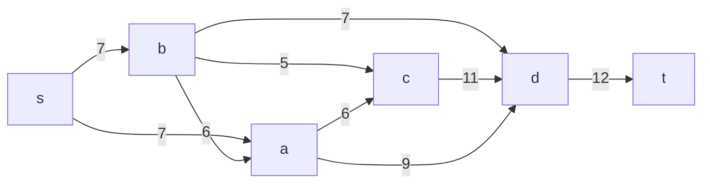
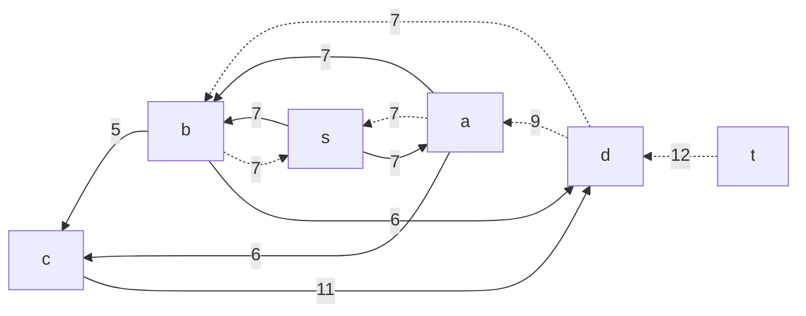
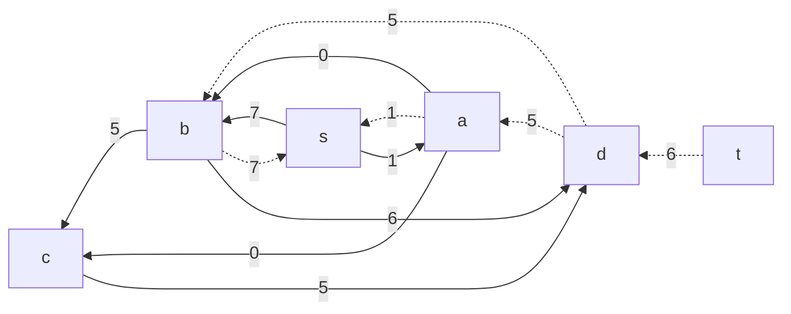
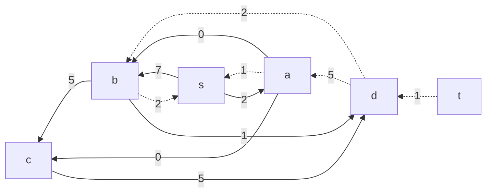
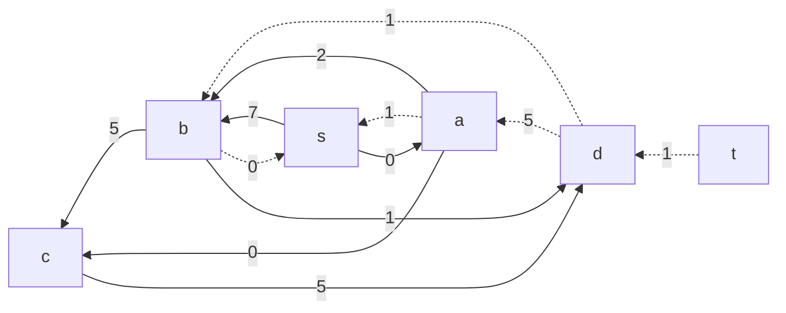
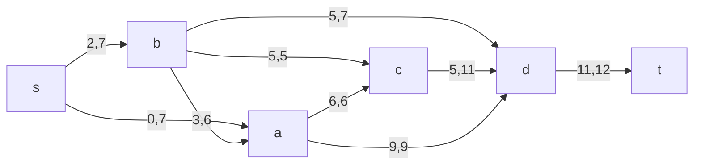

## Шаг 1. Построим сеть с источником s, стоком t и указанными пропускными способностями и стоимостью транспортировки.
Исходная сеть будет выглядеть следующим образом:

Здесь:

Пропускные способности дуг указаны в таблице.
Стоимость транспортировки единицы потока для каждой дуги также указана в таблице.
## Шаг 2. Построим остаточную сеть.
В остаточной сети учитываются текущие пропускные способности. Изначально поток по всем дугам равен нулю, поэтому остаточные пропускные способности равны пропускным способностям, указанным в исходной сети.

## Шаг 3. Поиск увеличивающего пути и определение максимального потока.
Теперь мы начинаем искать увеличивающий путь в остаточной сети. Мы будем искать путь от источника s до стока t в остаточной сети, пока не можем найти увеличивающие пути.

Найдем увеличивающий путь s -> a -> c -> d -> t. Минимальный вес по этому пути равен 6.
Уменьшаем пропускные способности дуг на этом пути:
(s, a) = 7 - 6 = 1
(a, c) = 6 - 6 = 0
(c, d) = 11 - 6 = 5
(d, t) = 12 - 6 = 6

Далее ищем увеличивающий путь s -> b -> d -> t. Минимальный вес на этом пути равен 5.
Уменьшаем пропускные способности:
(s, b) = 7 - 5 = 2
(b, d) = 7 - 5 = 2
(d, t) = 6 - 5 = 1

Теперь у нас поток 6 + 5 = 11.

## Шаг 4. Минимизация стоимости потока.
Теперь нам нужно минимизировать стоимость максимального потока. Мы будем искать ориентированные циклы отрицательной стоимости в остаточной сети.

Остаточная сеть:

Из остальной сети видим, что существует цикл с отрицательной стоимостью s -> b -> d -> a -> s, который позволит уменьшить общую стоимость потока.

Для цикла s -> b -> d -> a -> s минимальный вес ребра равен 2 (в цикле: 2 + 2 - 4 = -2).

Уменьшаем на 2 потоки:

(s, b) = 2 - 2 = 0
(b, d) = 1 - 2 = -1
(d, a) = 5 - 2 = 3

## Шаг 5. Рассчитаем стоимость полученного максимального потока.
Теперь, учитывая все изменения в потоках, расчет стоимости будет следующим:

|Дуги	                                        |sa	|sb	|bd	|ba	|bc	|cd	|ac	|ad	|dt	|Итого|
------------------------------------------------|---|---|---|---|---|---|---|---|---|-----|
Пропускная способность p(e)	                    |7	|7	|7	|6	|5	|11	|6	|9	|12	|-----|
Локальный поток f(e)	                        |0	|2	|5	|3	|5	|5	|6	|9	|11	|-----|
Стоимость транспортировки единицы потока c(e)	|2	|2	|5	|2	|2	|2	|4	|5	|2	|-----|
Суммарная стоимость f(e)*c(e)	                |0	|4	|25	|6	|10	|10	|24	|45	|22	|139  |

## Шаг 6. 
### Ответ: Максимальный поток в сети равен 11, минимальная стоимость потока 139.

Сеть с локальными потоками:
