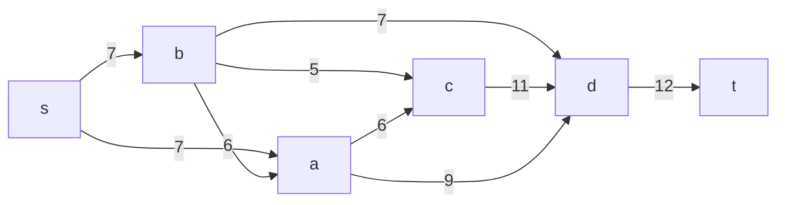
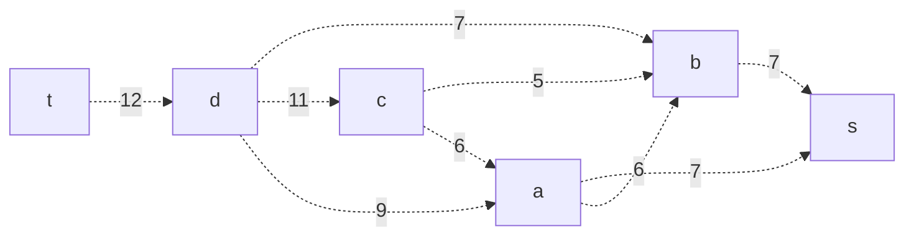
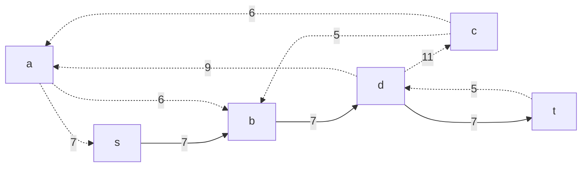
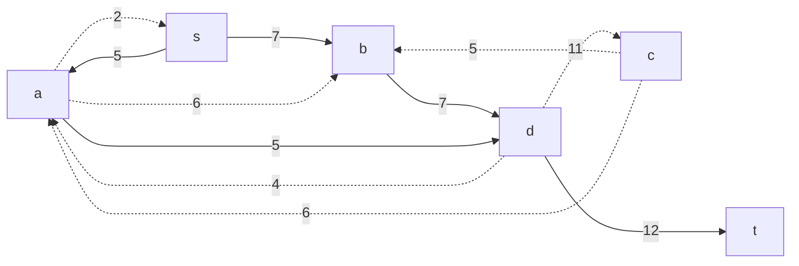
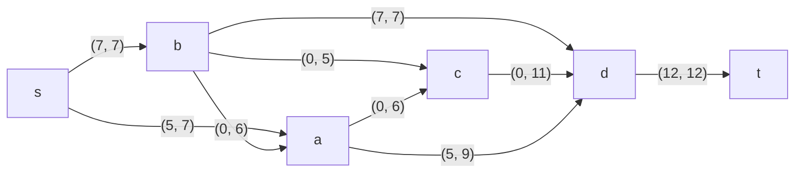
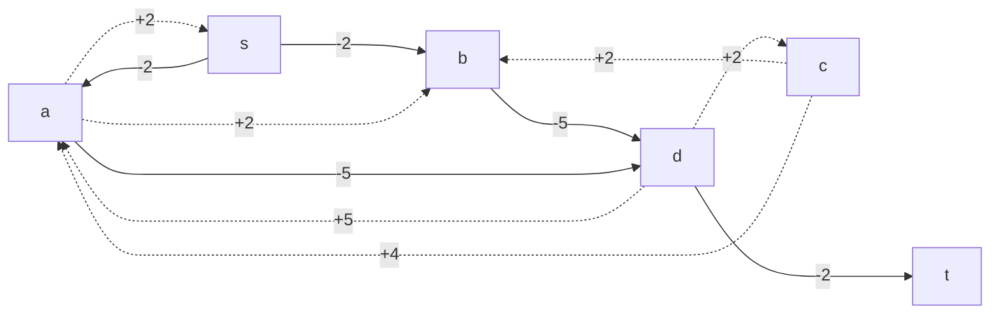
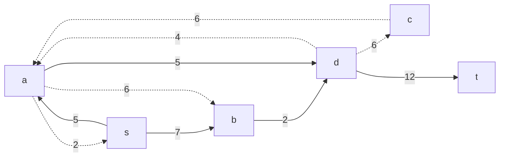
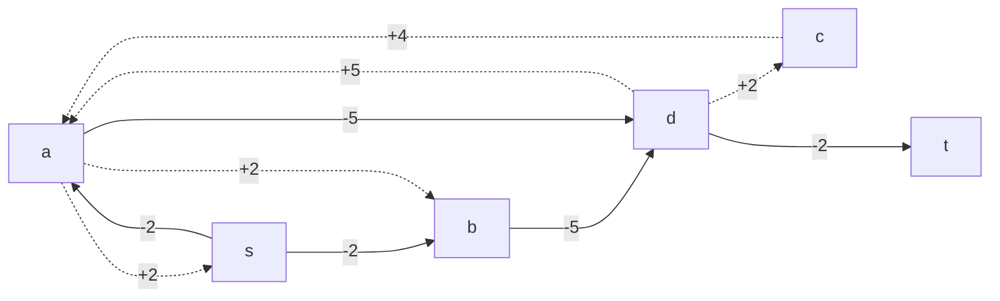

# Задача о максимальном потоке.

Для выполнения задания необходимо: 
1. Построить сеть с указанием пропускной способности дуг.
2. Построить остаточную сеть.
3. Определить максимальный поток методом поиска увеличивающих путей в остаточной сети.
4. Минимизировать стоимость максимального потока посредством поиска циклов отрицательной стоимости.
5. Оформить решение задачи по шагам с подробными комментариями, таблицами и диаграммами.
6. В ответе указать максимальную величину потока, минимальную стоимость и сеть с указанием соответствующих локальных потоков.

## Вариант 9:
#### Пропускная способность дуг сети p(e) и стоимость транспортировки  единицы потока c(e):

|          Дуги             | sa | sb | bd | ba | bc | cd | ac | ad | dt |
|:-------------------------:|:--:|:--:|----|:--:|:--:|:--:|:--:|:--:|:--:|
| Пропускная способность    | 7  | 7  | 7  | 6  | 5  | 11 | 6  | 9  | 12 |
| Стоимость транспортировки | 2  | 2  | 5  | 2  | 2  | 2  | 4  | 5  | 2  |

## Шаг 1. Построим сеть с источником s, стоком t и указанными пропускными способностями и стоимостью транспортировки.

### Исходная сеть:

### Остаточная сеть:

## Шаг 2. Проведем поиск увеличивающего пути в остаточной сети

В остаточной сети найден произвольный увеличивающий путь: t -> d -> b -> s.

Минимальный вес дуг на этом пути: 7.

Уменьшим вес дуг на найденном пути. 
Дуги для которых вес стал нулевым - дуга db и bs - удалим из остаточной сети.

## Шаг 3. Проведем поиск увеличивающего пути в остаточной сети

t -> d -> a -> s.

Минимальный вес дуг на этом пути: 5.

Уменьшим вес дуг на найденном пути. 
Дуги для которых вес стал нулевым - дуга td - удалим из остаточной сети.

## Шаг 4. Продолжим поиск увеличивающего пути в остаточной сети.

В остаточной сети не найдено увеличивающих путей, следовательно, алгоритм завершил работу и найденный поток величиной 7 + 5 = 12 является максимальным для данной сети.

Величины локальных потоков:

t -> d -> b -> s = 7 

t -> d -> a -> s = 5

Отобразим локальные потоки на исходной сети:

---
Величина потока равна 12:  
**7 + 5 = 12**

## Шаг 5. Рассчитаем стоимость полученного максимального потока.

| Дуги                          | sa | sb | bd | ba | bc | cd | ac | ad | dt |Итого|
|:------------------------------|:--:|:--:|:--:|:--:|:--:|:--:|:--:|:--:|:--:|:---:|
| Пропускная способность p(e)   | 7  | 7  | 7  | 6  | 5  | 11 | 6  | 9  | 12 |:---:|
| Стоимость транспортировки c(e)| 2  | 2  | 5  | 2  | 2  | 2  | 4  | 5  | 2  |:---:|
| Локальный поток f(e)          | 5  | 7  | 7  | 0  | 0  | 0  | 0  | 5  | 12 |:---:|
| Суммарная стоимость c(e)*f(e) | 10 | 14 | 35 | 0  | 0  | 0  | 0  | 25 | 24 | 108 |

Стоимость полученного потока составляет 108.

## Шаг 6. Попробуем уменьшить стоимость потока, для этого построим остаточную цепь.

Для каждого ребра остаточной сети укажем стоимость транспортировки единицы потока.

Найдем отрицательный цикл. Рассмотрим цикл:

 b -> d -> c -> b 

 (-5) + 2 + 2 = -1

Минимальный вес дуги в цикле = 5 (c -> b). Уменьшим на 5 вес всех ребер в цикле:

Скорректируем сеть со стоимостью дуг:

### Циклы отрицательной стоимости отсутствуют, следовательно, стоимость минимальна.

---

## Шаг 7. Расчёт стоимости оптимального потока

Обновлённая таблица:

| Дуги                          | sa | sb | bd | ba | bc | cd | ac | ad | dt |Итого|
|:------------------------------|:--:|:--:|:--:|:--:|:--:|:--:|:--:|:--:|:--:|:---:|
| Пропускная способность p(e)   | 7  | 7  | 7  | 6  | 5  | 11 | 6  | 9  | 12 |:---:|
| Стоимость транспортировки c(e)| 2  | 2  | 5  | 2  | 2  | 2  | 4  | 5  | 2  |:---:|
| Локальный поток f(e)          | 5  | 7  | 2  | 0  | 5  | 5  | 0  | 5  | 12 |:---:|
| Суммарная стоимость c(e)*f(e) | 10 | 14 | 10 | 0  | 10 | 10 | 0  | 25 | 24 | 103 |

# Ответ

Максимальный поток в сети равен 12, а минимальная суммарная стоимость данного потока составляет 103. Это достигается при следующем распределении локальных потоков:

Таким образом, оптимальное распределение потока с минимальной стоимостью имеет величину 12 и суммарную стоимость 103.

