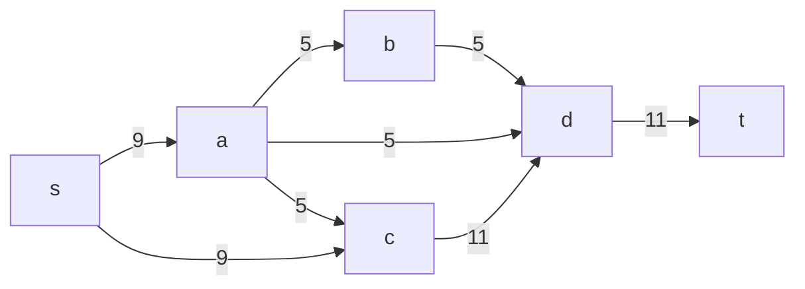
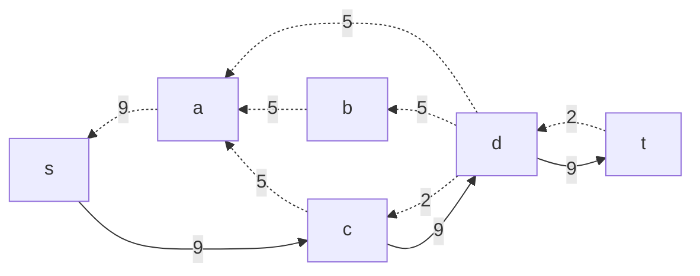
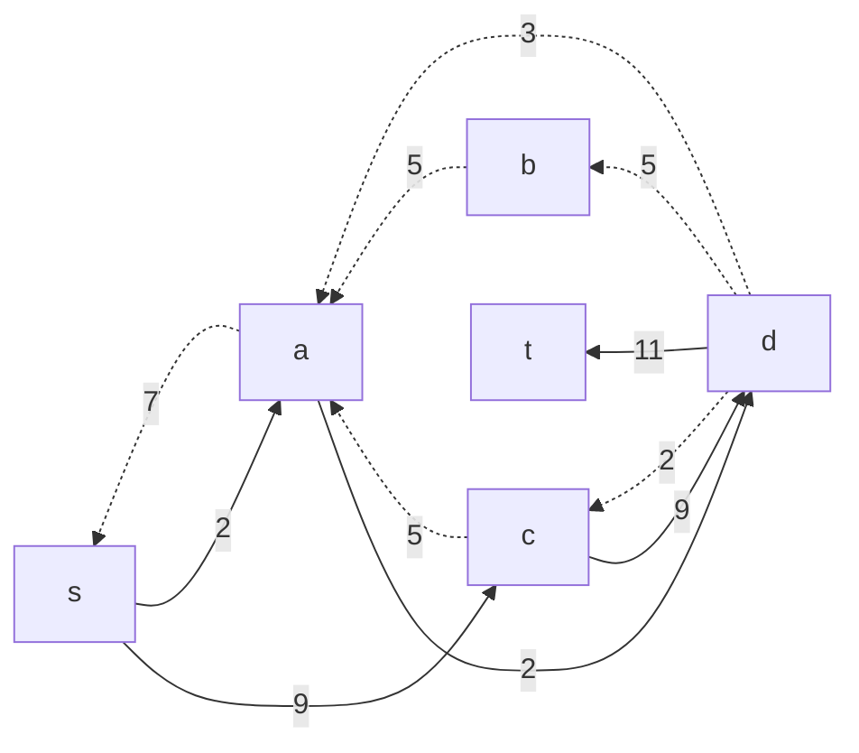
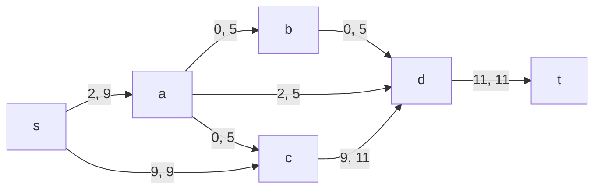
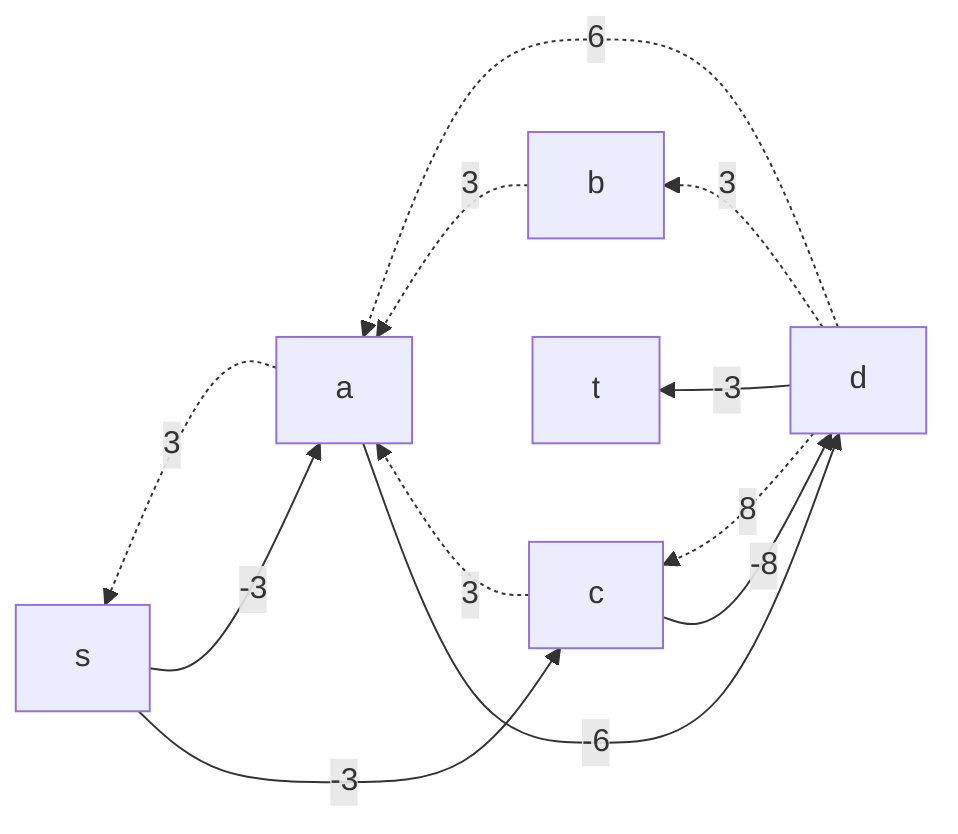
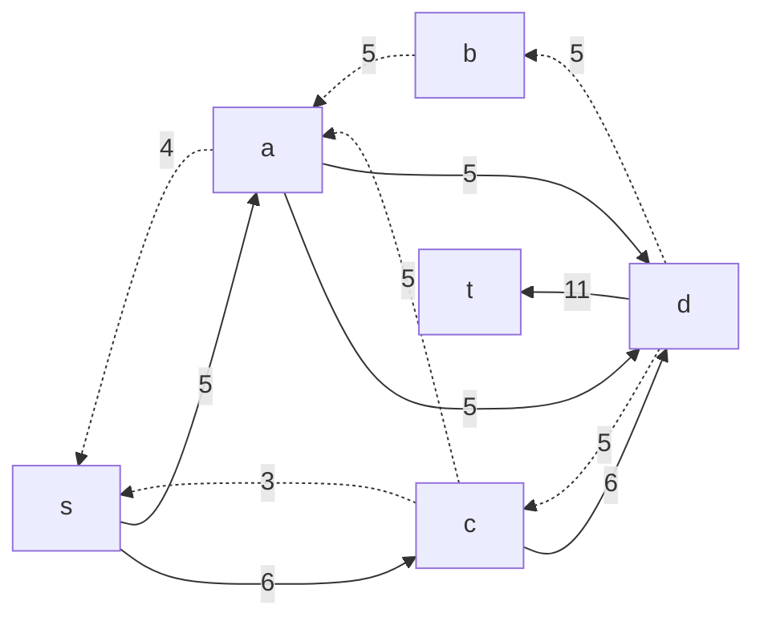
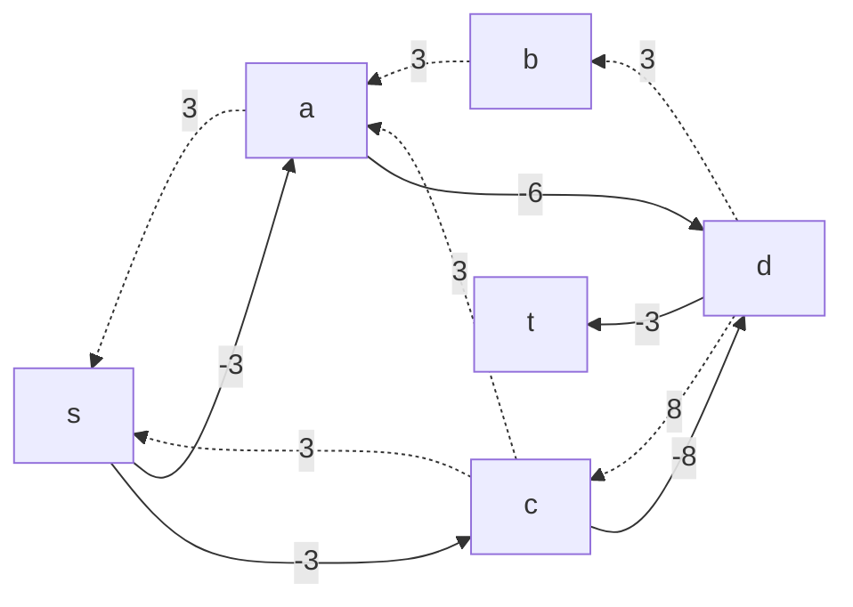
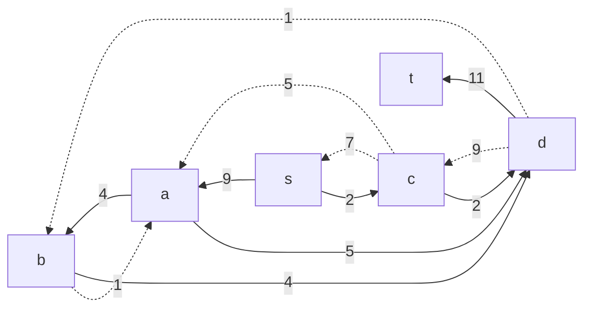
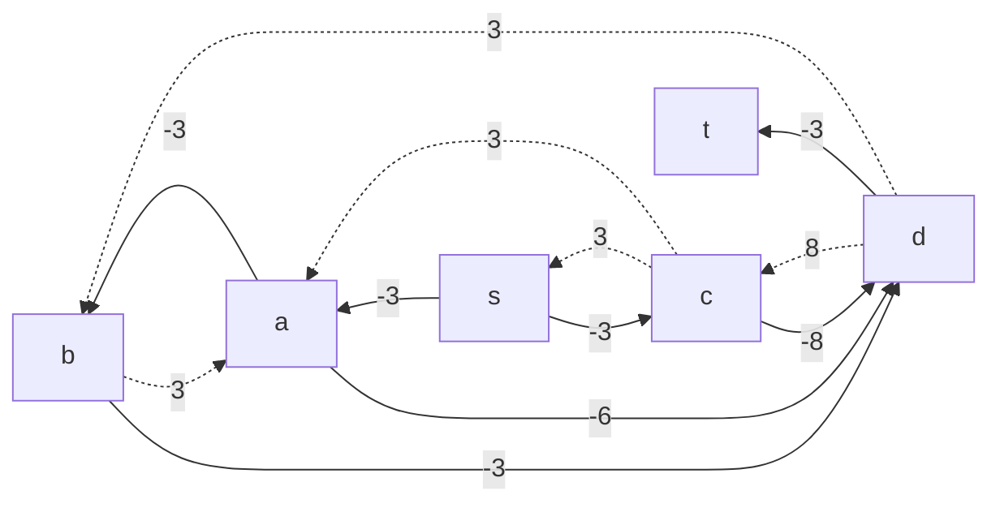
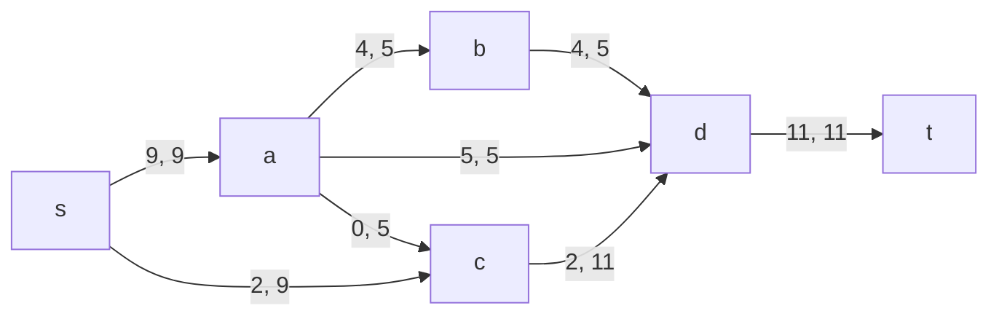

# Задание №10 (Вариант 5)
# Задача о максимальном потоке минимальной стоимости.

## Задание
Для каждого варианта представлены условия задачи, в соответствии с которыми необходимо: 
1. Построить сеть с указанием пропускной способности дуг.
2. Построить остаточную сеть.
3. Определить максимальный поток методом поиска увеличивающих путей в остаточной сети.
4. Минимизировать стоимость максимального потока посредством поиска циклов отрицательной стоимости.
5. Оформить решение задачи по шагам с подробными комментариями, таблицами и диаграммами.
6. В ответе указать максимальную величину потока, минимальную стоимость транспортировки и сеть с указанием соответствующих локальных потоков.

## Постановка задачи
1. Дана сеть (взвешенный ориентированный граф) с источником s и стоком t.
2. Для каждой дуги определена пропускная способность и стоимость транспортировки.
3. Необходимо найти для указанной сети максимальный поток минимальной стоимости. 

## Решение

Пропускная способность дуг сети и стоимость транспортировки указана в таблице.

| Дуги                                          | sa | sc | ab | ad | ac | cd | bd | dt |
|:----------------------------------------------|:--:|:--:|:--:|:--:|:--:|:--:|:--:|:--:|
| Пропускная способность p(e)                   | 9  | 9  | 5  | 5  | 5  | 11 | 5  | 11 |
| Стоимость транспортировки единицы потока c(e) | 3  | 3  | 3  | 6  | 3  | 8  | 3  | 3  |

### 1. Построим сеть с источником **s**, стоком **t** и указанными пропускными способностями дуг для поиска максимального потока.

Укажем начальный поток величиной 9 **s -> c -> d -> t**. Построим соответствующую остаточную сеть.

### 2. Проведем поиск увеличивающего пути в остаточной сети
В остаточной сети найден увеличивающий путь t -> d -> a -> s. Минимальный вес дуг на этом пути равен 2.

Уменьшим вес дуг на найденном пути, дуги для которых вес стал нулевым удалим из остаточной сети.

### 3. Продолжим поиск увеличивающего пути в остаточной сети

В остаточной сети не найдено увеличивающих путей, следовательно, алгоритм завершил работу и найденный поток величиной 11 является максимальным для данной сети.

### 4. Рассчитаем стоимость полученного максимального потока.

| Дуги                                          | sa | sc | ab | ad | ac | cd | bd | dt |Итог     |
|:----------------------------------------------|:--:|:--:|:--:|:--:|:--:|:--:|:--:|:--:|:-------:|
| Пропускная способность p(e)                   | 9  | 9  | 5  | 5  | 5  | 11 | 5  | 11 |         |
| Локальный поток f(e)                          | 2  | 9  | 0  | 2  | 0  | 9  | 0  | 11 |         |
| Стоимость транспортировки единицы потока c(e) | 3  | 3  | 3  | 6  | 3  | 8  | 3  | 3  |         |
| Суммарная стоимость f(e)*c(e)                 | 6  | 27 | 0  | 12 | 0  | 72 | 0  | 33 | **150** |

Стоимость полученного потока составляет 150. 

### 5. Попробуем уменьшить стоимость потока для чего построим остаточную сеть.
Для каждого ребра остаточной сети укажем стоимость транспортировки единицы потока.

В остаточной сети найден ориентированный цикл отрицательной стоимости s -> c -> d -> a -> s (- 3 - 8 + 6 + 3 = -2). 

Найдем минимальный вес ребра в указанном цикле, изображенном **в остаточной сети с указанием величины потока**.  

Минимальный вес ребра в цикле 3 - это неиспользованный резерв ребра a -> d.

Удалим найденный цикл - уменьшим на 2 вес всех ребер, входящих в цикл.

### 6. Проведем повторный поиск цикла отрицательной стоимости в остаточной сети.
Скорректируем остаточную сеть с указанием стоимости транспортировки единицы потока.

В остаточной сети найден ориентированный цикл отрицательной стоимости s -> c -> d -> b -> a -> s (- 3 - 8 + 3 + 3 + 3 = -2). 

Найдем минимальный вес ребра в указанном цикле, изображенном **в остаточной сети с указанием величины потока**.  

Минимальный вес ребра в цикле 4 - это неиспользованный резерв ребер s -> a.

Удалим найденный цикл - уменьшим на 4 вес всех ребер, входящих в цикл.

### 7. Проведем повторный поиск цикла отрицательной стоимости в остаточной сети.
Скорректируем остаточную сеть с указанием стоимости транспортировки единицы потока.

В остаточной сети отсутствуют циклы отрицательной стоимости, следовательно, стоимость потока минимальна.

### 8. Рассчитаем стоимость полученного максимального потока.

| Дуги                                          | sa | sc | ab | ad | ac | cd | bd | dt |Итог     |
|:----------------------------------------------|:--:|:--:|:--:|:--:|:--:|:--:|:--:|:--:|:-------:|
| Пропускная способность p(e)                   | 9  | 9  | 5  | 5  | 5  | 11 | 5  | 11 |         |
| Локальный поток f(e)                          | 9  | 2  | 4  | 5  | 0  | 2  | 4  | 11 |         |
| Стоимость транспортировки единицы потока c(e) | 3  | 3  | 3  | 6  | 3  | 8  | 3  | 3  |         |
| Суммарная стоимость f(e)*c(e)                 | 27 | 6  | 12 | 30 | 0  | 16 | 12 | 33 | **136** |

Стоимость полученного потока составляет 136. 

### Ответ:
Максимальный поток в сети равен 11, минимальная стоимость потока 136, она реализуется следующим локальными потоками:

