# Задание №10
# Задача о максимальном потоке минимальной стоимости.

## Задание
Для каждого варианта представлены условия задачи, в соответствии с которыми необходимо: 
1. Построить сеть с указанием пропускной способности дуг.
2. Построить остаточную сеть.
3. Определить максимальный поток методом поиска увеличивающих путей в остаточной сети.
4. Минимизировать стоимость максимального потока посредством поиска циклов отрицательной стоимости.
5. Оформить решение задачи по шагам с подробными комментариями, таблицами и диаграммами.
6. В ответе указать максимальную величину потока, минимальную стоимость транспортировки и сеть с указанием соответствующих локальных потоков.

## Постановка задачи
1. Дана сеть (взвешенный ориентированный граф) с источником s и стоком t.
2. Для каждой дуги определена пропускная способность и стоимость транспортировки.
3. Необходимо найти для указанной сети максимальный поток минимальной стоимости. 

## Вариант №7

Пропускная способность дуг сети и стоимость транспортировки указана в таблице.

| Дуги                                          | sa | sb | sc | ac | ad | ab | bd | ct | dt |
|:----------------------------------------------|:--:|:--:|:--:|:--:|:--:|:--:|:--:|:--:|:--:|
| Пропускная способность p(e)                   | 9  | 9  | 4  | 6  | 7  | 4  | 7  | 9  | 9  |
| Стоимость транспортировки единицы потока c(e) | 2  | 2  | 7  | 3  | 4  | 2  | 2  | 5  | 2  |

### Построим сеть с источником **s**, стоком **t** и указанными пропускными способностями дуг для поиска максимального потока.

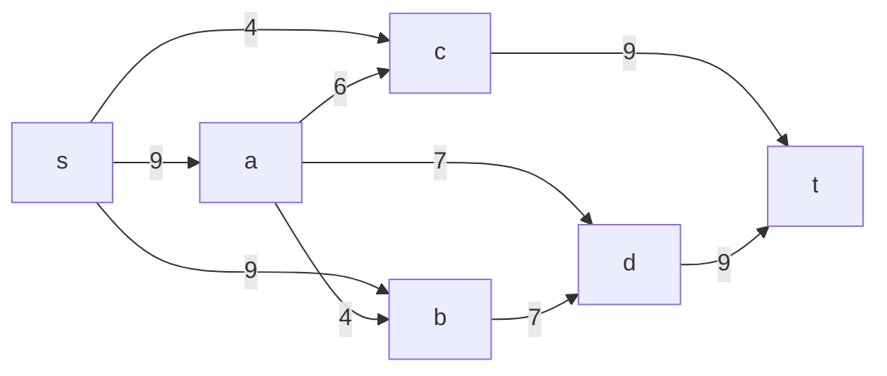
Построим соответствующую остаточную сеть.

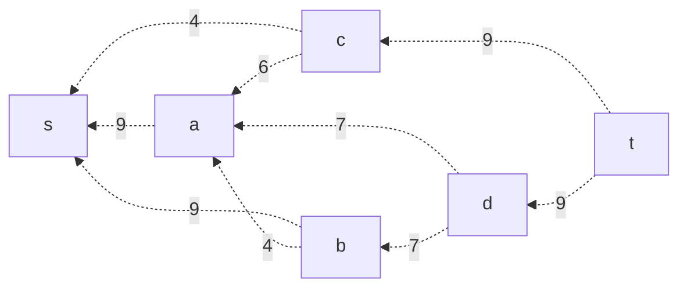

### Проведем поиск увеличивающего пути в остаточной сети

В остаточной сети найден произвольный увеличивающий путь:
t -> d -> a -> s. 

Минимальный вес дуг на этом пути: 7.

Уменьшим вес дуг на найденном пути.
Дуги для которых вес стал нулевым - дуга da - удалим из остаточной сети.

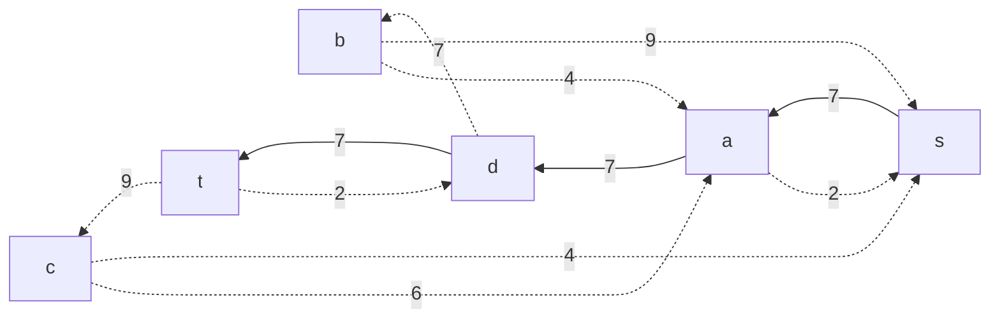

### Продолжим поиск увеличивающего пути в остаточной сети

В остаточной сети найден произвольный увеличивающий путь:
t -> c -> s. 

Минимальный вес дуг на этом пути: 4.

Уменьшим вес дуг на найденном пути.
Дуги для которых вес стал нулевым - дуга cs - удалим из остаточной сети.

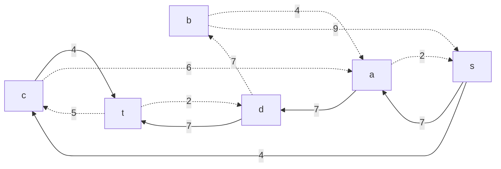

### Продолжим поиск увеличивающего пути в остаточной сети

В остаточной сети найден произвольный увеличивающий путь:
t -> d -> b -> s. 

Минимальный вес дуг на этом пути: 2.

Уменьшим вес дуг на найденном пути.
Дуги для которых вес стал нулевым - дуга td - удалим из остаточной сети.

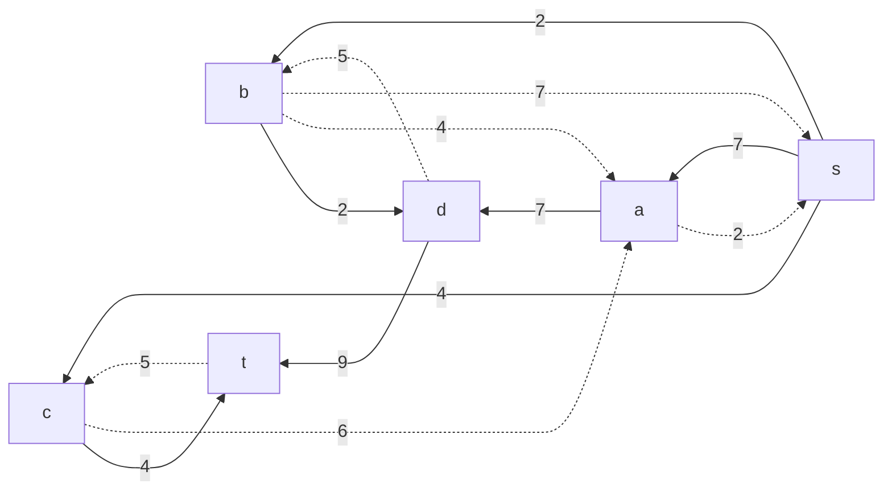

### Продолжим поиск увеличивающего пути в остаточной сети

В остаточной сети найден произвольный увеличивающий путь:
t -> c -> a -> s. 

Минимальный вес дуг на этом пути: 2.

Уменьшим вес дуг на найденном пути.
Дуги для которых вес стал нулевым - дуга as - удалим из остаточной сети.

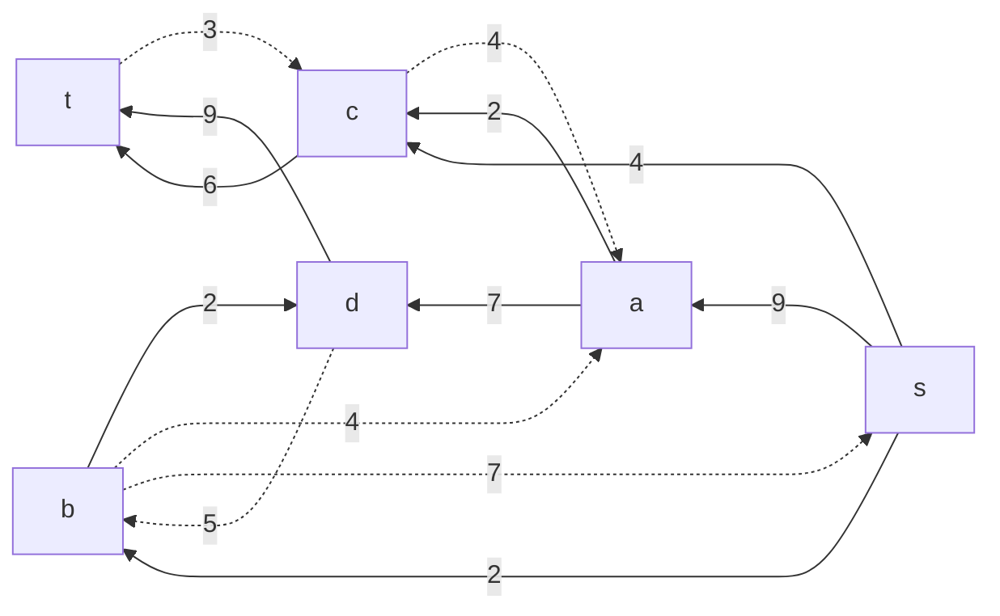

### Продолжим поиск увеличивающего пути в остаточной сети

В остаточной сети найден произвольный увеличивающий путь:
t -> c -> a -> d -> b -> s. 

Минимальный вес дуг на этом пути: 3.

Важно учесть, что пусть проходит через дугу ad с нулевым резервом. Ещё один поток через неё провести нельзя. Значит, придётся корректировать величину других потоков.

Уменьшим вес дуг на найденном пути.
Дуги для которых вес стал нулевым - дуга tc - удалим из остаточной сети.

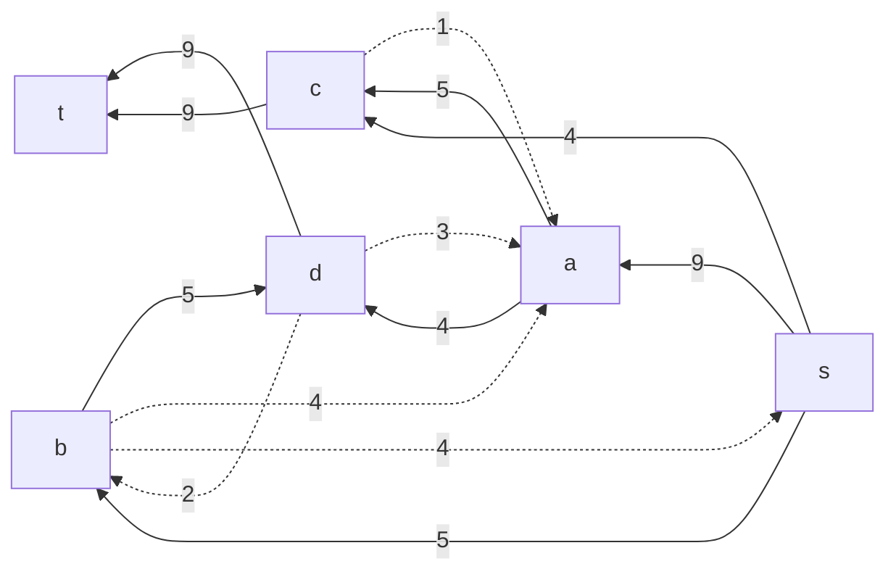

Скорректируем величину потоков, проходящих через вершину a, с учётом изменения в ребре ad.
Уменьшим один поток на 3 единицы, и увеличим другой на 3:
- s - a - d - t = 7 - 3 = 4
- s - a - c - t = 2 + 3 = 5

Увеличивающих путей больше не найден. Поток максимален.
Величины локальных потоков:
- s - a - d - t = 4
- s - c - t = 4
- s - b - d - t = 5
- s - a - c - t = 5

Отобразим локальные потоки.

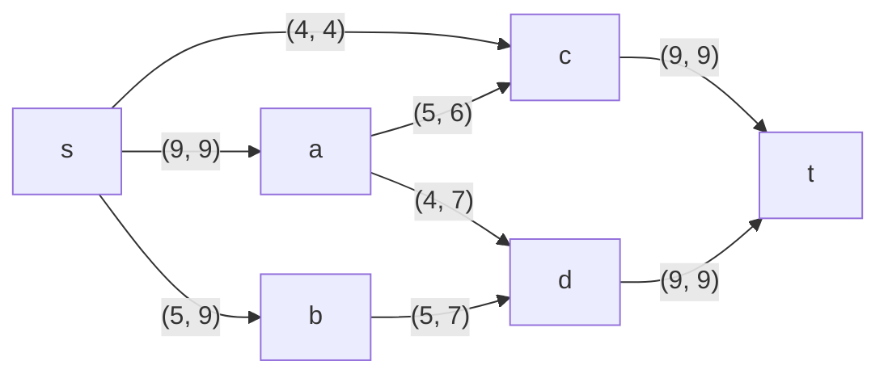

Величина потока:
$$
4 + 4 + 5 + 5 = 18
$$

### Рассчитаем стоимость полученного максимального потока.

| Дуги                                          | sa | sb | sc | ac | ad | ab | bd | ct | dt | Итого  |
|:----------------------------------------------|:--:|:--:|:--:|:--:|:--:|:--:|:--:|:--:|:--:|:------:|
| Пропускная способность p(e)                   | 9  | 9  | 4  | 6  | 7  | 4  | 7  | 9  | 9  |        |
| Локальный поток f(e)                          | 9  | 5  | 4  | 5  | 4  | 0  | 5  | 9  | 9  |        |
| Стоимость транспортировки единицы потока c(e) | 2  | 2  | 7  | 3  | 4  | 2  | 2  | 5  | 2  |        |
| Суммарная стоимость f(e)*c(e)                 | 18 | 10 | 28 | 15 | 16 | 0  | 10 | 45 | 18 |**160** |

Стоимость полученного потока составляет 160. 

### Попробуем уменьшить стоимость потока для чего построим остаточную сеть.
Для каждого ребра остаточной сети укажем стоимость транспортировки единицы потока.

В остаточной сети найдём ориентированный цикл отрицательной стоимости:
s -> c -> a -> d -> b -> s
$$
-7 + 3 - 4 + 2 = -4 
$$

Найдем минимальный вес ребра в указанном цикле, изображенном в остаточной сети с указанием величины потока.  

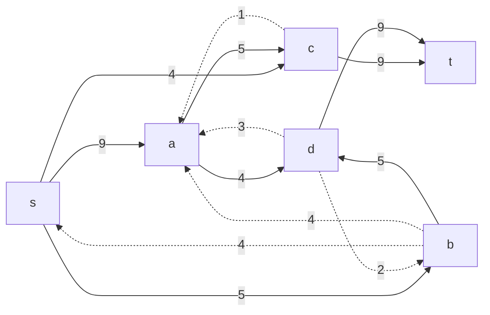

Минимальный вес ребра в цикле: 1 
Это неиспользованный резерв ребра a -> c.

Удалим найденный цикл - уменьшим на 1 вес всех ребер, входящих в цикл.

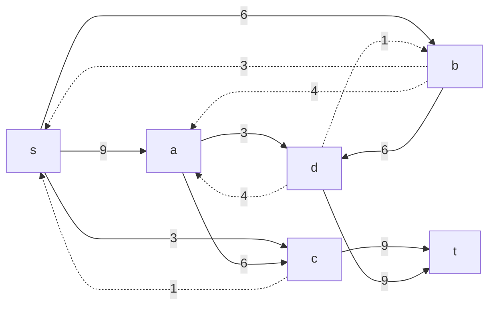
Скорректируем остаточную сеть с указанием стоимости транспортировки единицы потока.

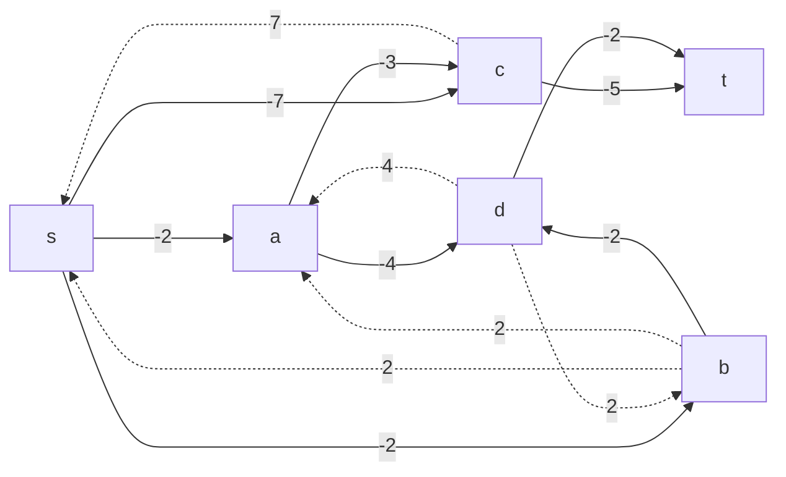

### Проведем повторный поиск цикла отрицательной стоимости в остаточной сети.

В остаточной сети найдём ориентированный цикл отрицательной стоимости:
s -> a -> d -> b -> s
$$
-2 - 4 + 2 + 2 = -2 
$$

Минимальный вес ребра в цикле: 1 
Это неиспользованный резерв ребра b -> d.

Удалим найденный цикл - уменьшим на 1 вес всех ребер, входящих в цикл.

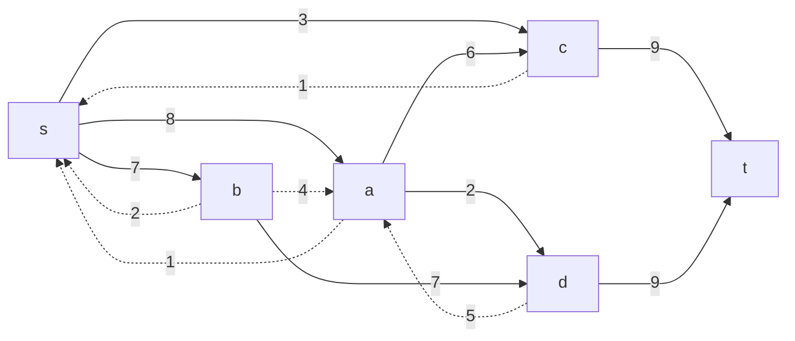

Скорректируем остаточную сеть с указанием стоимости транспортировки единицы потока.

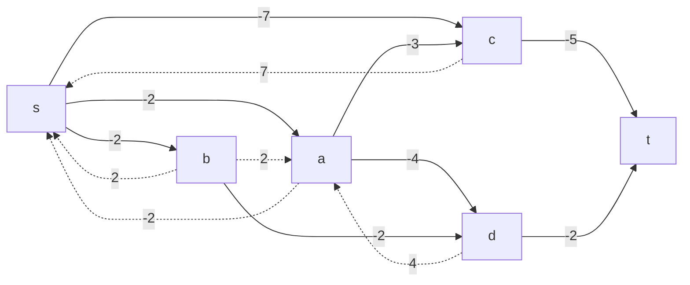

Циклы отрицательной стоимости отсутствуют. Следовательно, стоимость потока минимальна.

### Рассчитаем стоимость полученного максимального потока.

| Дуги                                          | sa | sb | sc | ac | ad | ab | bd | ct | dt | Итого  |
|:----------------------------------------------|:--:|:--:|:--:|:--:|:--:|:--:|:--:|:--:|:--:|:------:|
| Пропускная способность p(e)                   | 9  | 9  | 4  | 6  | 7  | 4  | 7  | 9  | 9  |        |
| Локальный поток f(e)                          | 8  | 7  | 3  | 6  | 2  | 0  | 7  | 9  | 9  |        |
| Стоимость транспортировки единицы потока c(e) | 2  | 2  | 7  | 3  | 4  | 2  | 2  | 5  | 2  |        |
| Суммарная стоимость f(e)*c(e)                 | 16 | 14 | 21 | 18 | 8  | 0  | 14 | 45 | 18 |**154** |

Стоимость полученного потока составляет 154. 

### Ответ:
Максимальный поток составляет 18, минимальная стоимость потока 154, она реализуется следующим локальными потоками:

- s -> a -> d -> t = 2
- s -> c -> t = 3
- s -> b -> d -> t = 7
- s -> a -> c -> t = 6

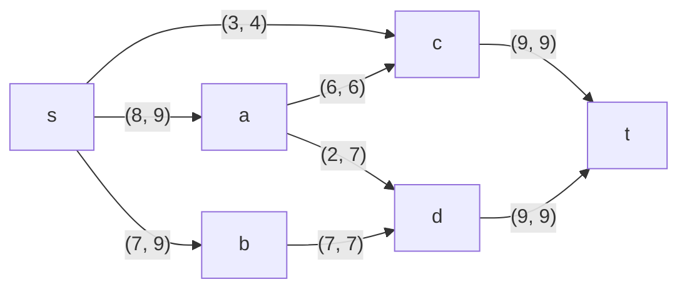
