# Задание 10. Вариант 2 #
## Постановка задачи ##
#### Пропускная способность дуг сети p(e) и стоимость транспортировки  единицы потока c(e):

| Дуги                          | sa | sb | bc | ab | ac | ad | cd | dt | at |
|:------------------------------|:--:|:--:|:--:|:--:|:--:|:--:|:--:|:--:|:--:|
| Пропускная способность p(e)   | 5  | 11 | 5  | 2  | 4  | 11 | 9  | 13 | 5  |
| Стоимость транспортировки c(e)| 2  | 3  | 2  | 3  | 4  | 6  | 2  | 1  | 8  |

#### 1. Построим сеть с источником s, стоком t и указанными пропускными способностями дуг для поиска максимального потока.

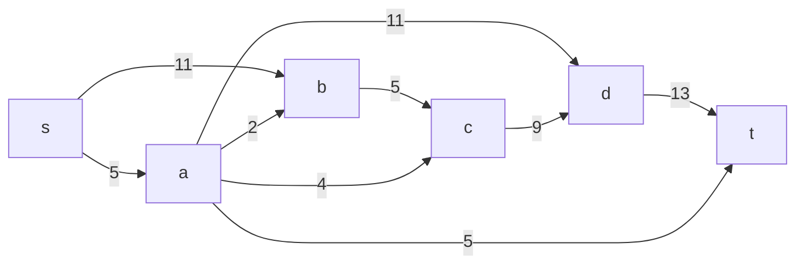
Построим остаточную цепь
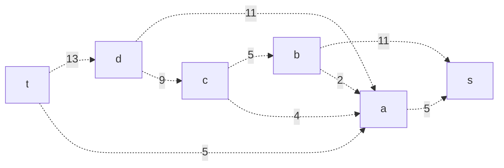
Найдём начальный поток величиной 5 t -> a -> s

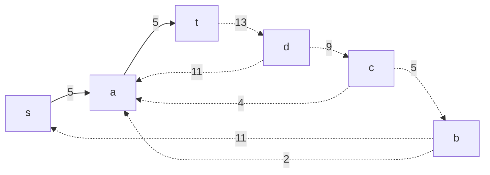
#### 2. Проведем поиск увеличивающего пути в остаточной сети.
В остаточной сети найден увеличивающий путь t -> d -> c -> b -> s. Минимальный вес дуги на данном пути 5.

Уменьшим вес дуг на найденном пути, дуги для которых вес стал нулевым удалим из остаточной сети.

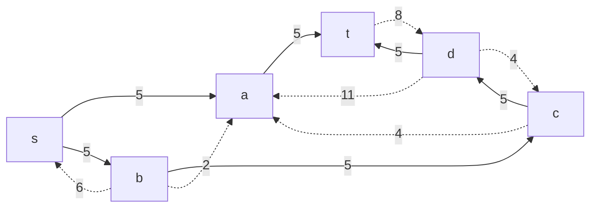
#### 3. Продолжим поиск увеличивающего пути в остаточной сети.

В остаточной сети не найдено увеличивающих путей, следовательно, алгоритм завершил работу и найденный поток величиной 10 является максимальным для данной сети.

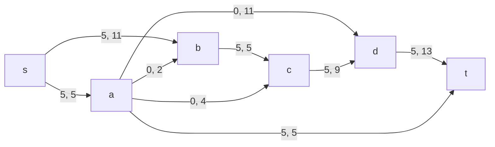

#### 4. Рассчитаем стоимость полученного максимального потока.

| Дуги                          | sa | sb | bc | ab | ac | ad | cd | dt | at |Итого|
|:------------------------------|:--:|:--:|:--:|:--:|:--:|:--:|:--:|:--:|:--:|:---:|
| Пропускная способность p(e)   | 5  | 11 | 5  | 2  | 4  | 11 | 9  | 13 | 5  |:---:|
| Стоимость транспортировки c(e)| 2  | 3  | 2  | 3  | 4  | 6  | 2  | 1  | 8  |:---:|
| Локальный поток f(e)          | 5  | 5  | 5  | 0  | 0  | 0  | 5  | 5  | 5  |:---:|
| Суммарная стоимость c(e)*f(e) | 10 | 15 | 10 | 0  | 0  | 0  | 10 | 5  | 40 | 90  |

Стоимость полученного потока составляет 90.

#### 5. Попробуем уменьшить стоимость потока, для этого построим остаточную цепь.

Для каждого ребра остаточной сети укажем стоимость транспортировки единицы потока.

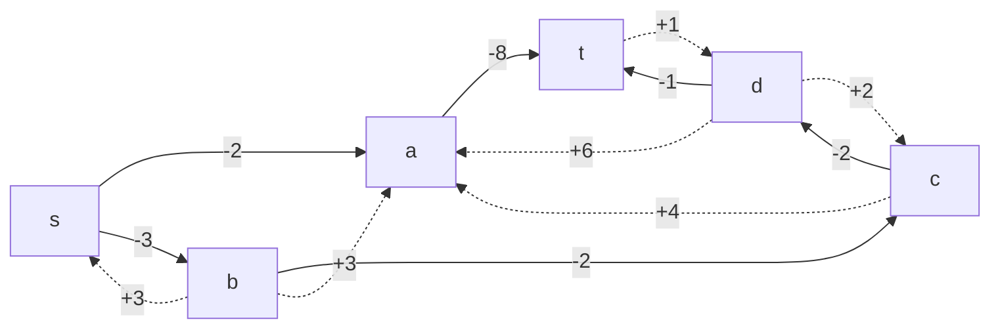

В остаточной сети найден ориентированный цикл отрицательной стоимости t -> d -> c -> a -> t (+ 1 + 2 + 4 - 8 = -1).

Найдем минимальный вес ребра в указанном цикле, изображенном в остаточной сети с указанием величины потока.

Минимальный вес ребра в цикле 4.

Удалим найденный цикл - уменьшим на 4 вес всех ребер, входящих в цикл.

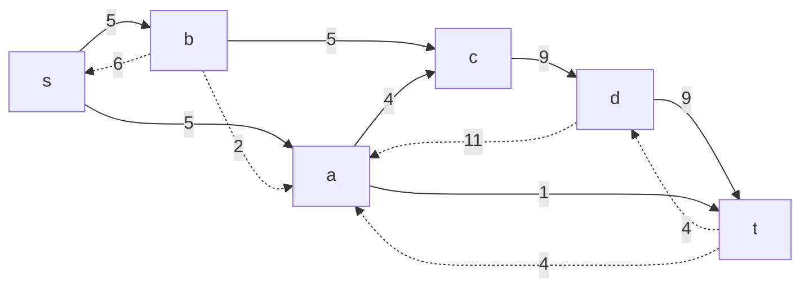

#### 6. Проведем повторный поиск цикла отрицательной стоимости в остаточной сети.

Скорректируем остаточную сеть с указанием стоимости транспортировки единицы потока.

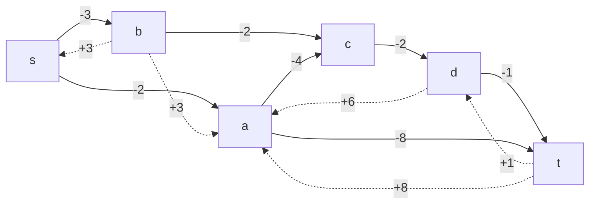

В остаточной сети найден ориентированный цикл отрицательной стоимости t -> d -> a -> t (+ 1 + 6 - 8 = -1).

Найдем минимальный вес ребра в указанном цикле, изображенном в остаточной сети с указанием величины потока.

Минимальный вес ребра в цикле 1.

Удалим найденный цикл - уменьшим на 1 вес всех ребер, входящих в цикл.

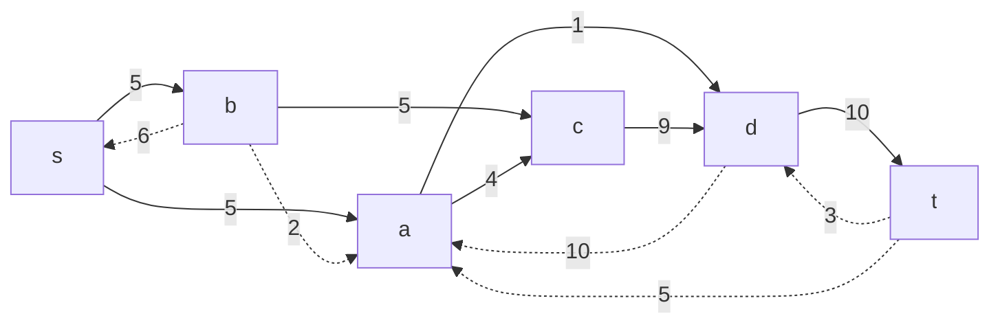
#### 7. Проведем повторный поиск цикла отрицательной стоимости в остаточной сети.

Скорректируем остаточную сеть с указанием стоимости транспортировки единицы потока.

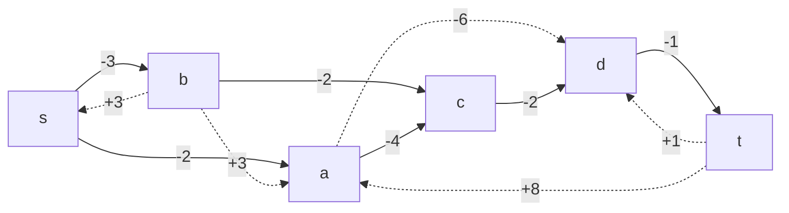

В остаточной сети отсутствуют циклы отрицательной стоимости, следовательно, стоимость потока минимальна.

#### 8. Рассчитаем стоимость полученного максимального потока.

| Дуги                          | sa | sb | bc | ab | ac | ad | cd | dt | at |Итого|
|:------------------------------|:--:|:--:|:--:|:--:|:--:|:--:|:--:|:--:|:--:|:---:|
| Пропускная способность p(e)   | 5  | 11 | 5  | 2  | 4  | 11 | 9  | 13 | 5  |     |
| Стоимость транспортировки c(e)| 2  | 3  | 2  | 3  | 4  | 6  | 2  | 1  | 8  |     |
| Локальный поток f(e)          | 5  | 5  | 5  | 0  | 4  | 1  | 9  | 10 | 0  |     |
| Суммарная стоимость c(e)*f(e) | 10 | 15 | 10 | 0  | 16 | 6  | 18 | 10 | 0  | 85  |

Стоимость полученного потока составляет 85.

### Ответ

Максимальный поток в сети равен 10, минимальная стоимость потока 85, она реализуется следующим локальными потоками:

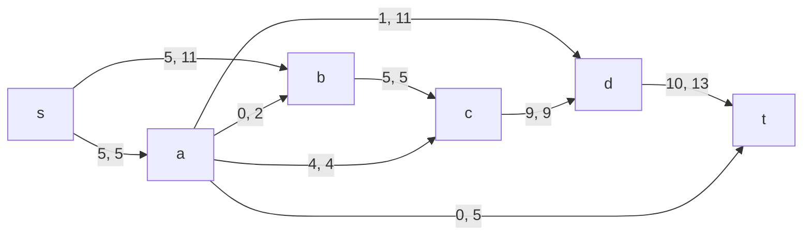