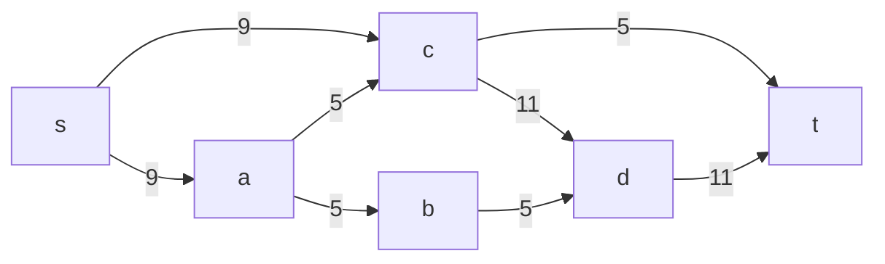
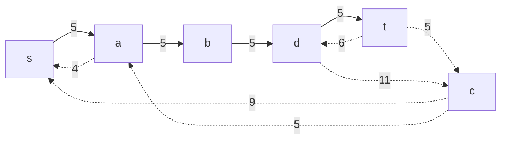
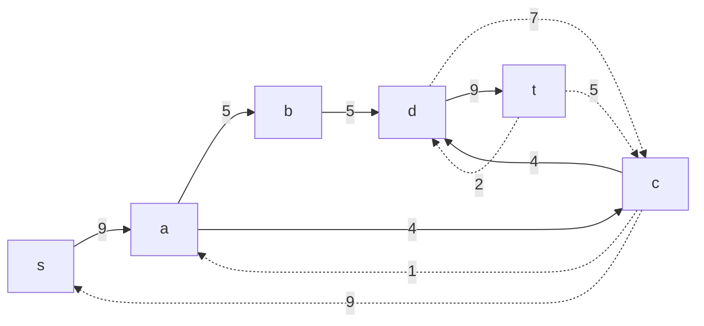
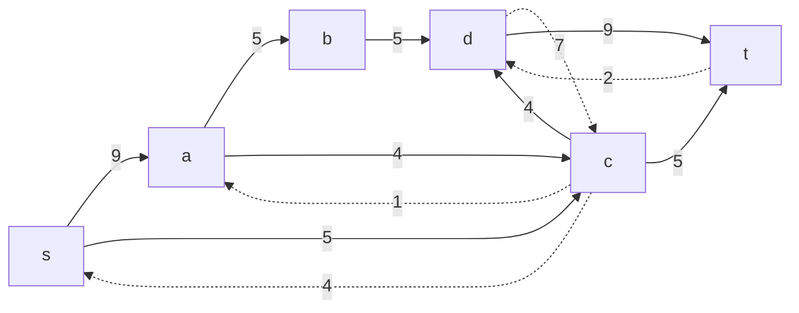
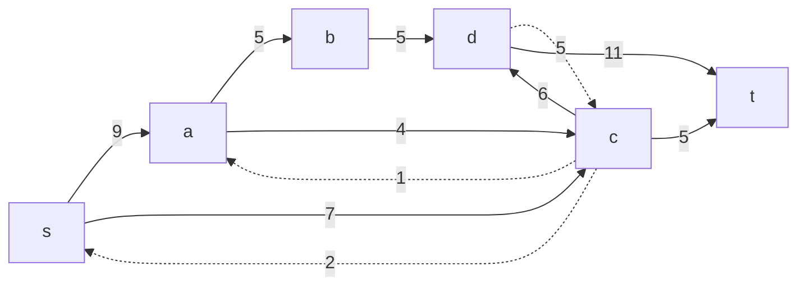
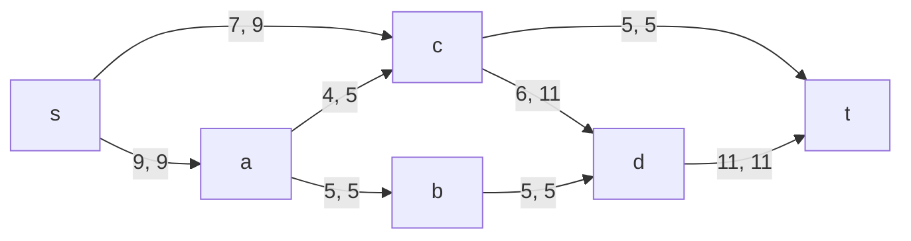
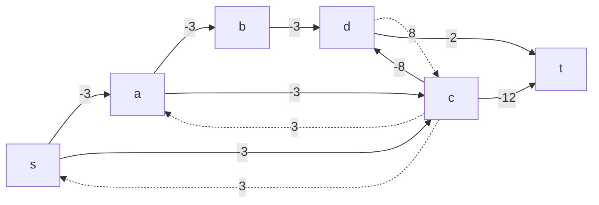
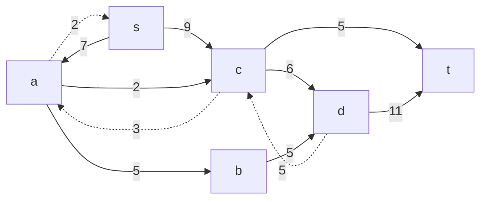
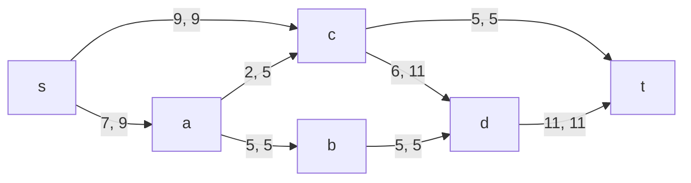

# Задание №10 (Вариант 8)
# Задача о максимальном потоке минимальной стоимости.

## Задание
Для каждого варианта представлены условия задачи, в соответствии с которыми необходимо: 
1. Построить сеть с указанием пропускной способности дуг.
2. Построить остаточную сеть.
3. Определить максимальный поток методом поиска увеличивающих путей в остаточной сети.
4. Минимизировать стоимость максимального потока посредством поиска циклов отрицательной стоимости.
5. Оформить решение задачи по шагам с подробными комментариями, таблицами и диаграммами.
6. В ответе указать максимальную величину потока, минимальную стоимость транспортировки и сеть с указанием соответствующих локальных потоков.

## Постановка задачи
1. Дана сеть (взвешенный ориентированный граф) с источником s и стоком t.
2. Для каждой дуги определена пропускная способность и стоимость транспортировки.
3. Необходимо найти для указанной сети максимальный поток минимальной стоимости. 

## Пример решения задачи на поиск максимального потока в сети

Пропускная способность дуг сети и стоимость транспортировки указана в таблице.

| Дуги                           | sa | sc | ab | ct | ac | cd | bd | dt |
|:-------------------------------|:--:|:--:|:--:|:--:|:--:|:--:|:--:|:--:|
| Пропускная способность p(e)    | 9  | 9  | 5  | 5  | 5  | 11 | 5  | 11 |
| Стоимость транспортировки c(e) | 3  | 3  | 3  | 12 | 3  | 8  | 3  | 2  |

### 1. Построим сеть с источником **s**, стоком **t** и указанными пропускными способностями дуг для поиска максимального потока.

Укажем начальный поток величиной 5 **s -> a -> b -> d -> t**. Построим соответствующую остаточную сеть.

### 2. Проведем поиск увеличивающего пути в остаточной сети
В остаточной сети найден увеличивающий путь t -> d -> c -> a -> s. Минимальный вес дуг на этом пути равен 4.

Уменьшим вес дуг на найденном пути, дуги для которых вес стал нулевым удалим из остаточной сети.

### 3. Продолжим поиск увеличивающего пути в остаточной сети
В остаточной сети найден увеличивающий путь t -> c -> s. Минимальный вес дуг на этом пути равен 5.

Уменьшим вес дуг на найденном пути, дуги для которых вес стал нулевым удалим из остаточной сети.

### 4. Продолжим поиск увеличивающего пути в остаточной сети
В остаточной сети найден увеличивающий путь t -> d -> c -> s. Минимальный вес дуг на этом пути равен 2.

Уменьшим вес дуг на найденном пути, дуги для которых вес стал нулевым удалим из остаточной сети.

### 5. Продолжим поиск увеличивающего пути в остаточной сети

В остаточной сети не найдено увеличивающих путей, следовательно, алгоритм завершил работу и найденный поток величиной 11 является максимальным для данной сети.

### 6. Рассчитаем стоимость полученного максимального потока.

| Дуги                                          | sa | sc | ab | ct | ac | cd | bd | dt |  Итого |
|:----------------------------------------------|:--:|:--:|:--:|:--:|:--:|:--:|:--:|:--:|:------:|
| Пропускная способность p(e)                   | 9  | 9  | 5  | 5  | 5  | 11 | 5  | 11 |        |
| Локальный поток f(e)                          | 9  | 7  | 5  | 5  | 4  | 6  | 5  | 11 |        |
| Стоимость транспортировки единицы потока c(e) | 3  | 3  | 3  | 12 | 3  | 8  | 3  | 2  |        |
| Суммарная стоимость f(e)*c(e)                 | 27 | 21 | 15 | 60 | 12 | 48 | 15 | 22 | **220**|

Стоимость полученного потока составляет 220. 

### 7. Попробуем уменьшить стоимость потока для чего построим остаточную сеть.
Для каждого ребра остаточной сети укажем стоимость транспортировки единицы потока.

В остаточной сети найден ориентированный цикл отрицательной стоимости s -> a -> c -> s (- 3 - 3 + 3 = -3). 

Найдем минимальный вес ребра в указанном цикле, изображенном **в остаточной сети с указанием величины потока**.  

Минимальный вес ребра в цикле 2 - это неиспользованный резерв ребра c -> s.

Удалим найденный цикл - уменьшим на 2 вес всех ребер, входящих в цикл.

### 8. Рассчитаем стоимость полученного максимального потока.

| Дуги                                          | sa | sc | ab | ct | ac | cd | bd | dt |  Итого |
|:----------------------------------------------|:--:|:--:|:--:|:--:|:--:|:--:|:--:|:--:|:------:|
| Пропускная способность p(e)                   | 9  | 9  | 5  | 5  | 5  | 11 | 5  | 11 |        |
| Локальный поток f(e)                          | 7  | 9  | 5  | 5  | 2  | 6  | 5  | 11 |        |
| Стоимость транспортировки единицы потока c(e) | 3  | 3  | 3  | 12 | 3  | 8  | 3  | 2  |        |
| Суммарная стоимость f(e)*c(e)                 | 21 | 27 | 15 | 60 | 6  | 48 | 15 | 22 | **214**|

Стоимость полученного потока составляет 214. 

### Ответ:
Максимальный поток в сети равен 16, минимальная стоимость потока 214, она реализуется следующим локальными потоками:

