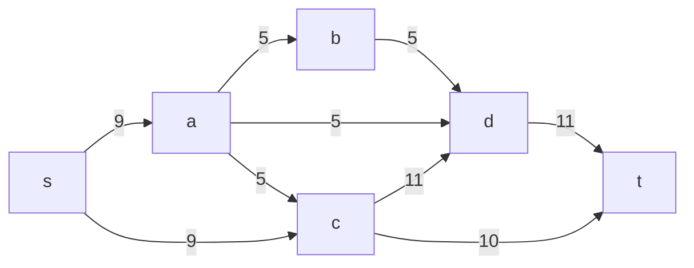
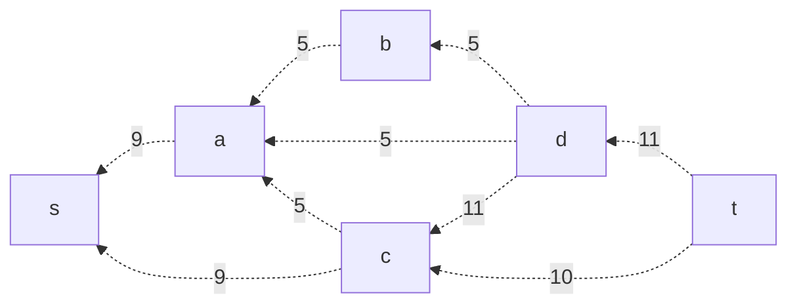
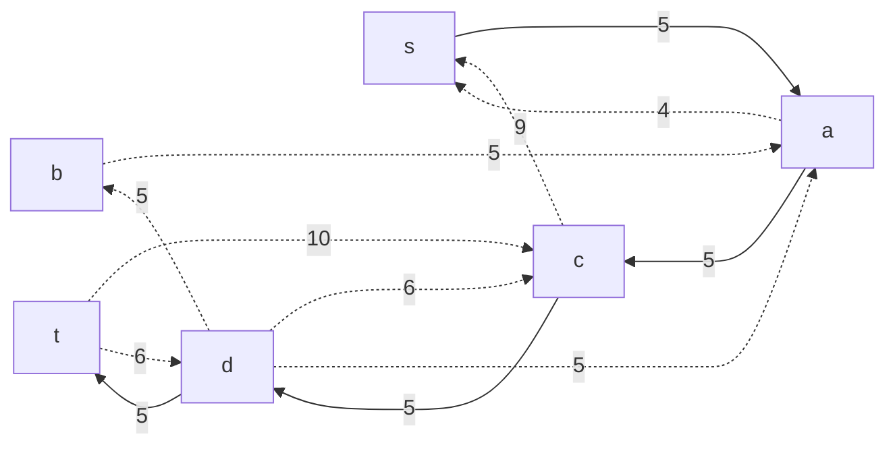
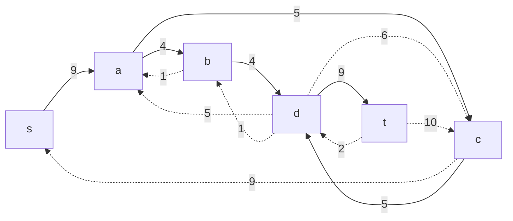
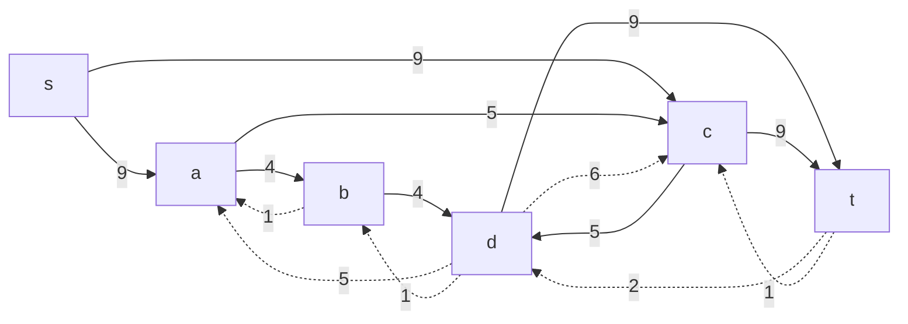
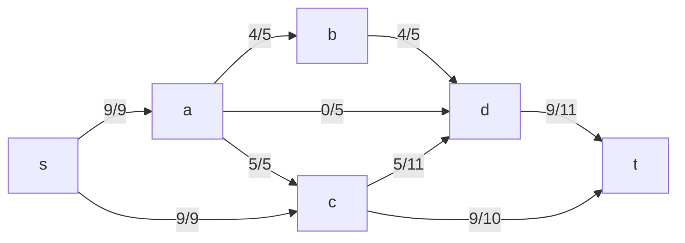
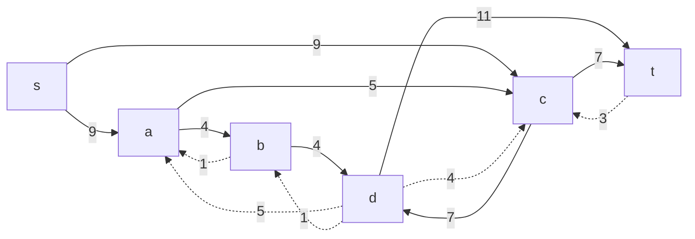
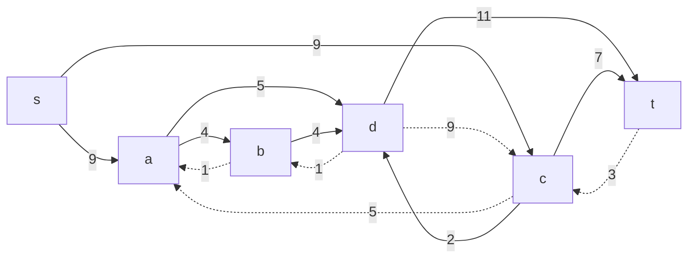
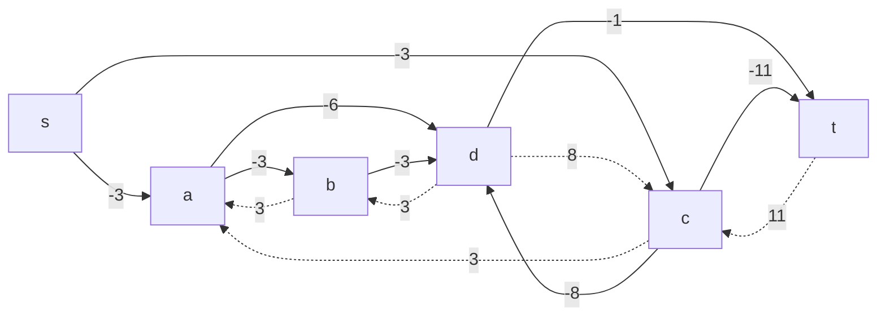
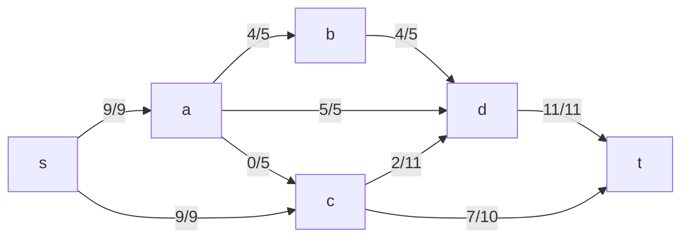

# Задача о максимальном потоке минимальной стоимости. Вариант 10

В данной задаче задана сеть с истоком **s** и стоком **t**. Для каждой дуги определены пропускная способность _p(e)_ и стоимость транспортировки единицы потока _c(e)_ согласно таблице:

| Дуга                   | sa | sc | ab | ad | ac | cd | bd | dt | ct |
|------------------------|:--:|:--:|:--:|:--:|:--:|:--:|:--:|:--:|:--:|
| Пропускная способность | 9  | 9  | 5  | 5  | 5  | 11 | 5  | 11 | 10 |
| Стоимость              | 3  | 3  | 3  | 6  | 3  | 8  | 3  | 1  | 11 |

Наша цель – найти максимальный поток минимальной стоимости.

---

## 1. Построение исходной сети

Запишем дуги сети с указанием пропускных способностей:

---

## 2. Задание начального потока и построение остаточной сети

Построим остаточную сеть:

### 2.1. Первый увеличивающий путь

Проводим обратный поиск увеличивающего пути от стока к истоку. Рассмотрим обратный путь:

**Путь 1 (обратный):**  
_t → d → c → a → s_

Минимальный вес дуги (c → a) = **5**. Уменьшаем вес всех дуг, входящих в обратный путь, на минимальный вес дуги (5).
Если вес дуги = 0 -> убираем из сети

---

## 3. Поиск увеличивающих путей в остаточной сети

### 3.1. Путь 2 (обратный): _t → d → b → a → s_

Минимальный вес дуги (a → s) = **4**. Уменьшаем вес всех дуг, входящих в обратный путь, на минимальный вес дуги (4).
Если вес дуги = 0 -> убираем из сети

### 3.2. Путь 3 (обратный): _t → c → s_

Минимальный вес дуги (c → s) = **9**. Уменьшаем вес всех дуг, входящих в обратный путь, на минимальный вес дуги (9).
Если вес дуги = 0 -> убираем из сети

---

Увеличивающих путей не найдено, поток максимален

Величины локальных потоков:

- s - a - b - d - t = 4
- s - a - d - t = 0
- s - a - c - d - t = 5
- s - c - t = 9

Отобразим локальные потоки на исходной сети:

---

Величина потока равна 18:
$$
9 + 5 + 4 + 0 = 18
$$

## 5. Расчёт стоимости полученного максимального потока

Составляем таблицу для расчёта:

| Дуга                   | sa | sc | ab | ad | ac | cd | bd | dt | ct | Итого |
|------------------------|:--:|:--:|:--:|:--:|:--:|:--:|:--:|:--:|:--:|:-----:|
| Пропускная способность | 9  | 9  | 5  | 5  | 5  | 11 | 5  | 11 | 10 |       |
| Локальный поток f(e)   | 9  | 9  | 4  | 0  | 5  | 5  | 4  | 9  | 9  |  18   |
| Стоимость c(e)         | 3  | 3  | 3  | 6  | 3  | 8  | 3  | 1  | 11 |       |
| f(e)*c(e)             | 27 | 27 | 12 | 0  | 15 | 40 | 12 | 9  | 99 | **241** |

Суммарная стоимость = 27 + 27 + 12 + 0 + 15 + 40 + 12 + 9 + 99 = **241**.

---

## 6. Снижение стоимости потока (поиск отрицательного цикла)

Для каждого ребра остаточной сети укажем стоимость транспортировки единицы потока:

Найдем отрицательный цикл. Рассмотрим цикл:

**Цикл:** _c → t → d → c_

Сумма стоимостей цикла равна:

$$
-11 + 1 + 8 = -2
$$

Минимальный вес дуги в цикле = 2 (t -> d). Уменьшим на 2 вес всех ребер в цикле:

Скорректируем сеть со стоимостью дуг:

Продолжим поиск цикла с отрицательной стоимостью:

**Цикл:** _c → d → a → c_

Сумма стоимостей цикла равна:

$$
-8 + 6 + -3 = -5
$$

Минимальный вес дуги в цикле = 5 (d -> a). Уменьшим на 5 вес всех ребер в цикле:

Скорректируем сеть со стоимостью дуг:

Циклы отрицательной стоимости отсутствуют, следовательно, стоимость минимальна. 

---

## 8. Расчёт стоимости оптимального потока

Обновлённая таблица:

| Дуга                   | sa | sc | ab | ad | ac | cd | bd | dt | ct |  Итого  |
|------------------------|:--:|:--:|:--:|:--:|:--:|:--:|:--:|:--:|:--:|:-------:|
| Пропускная способность | 9  | 9  | 5  | 5  | 5  | 11 | 5  | 11 | 10 |         |
| Локальный поток f(e)   | 9  | 9  | 4  | 5  | 0  | 2  | 4  | 11 | 7  |   18    |
| Стоимость c(e)         | 3  | 3  | 3  | 6  | 3  | 8  | 3  | 1  | 11 |         |
| f(e)*c(e)             | 27 | 27 | 12 | 30 | 0  | 16 | 12 | 11 | 77 | **212** |

Новая суммарная стоимость = 27 + 27 + 12 + 30 + 0 + 16 + 12 + 11 + 77 = **212**.

---

## 9. Ответ

Максимальный поток в сети равен **18**, а минимальная суммарная стоимость данного потока составляет **212**. Это достигается при следующем распределении локальных потоков:

Таким образом, оптимальное распределение потока с минимальной стоимостью имеет величину **18** и суммарную стоимость **212**.