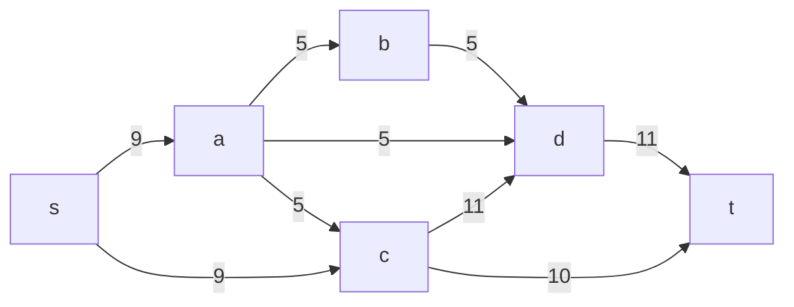
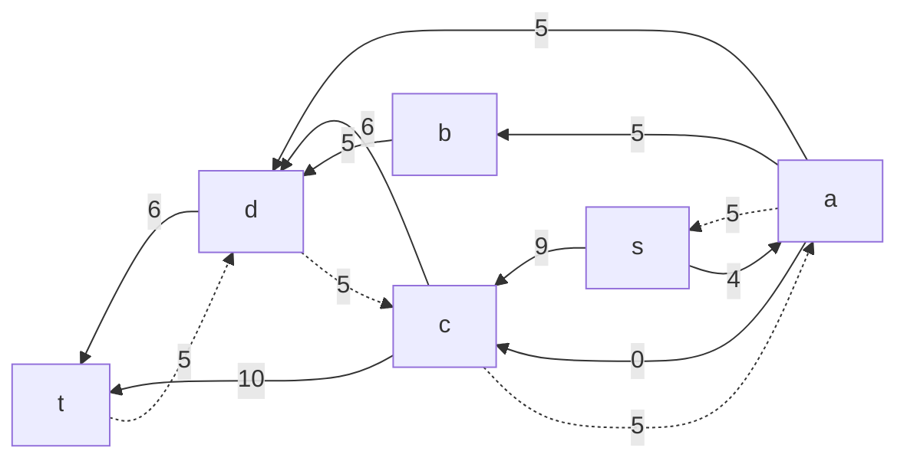
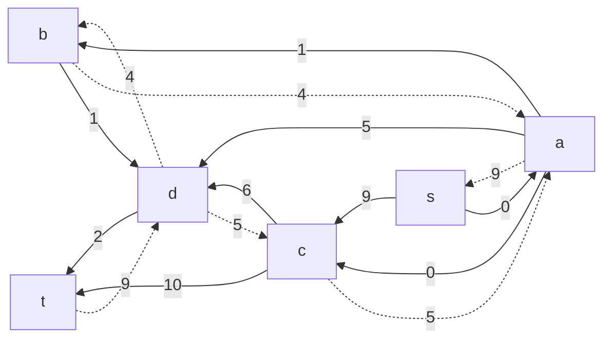
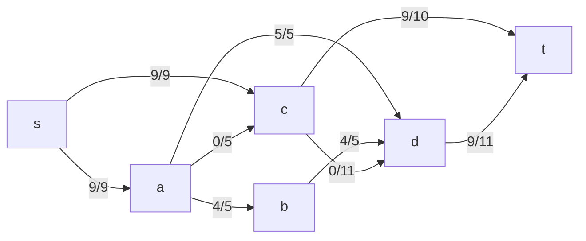

# Задача о максимальном потоке минимальной стоимости. Вариант 10

В данной задаче задана сеть с истоком **s** и стоком **t**. Для каждой дуги определены пропускная способность _p(e)_ и стоимость транспортировки единицы потока _c(e)_ согласно таблице:

| Дуга                   | sa | sc | ab | ad | ac | cd | bd | dt | ct |
|------------------------|:--:|:--:|:--:|:--:|:--:|:--:|:--:|:--:|:--:|
| Пропускная способность | 9  | 9  | 5  | 5  | 5  | 11 | 5  | 11 | 10 |
| Стоимость              | 3  | 3  | 3  | 6  | 3  | 8  | 3  | 1  | 11 |

Наша цель – найти максимальный поток минимальной стоимости.

---

## 1. Построение исходной сети

Запишем дуги сети с указанием пропускных способностей:

---

## 2. Задание начального потока и построение остаточной сети

### 2.1. Первое увеличение потока (Путь 1)

Проводим обратный поиск увеличивающего пути от стока к истоку. Рассмотрим обратный путь:

**Путь 1 (обратный):**  
_t → d → c → a → s_

Этот путь соответствует прямому пути: _s → a → c → d → t_.

Определяем резервы дуг (в исходной сети):
- **s → a:** резерв = 9  
- **a → c:** резерв = 5  
- **c → d:** резерв = 11  
- **d → t:** резерв = 11  

Минимальный резерв = **5**.  
Проводим увеличение потока на 5 единиц (в прямом направлении: _s → a → c → d → t_):

- _f(s→a) = 5_
- _f(a→c) = 5_
- _f(c→d) = 5_
- _f(d→t) = 5_

Формируем остаточную сеть. Напоминаем:
- Прямая дуга имеет остаточный резерв = _p(e) – f(e)_.
- Для каждой использованной дуги добавляем обратную дугу с резервом, равным величине потока, и стоимостью, противоположной стоимости прямой дуги.

Остаточная сеть после Путь 1:

---

## 3. Поиск увеличивающих путей в остаточной сети

### 3.1. Путь 2 (обратный): _t → d → b → a → s_

Этот обратный путь соответствует прямому пути: _s → a → b → d → t_.

Анализируем дуги (в прямом направлении):
- **s → a:** остаточный резерв = 4  
- **a → b:** резерв = 5  
- **b → d:** резерв = 5  
- **d → t:** резерв = 6  

Минимальный резерв = **4**.

Увеличиваем поток на 4 единицы (в прямом направлении):
- _f(s→a): 5 + 4 = 9_ (дуга теперь полностью насыщена)
- _f(a→b): 0 + 4 = 4_
- _f(b→d): 0 + 4 = 4_
- _f(d→t): 5 + 4 = 9_

Обновлённая остаточная сеть после Путь 2:

### 3.2. Путь 3 (обратный): _t → c → s_

Этот обратный путь соответствует прямому пути: _s → c → t_.

Проверяем дуги (в прямом направлении):
- **s → c:** остаточный резерв = 9  
- **c → t:** резерв = 10  

Минимальный резерв = **9**.

Увеличиваем поток на 9 единиц:
- _f(s→c): 0 + 9 = 9_
- _f(c→t): 0 + 9 = 9_

Обновляем остаточную сеть:
- Дуга _s→c_ становится насыщенной (9 – 9 = 0).
- Дуга _c→t_ имеет остаточный резерв = 10 - 9 = 1.
- Добавляем обратную дугу _t→c_ с резервом 9 и стоимостью –11.

Теперь суммарный поток из истока:
- Из **s**: _f(s→a)=9_ и _f(s→c)=9_, итого **18**.

Таким образом, максимальный поток равен **18**.

---

## 4. Итоговое распределение потока (до корректировки стоимости)

Локальные потоки по дугам исходной сети:

- **s → a:** 9 из 9  
- **s → c:** 9 из 9  
- **a → c:** 5 из 5  *(Путь 1)*  
- **a → b:** 4 из 5  
- **a → d:** 0 из 5  
- **b → d:** 4 из 5  
- **c → d:** 5 из 11  *(Путь 1)*  
- **c → t:** 9 из 10  
- **d → t:** 9 из 11  

Иллюстрация полученного потока:

---

## 5. Расчёт стоимости полученного максимального потока

Составляем таблицу для расчёта:

| Дуга                   | sa | sc | ab | ad | ac | cd | bd | dt | ct | Итого |
|------------------------|:--:|:--:|:--:|:--:|:--:|:--:|:--:|:--:|:--:|:-----:|
| Пропускная способность | 9  | 9  | 5  | 5  | 5  | 11 | 5  | 11 | 10 |       |
| Локальный поток f(e)   | 9  | 9  | 4  | 0  | 5  | 5  | 4  | 9  | 9  |  18   |
| Стоимость c(e)         | 3  | 3  | 3  | 6  | 3  | 8  | 3  | 1  | 11 |       |
| f(e)*c(e)             | 27 | 27 | 12 | 0  | 15 | 40 | 12 | 9  | 99 | **241** |

Суммарная стоимость = 27 + 27 + 12 + 0 + 15 + 40 + 12 + 9 + 99 = **241**.

---

## 6. Снижение стоимости потока (поиск отрицательного цикла)

Для уменьшения суммарной стоимости строим остаточную сеть с учетом стоимостей транспортировки:
- Прямые дуги имеют заданные стоимости.
- Обратные дуги имеют стоимости с противоположным знаком.

Найдем отрицательный цикл. Рассмотрим цикл:

**Цикл:** _c → a → d → c_

Анализ дуг цикла:
- **c → a:** обратная дуга к _a → c_. При _f(a→c)=5_ дуга _c → a_ имеет резерв 5 и стоимость **–3**.
- **a → d:** прямая дуга (не использована ранее); резерв = 5, стоимость = **+6**.
- **d → c:** обратная дуга к _c → d_. При _f(c→d)=5_ дуга _d → c_ имеет резерв 5 и стоимость **–8**.

Суммарная стоимость цикла = (–3) + 6 + (–8) = **–5** (отрицательная).  
Минимальный резерв на дугах цикла = min(5, 5, 5) = **5**.

Корректируем поток:
- По дуге _a → c:_ уменьшаем поток на 5: 5 – 5 = **0**.
- По дуге _a → d:_ увеличиваем поток на 5: 0 + 5 = **5**.
- По дуге _c → d:_ уменьшаем поток на 5: 5 – 5 = **0**.

Остальные потоки остаются без изменений.

---

## 7. Итоговое распределение потока после снижения стоимости

Новые локальные потоки по дугам исходной сети:

- **s → a:** 9 из 9  
- **s → c:** 9 из 9  
- **a → c:** 0 из 5  
- **a → b:** 4 из 5  
- **a → d:** 5 из 5  
- **b → d:** 4 из 5  
- **c → d:** 0 из 11  
- **c → t:** 9 из 10  
- **d → t:** 9 из 11  

Иллюстрация оптимального распределения потока:

---

## 8. Расчёт стоимости оптимального потока

Обновлённая таблица:

| Дуга                   | sa | sc | ab | ad | ac | cd | bd | dt | ct | Итого |
|------------------------|:--:|:--:|:--:|:--:|:--:|:--:|:--:|:--:|:--:|:-----:|
| Пропускная способность | 9  | 9  | 5  | 5  | 5  | 11 | 5  | 11 | 10 |       |
| Локальный поток f(e)   | 9  | 9  | 4  | 5  | 0  | 0  | 4  | 9  | 9  |  18   |
| Стоимость c(e)         | 3  | 3  | 3  | 6  | 3  | 8  | 3  | 1  | 11 |       |
| f(e)*c(e)             | 27 | 27 | 12 | 30 | 0  | 0  | 12 | 9  | 99 | **216** |

Новая суммарная стоимость = 27 + 27 + 12 + 30 + 0 + 0 + 12 + 9 + 99 = **216**.

---

## 9. Ответ

Максимальный поток в сети равен **18**, а минимальная суммарная стоимость данного потока составляет **216**. Это достигается при следующем распределении локальных потоков:

Таким образом, оптимальное распределение потока с минимальной стоимостью имеет величину **18** и суммарную стоимость **216**.
