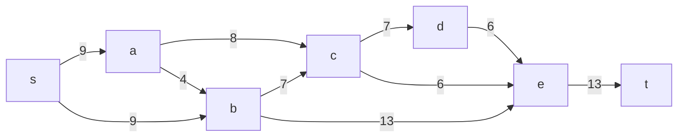
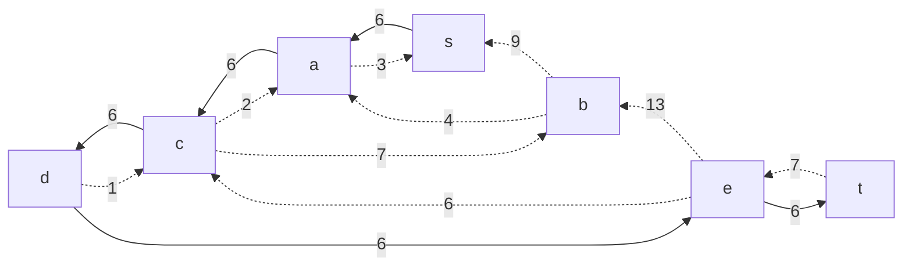
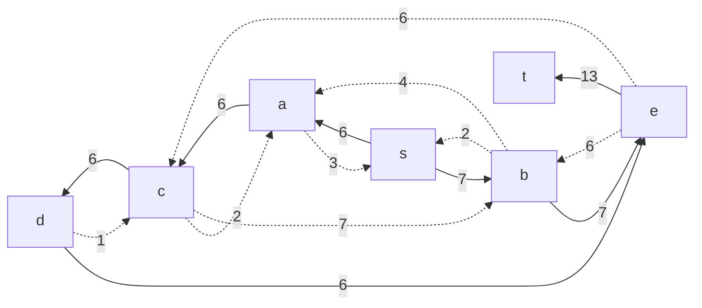
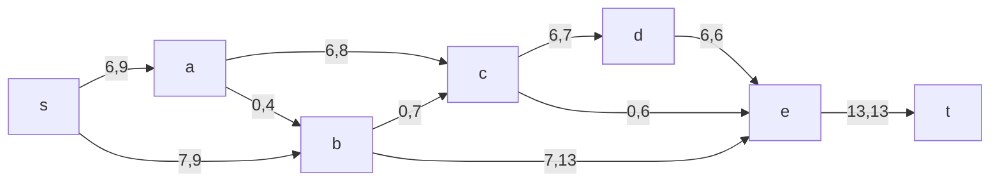
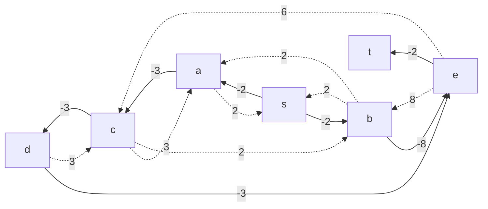
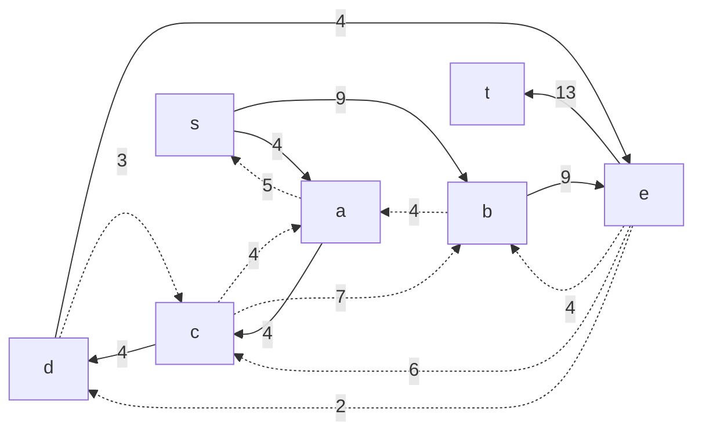
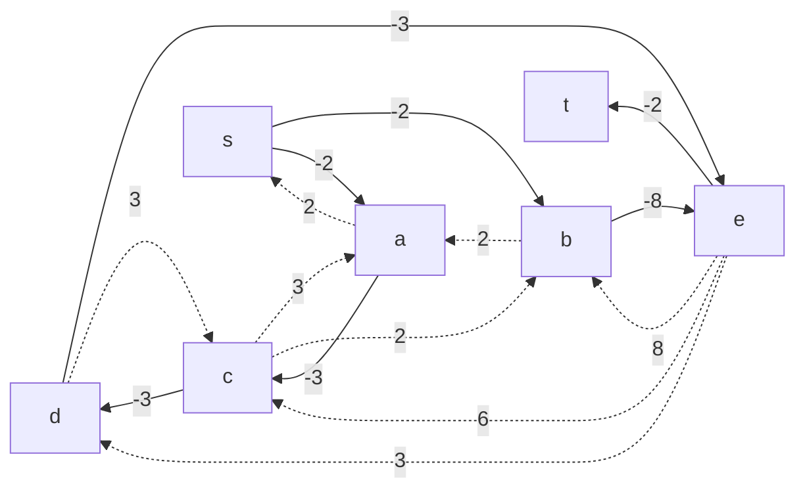
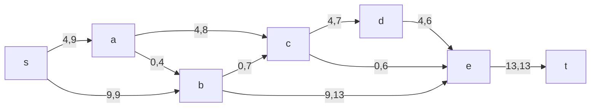

# Задание №10. Задача о максимальном потоке минимальной стоимости.
## Вариант 6

#### Пропускная способность дуг сети p(e) и стоимость транспортировки  единицы потока c(e):

| Дуги                      | sa | sb | ac | ab | bc | cd | de | ce | be | et |
|:--------------------------|:--:|:--:|:--:|:--:|:--:|:--:|:--:|:--:|:--:|:--:|
| Пропускная способность    | 9  | 9  | 8  | 4  | 7  | 7  | 6  | 6  | 13 | 13 |
| Стоимость транспортировки | 2  | 2  | 3  | 2  | 2  | 3  | 3  | 6  | 8  | 2  |

### 1. Построим сеть с источником **s**, стоком **t** и указанными пропускными способностями дуг для поиска максимального потока.

Укажем начальный поток величиной 6 **s -> a -> c -> d -> e -> t**. Построим соответствующую остаточную сеть.

### 2. Проведем поиск увеличивающего пути в остаточной сети
В остаточной сети найден увеличивающий путь t -> e -> b -> s. Минимальный вес дуг на этом пути равен 7.

Уменьшим вес дуг на найденном пути, дуги для которых вес стал нулевым удалим из остаточной сети.

### 3. Продолжим поиск увеличивающего пути в остаточной сети

В остаточной сети не найдено увеличивающих путей, следовательно, алгоритм завершил работу и найденный поток величиной 13 является максимальным для данной сети.

### 4. Рассчитаем стоимость полученного максимального потока.

| Дуги                                          | sa | sb | ac | ab | bc | cd | de | ce | be | et | Итого  |
|:----------------------------------------------|:--:|:--:|:--:|:--:|:--:|:--:|:--:|:--:|:--:|:--:|:------:|
| Пропускная способность p(e)                   | 9  | 9  | 8  | 4  | 7  | 7  | 6  | 6  | 13 | 13 |        |
| Локальный поток f(e)                          | 6  | 7  | 6  | 0  | 0  | 6  | 6  | 0  | 7  | 13 |        |
| Стоимость транспортировки единицы потока c(e) | 2  | 2  | 3  | 2  | 2  | 3  | 3  | 6  | 8  | 2  |        |
| Суммарная стоимость f(e)*c(e)                 | 12 | 14 | 18 | 0  | 0  | 18 | 18 | 0  | 56 | 26 | **162** |

Стоимость полученного потока составляет 162. 

### 5. Попробуем уменьшить стоимость потока для чего построим остаточную сеть.
Для каждого ребра остаточной сети укажем стоимость транспортировки единицы потока.

В остаточной сети найден ориентированный цикл отрицательной стоимости s -> a -> c -> d -> e -> b -> s (- 2 - 3 -3 -3 + 8 + 2 = -1). 

Найдем минимальный вес ребра в указанном цикле, изображенном **в остаточной сети с указанием величины потока**.  

Минимальный вес ребра в цикле 2 - это неиспользованный резерв ребра b -> s.

Удалим найденный цикл - уменьшим на 2 вес всех ребер, входящих в цикл.

### 6. Проведем повторный поиск цикла отрицательной стоимости в остаточной сети.
Скорректируем остаточную сеть с указанием стоимости транспортировки единицы потока.

В остаточной сети отсутствуют циклы отрицательной стоимости, следовательно, стоимость потока минимальна.

### 7. Рассчитаем стоимость полученного максимального потока.

| Дуги                                          | sa | sb | ac | ab | bc | cd | de | ce | be | et | Итого  |
|:----------------------------------------------|:--:|:--:|:--:|:--:|:--:|:--:|:--:|:--:|:--:|:--:|:------:|
| Пропускная способность p(e)                   | 9  | 9  | 8  | 4  | 7  | 7  | 6  | 6  | 13 | 13 |        |
| Локальный поток f(e)                          | 4  | 9  | 4  | 0  | 0  | 4  | 4  | 0  | 9  | 13 |        |
| Стоимость транспортировки единицы потока c(e) | 2  | 2  | 3  | 2  | 2  | 3  | 3  | 6  | 8  | 2  |        |
| Суммарная стоимость f(e)*c(e)                 | 8  | 18 | 12 | 0  | 0  | 12 | 12 | 0  | 72 | 26 | **160** |

Стоимость полученного потока составляет 160. 

### Ответ:
Максимальный поток в сети равен 13, минимальная стоимость потока 160, она реализуется следующим локальными потоками:

