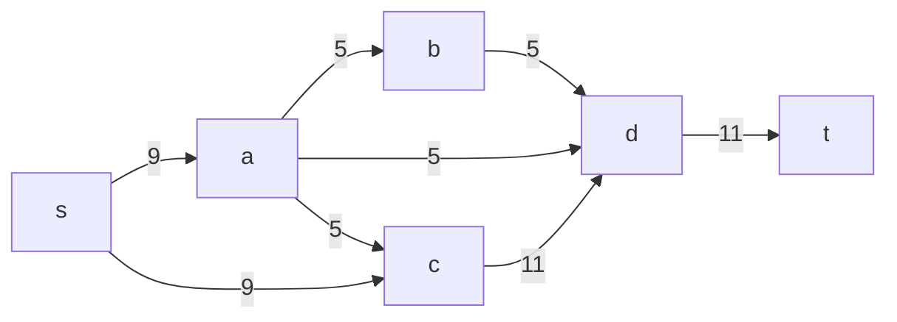
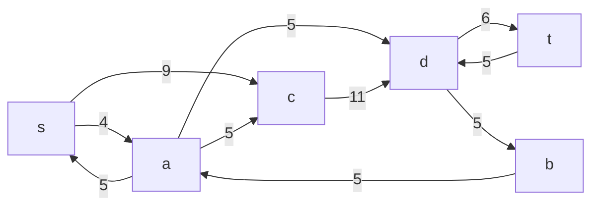
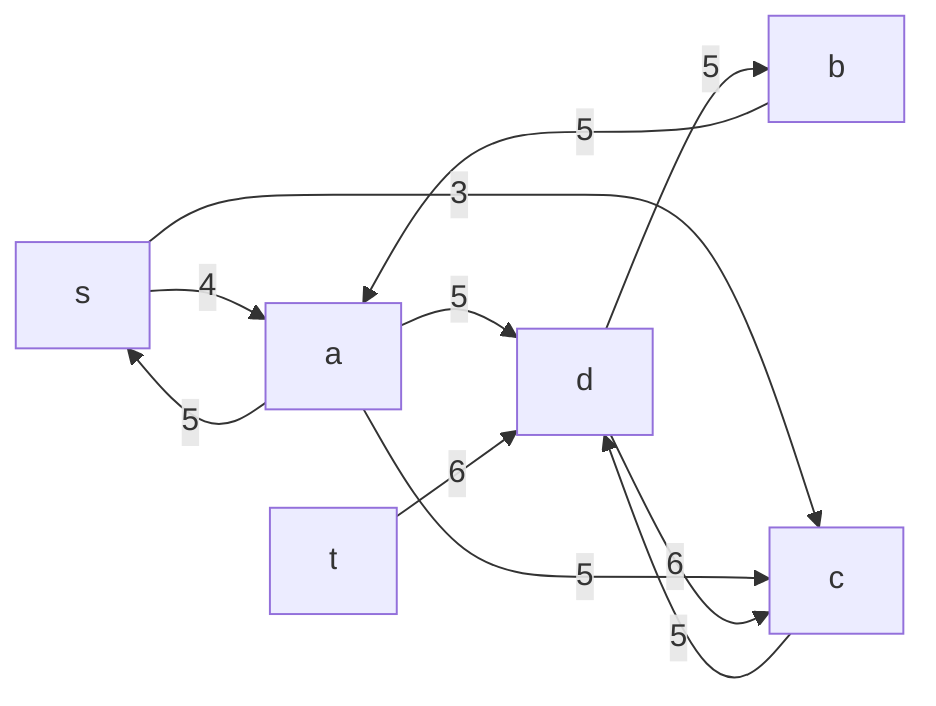
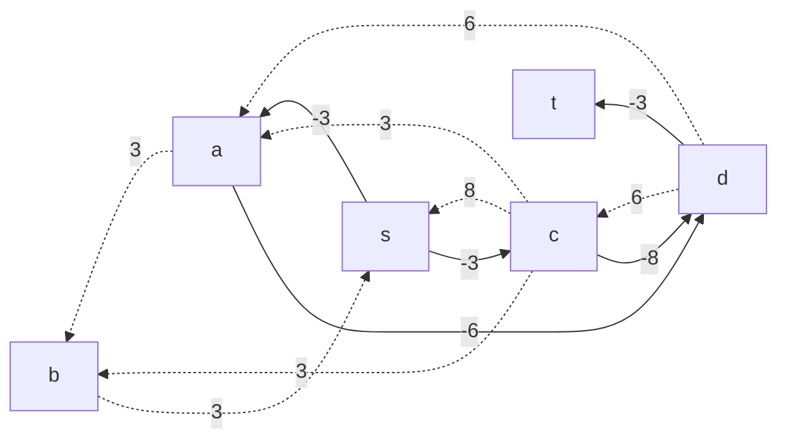
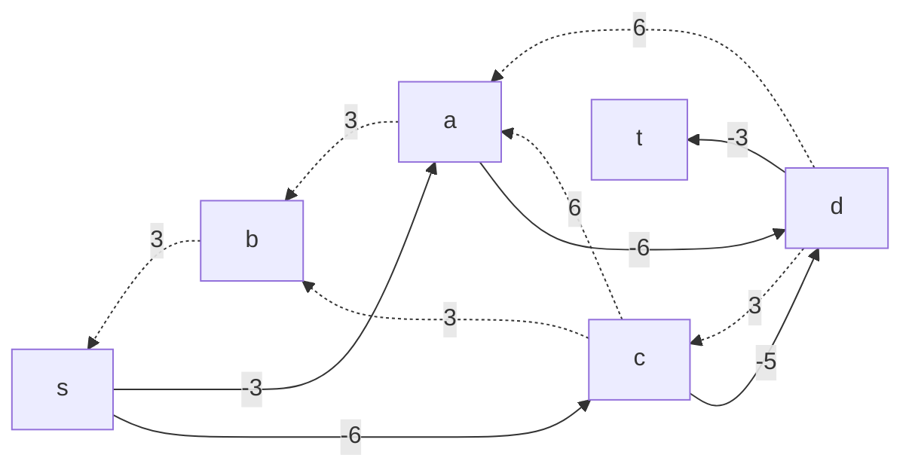
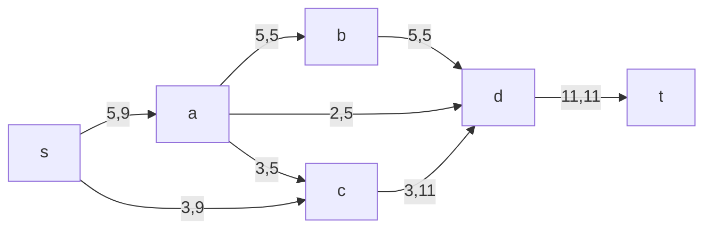

# Задание №10
### Постановка задачи

1. Дана сеть (взвешенный ориентированный граф) с источником \(s\) и стоком \(t\).  
2. Для каждой дуги определена пропускная способность \(p(e)\) и стоимость транспортировки \(c(e)\).  
3. Необходимо найти для указанной сети **максимальный поток** **минимальной стоимости**.

### Вариант 3

#### Пропускная способность дуг сети \(p(e)\) и стоимость транспортировки единицы потока \(c(e)\):

| Дуги | sa | sc | ab | ad | ac | cd | bd | dt |
|:----:|:--:|:--:|:--:|:--:|:--:|:--:|:--:|:--:|
| **Пропускная способность** | 9 | 9 | 5 | 5 | 5 | 11 | 5 | 11 |
| **Стоимость транспортировки** | 3 | 3 | 3 | 6 | 3 | 8 | 3 | 3  |

---

### 1. Построим сеть с источником \(s\), стоком \(t\) и указанными пропускными способностями дуг для поиска максимального потока

Укажем начальный поток величиной s -> a -> b -> d -> t. И построим соответствующую остаточную сеть.

### 2. Проведем поиск увеличивающего пути в остаточной сети

В остаточной сети находим увеличивающий путь s -> c -> d -> t. Минимальный вес дуг равен 6.

### 3. Продолжаем поиск увеличивающего пути в остаточной сети

В остаточной сети не найдено увеличивающих путей, следовательно, алгоритм завершил работу и найденный поток величиной 11 является максимальным для данной сети.

### 4. Рассчитаем стоимость полученного максимального потока

|          Дуги                                | sa | sc | ab | ad | ac | cd | bd | dt |  Итого  |
|:--------------------------------------------:|:--:|:--:|----|:--:|:--:|:--:|:--:|:--:|:-------:|
| **Пропускная способность**                   | 9  | 9  | 5  | 5  | 5  | 11 | 5  | 11 |         |
| **Локальный поток** f(e)              | 5  | 6  | 5  | 2  | 0  | 6  | 5  | 11 |         |
| **Стоимость транспортировки** c(e)   | 3  | 3  | 3  | 6  | 3  | 8  | 3  | 3  |         |
| **Суммарная стоимость** f(e)*c(e) | 15 | 18 | 15 | 12 | 0  | 48 | 15 | 33 | **156** |

Стоимость полученного потока составляет 158.

### 5. Попробуем уменьшить стоимость потока для чего построим остаточную сеть.

Для каждого ребра остаточной сети укажем стоимость транспортировки единицы потока.

В остаточной сети найден ориентированный цикл отрицательной стоимости s → a → d → c → s (-3 → -6 → -8 → -3 = -20). 

Найдем минимальный вес ребра в указанном цикле, изображенном **в остаточной сети с указанием величины потока**.

Минимальный вес ребра в цикле 3 - это неиспользованный резерв ребра c → s.  

Удалим найденный цикл - уменьшим на 3 вес всех ребер, входящих в цикл.

### 6. Проведем повторный поиск цикла отрицательной стоимости в остаточной сети.

Снова скорректируем остаточную сеть и проверим наличие новых циклов отрицательной стоимости.

В остаточной сети отсутствуют циклы отрицательной стоимости, следовательно, стоимость потока минимальна.

### 7. Рассчитаем стоимость полученного максимального потока.

|          Дуги                                | sa | sc | ab | ad | ac | cd | bd | dt |  Итого  |
|:--------------------------------------------:|:--:|:--:|----|:--:|:--:|:--:|:--:|:--:|:-------:|
| **Пропускная способность**                   | 9  | 9  | 5  | 5  | 5  | 11 | 5  | 11 |         |
| **Локальный поток** f(e)                     | 5  | 3  | 5  | 2  | 3  | 3  | 5  | 11 |         |
| **Стоимость транспортировки** c(e)           | 3  | 3  | 3  | 6  | 3  | 8  | 3  | 3  |         |
| **Суммарная стоимость** f(e)*c(e)            | 15 | 9  | 15 | 12 | 9  | 24 | 15 | 33 | **132** |

Стоимость полученного потока составляет 132. 

### **Ответ:**  
Максимальный поток в сети равен **11**, минимальная стоимость потока **132**, она реализуется следующими локальными потоками:

