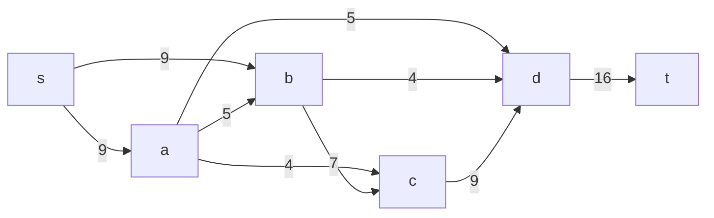
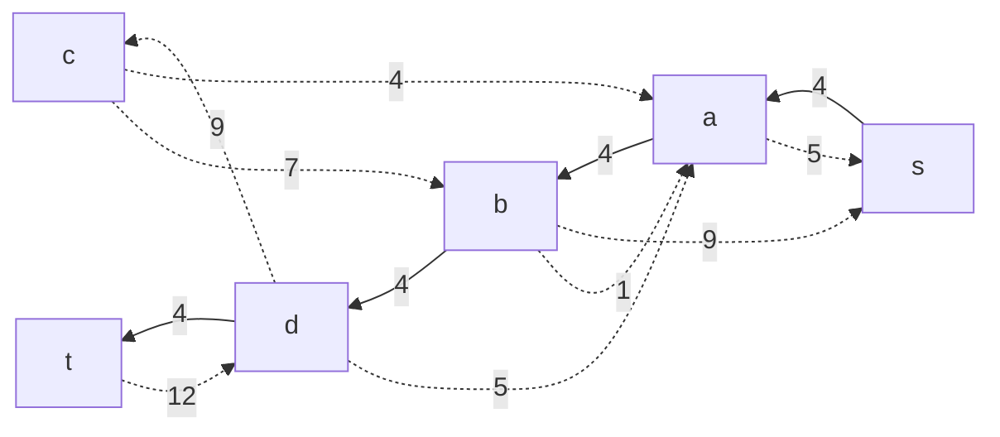
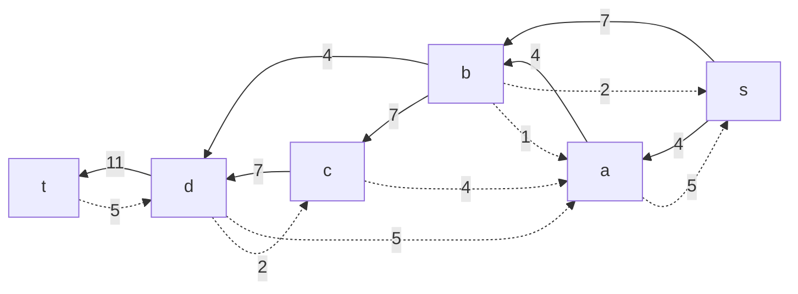
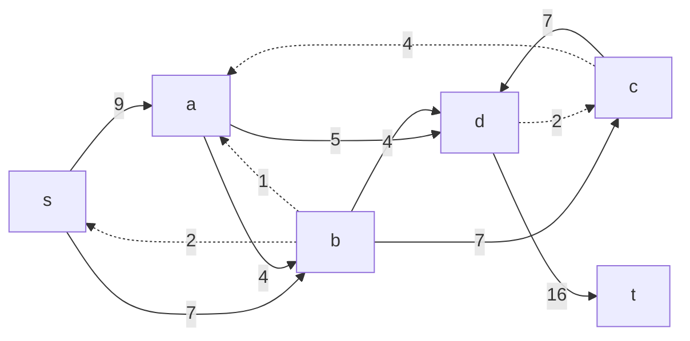
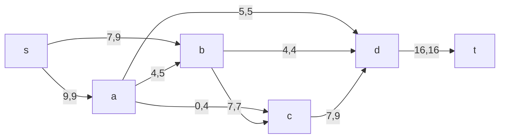
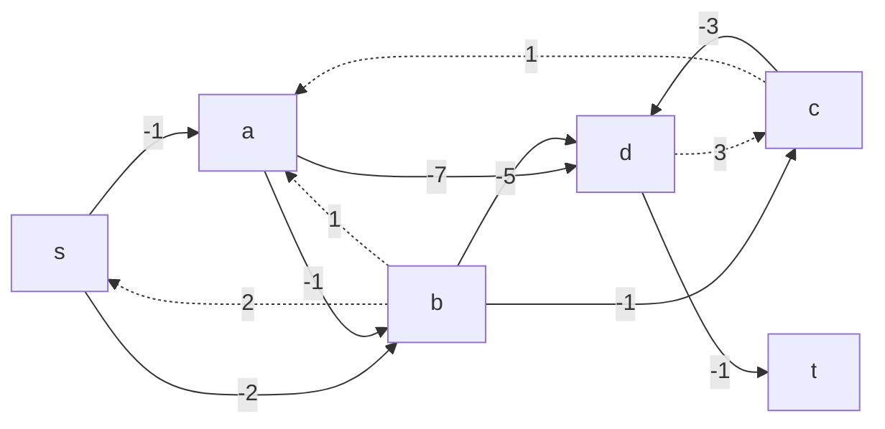
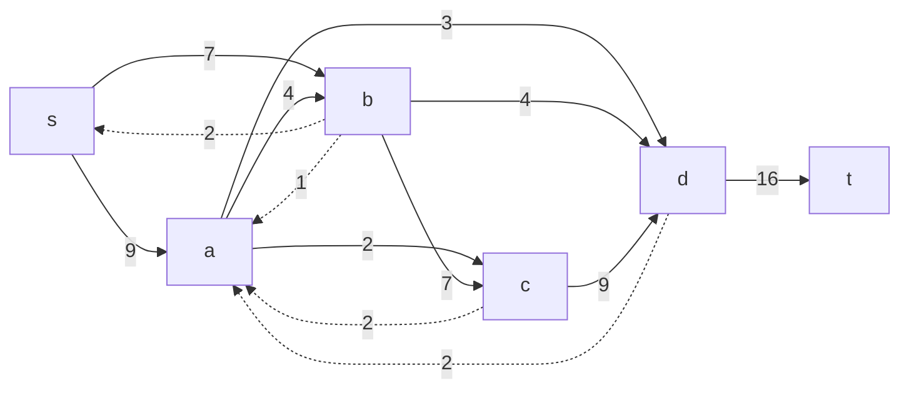
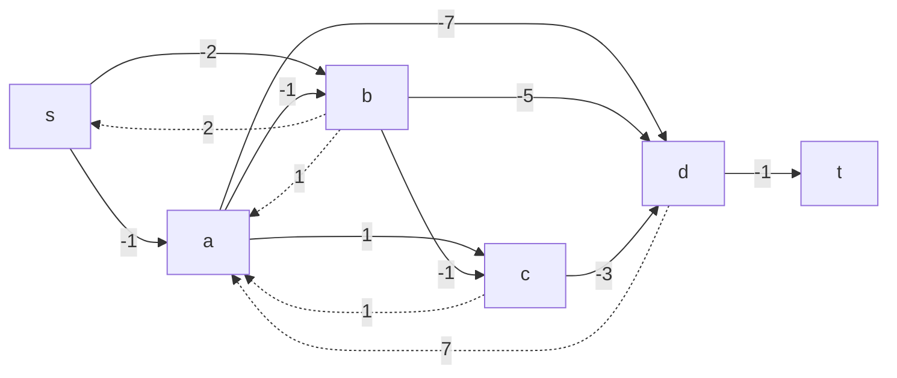
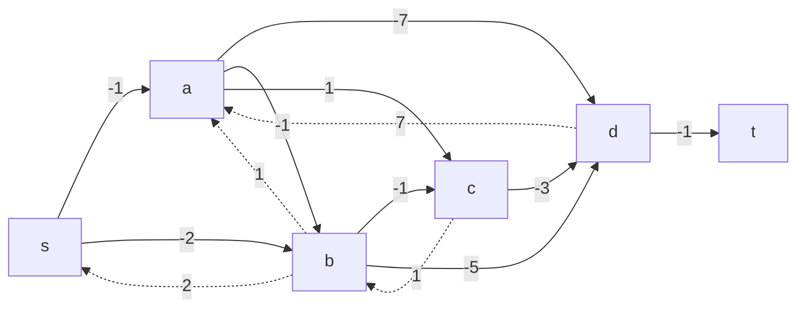

### Вариант 1:
#### Пропускная способность дуг сети p(e) и стоимость транспортировки единицы потока c(e):

| Дуги                      | sa  | sb  | ad  | ab  | ac  | bc  | bd  | cd  | dt  |
| :------------------------ | :-: | :-: | :-: | :-: | :-: | :-: | :-: | :-: | :-: |
| Пропускная способность    |  9  |  9  |  5  |  5  |  4  |  7  |  4  |  9  | 16  |
| Стоимость транспортировки |  1  |  2  |  7  |  1  |  1  |  1  |  5  |  3  |  1  |

#### 1. Построим сеть с источником **s**, стоком **t** и указанными пропускными способностями дуг для поиска максимального потока.

Укажем начальный поток величиной 4 **s $\rightarrow$ a $\rightarrow$ b $\rightarrow$ d $\rightarrow$ t**. Построим соответствующую остаточную сеть.

#### 2. Проведем поиск увеличивающего пути в остаточной сети
В остаточной сети найден увеличивающий путь **t $\rightarrow$ d $\rightarrow$ c $\rightarrow$ b $\rightarrow$ s**. Минимальный вес дуг на этом пути равен 7.

Уменьшим вес дуг на найденном пути, дуги для которых вес стал нулевым удалим из остаточной сети.

#### 3. Продолжим поиск увеличивающего пути в остаточной сети
В остаточной сети найден увеличивающий путь **t $\rightarrow$ d $\rightarrow$ a $\rightarrow$ s**. Минимальный вес дуг на этом пути равен 5.

Уменьшим вес дуг на найденном пути, дуги для которых вес стал нулевым удалим из остаточной сети.

#### 4. Продолжим поиск увеличивающего пути в остаточной сети

В остаточной сети не найдено увеличивающих путей, следовательно, алгоритм завершил работу и найденный поток величиной 16 является максимальным для данной сети.

#### 5. Рассчитаем стоимость полученного максимального потока.

| Дуги                                      | sa | sb | ad| ab| ac | bc| bd | cd | dt | Итого  |
|:------------------------------------------|:--:|:--:|:--:|:--:|:--:|:--:|:--:|:--:|:--:|:------:|
| Пропускная способность p(e)               |  9 |  9 |  5|  5|  4 |  7|  4 |  9 | 16 |   |
| Локальный поток f(e)                      |  9 |  7 |  5|  4|  0 |  7|  4 |  7 | 16 |   |
| Стоимость транспортировки единицы потока c(e) |  1 |  2 |  7|  1 |  1|  1 |  5 |  3 | 1 |   |
| Суммарная стоимость f(e)*c(e)             |  9 | 14 | 35|  4|  0 |  7| 20 | 21 | 16 |  *126*|

Стоимость полученного потока составляет 126 условных единиц. 

#### 6. Попробуем уменьшить стоимость потока для чего построим остаточную сеть.
Для каждого ребра остаточной сети укажем стоимость транспортировки единицы потока.

В остаточной сети найден ориентированный цикл отрицательной стоимости **a $\rightarrow$ d $\rightarrow$ c $\rightarrow$ a** ($-7 + 3 + 1 = -3$). 

Найдем минимальный вес ребра в указанном цикле, изображенном **в остаточной сети с указанием величины потока**.  

Минимальный вес ребра в цикле 2 - это неиспользованный резерв ребер c $\rightarrow$ d и a $\rightarrow$ c.

Удалим найденный цикл - уменьшим на 2 вес всех ребер, входящих в цикл.

#### 7. Проведем повторный поиск цикла отрицательной стоимости в остаточной сети.
Скорректируем остаточную сеть с указанием стоимости транспортировки единицы потока.

В остаточной сети найден ориентированный цикл отрицательной стоимости **b $\rightarrow$ c $\rightarrow$ a $\rightarrow$ b**  ($- 1 + 1 - 1 = -1$). 

Найдем минимальный вес ребра в указанном цикле, изображенном **в остаточной сети с указанием величины потока**.  

Минимальный вес ребра в цикле 2 - это неиспользованный резерв ребра a $\rightarrow$ c.

Удалим найденный цикл - уменьшим на 2 вес всех ребер, входящих в цикл.

#### 8. Проведем повторный поиск цикла отрицательной стоимости в остаточной сети.
Скорректируем остаточную сеть с указанием стоимости транспортировки единицы потока.

В остаточной сети отсутствуют циклы отрицательной стоимости, следовательно, стоимость потока минимальна.

#### 9. Рассчитаем стоимость полученного максимального потока.

| Дуги                                      | sa | sb | ad| ab| ac | bc| bd | cd | dt | Итого  |
|:------------------------------------------|:--:|:--:|:--:|:--:|:--:|:--:|:--:|:--:|:--:|:------:|
| Пропускная способность p(e)               |  9 |  9 |  5|  5|  4 |  7|  4 |  9 | 16 |   |
| Локальный поток f(e)                      |  9 |  7 |  3|  2|  4 |  5|  4 |  9 | 16 |   |
| Стоимость транспортировки единицы потока c(e)|1|  2 |  7|  1|  1 |  1|  5 |  3 | 1  |   |
| Суммарная стоимость f(e)*c(e)             |  9 | 14 | 21|  2|  4 |  5| 20 | 27 | 16 |*118*|

Стоимость полученного потока составляет 118. 

#### Ответ:
Максимальный поток в сети равен 16, минимальная стоимость потока 118, она реализуется следующим локальными потоками:

