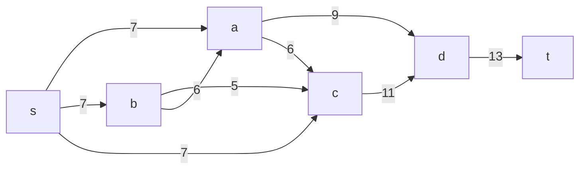
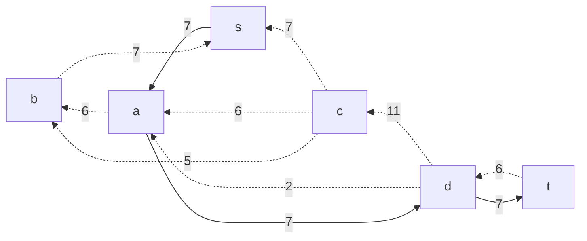
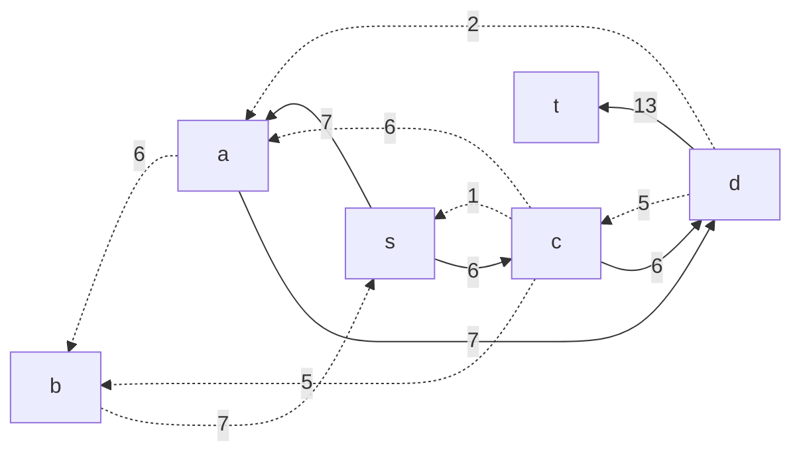
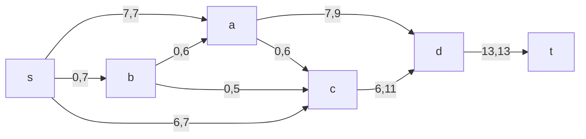
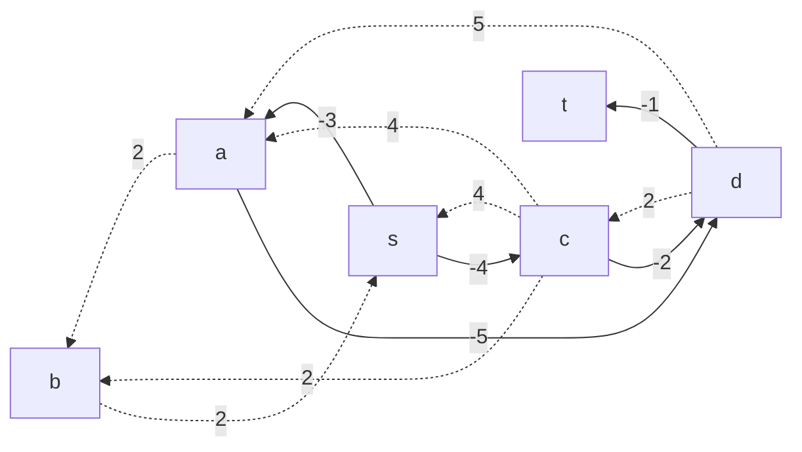
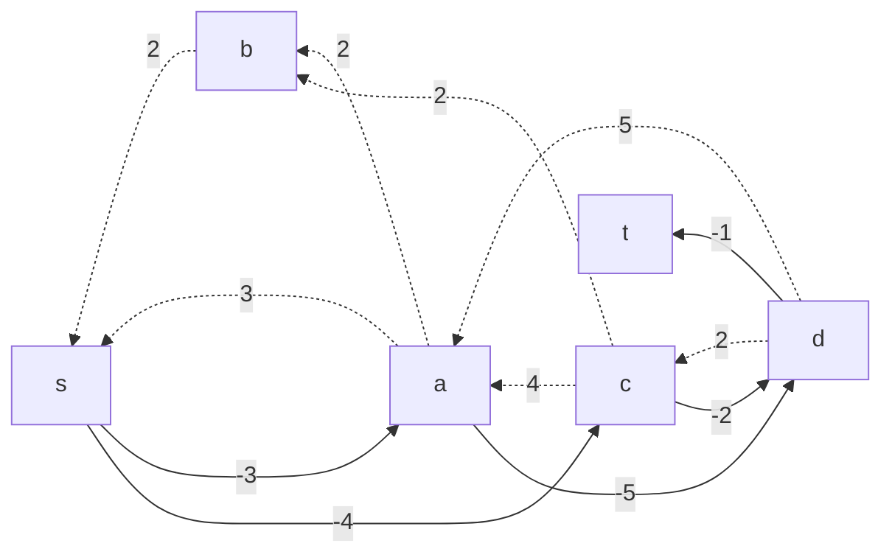
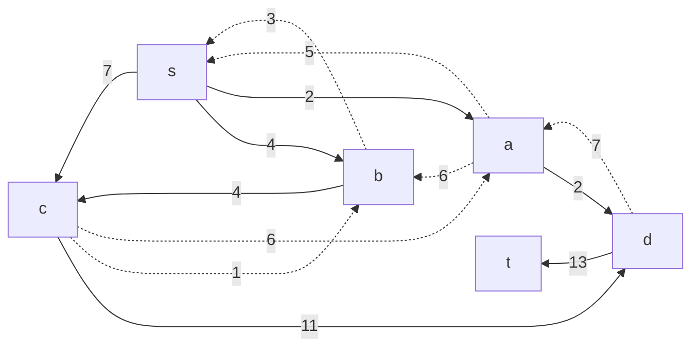
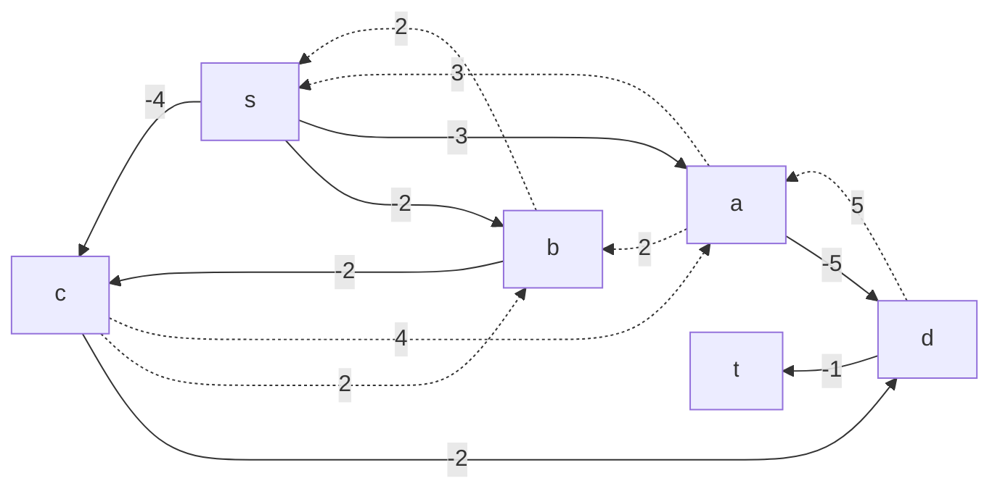
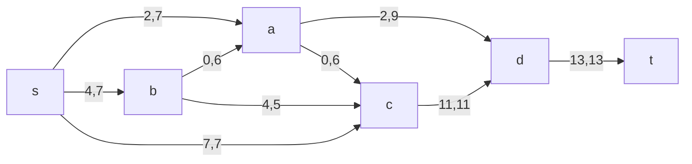

# Задание №10
# Задача о максимальном потоке минимальной стоимости.

## Постановка задачи
1. Дана сеть (взвешенный ориентированный граф) с источником s и стоком t.
2. Для каждой дуги определена пропускная способность и стоимость транспортировки.
3. Необходимо найти для указанной сети максимальный поток минимальной стоимости. 

### Вариант 4:
#### Пропускная способность дуг сети p(e) и стоимость транспортировки  единицы потока c(e):

|          Дуги             | sa | sb | sc | ba | bc | cd | ac | ad | dt |
|:-------------------------:|:--:|:--:|----|:--:|:--:|:--:|:--:|:--:|:--:|
| Пропускная способность    | 7  | 7  | 7  | 6  | 5  | 11 | 6  | 9  | 13 |
| Стоимость транспортировки | 3  | 2  | 4  | 2  | 2  | 2  | 4  | 5  | 1  |

### 1. Построим сеть с источником **s**, стоком **t** и указанными пропускными способностями дуг для поиска максимального потока.

Укажем начальный поток величиной 7 **s -> a -> d -> t**. Построим соответствующую остаточную сеть.

### 2. Проведем поиск увеличивающего пути в остаточной сети
В остаточной сети найден увеличивающий путь t -> d -> c -> s. Минимальный вес дуг на этом пути равен 6.

Уменьшим вес дуг на найденном пути, дуги для которых вес стал нулевым удалим из остаточной сети.

### 3. Продолжим поиск увеличивающего пути в остаточной сети

В остаточной сети не найдено увеличивающих путей, следовательно, алгоритм завершил работу и найденный поток величиной 10 является максимальным для данной сети.

### 5. Рассчитаем стоимость полученного максимального потока.

|          Дуги                                | sa | sb | sc | ba | bc | cd | ac | ad | dt |  Итого  |
|:--------------------------------------------:|:--:|:--:|----|:--:|:--:|:--:|:--:|:--:|:--:|:-------:|
| Пропускная способность                        | 7 | 7  | 7  | 6  | 5  | 11 | 6  | 9  | 13 |         |
| Локальный поток f(e)                          | 7  | 0  | 6  | 0  | 0  | 6  | 0 | 7  | 13 |         |
| Стоимость транспортировки                     | 3  | 2  | 4  | 2  | 2  | 2  | 4  | 5 | 1  |         |
| Суммарная стоимость f(e)*c(e)                 | 21 | 0  | 24 | 0  | 0  | 12 | 0  | 35| 13 | **105** |

Стоимость полученного потока составляет 105. 

### 6. Попробуем уменьшить стоимость потока для чего построим остаточную сеть.
Для каждого ребра остаточной сети укажем стоимость транспортировки единицы потока.

В остаточной сети найден ориентированный цикл отрицательной стоимости s -> a -> d -> c -> s (- 3 - 5 + 2 + 4 = -2). 

Найдем минимальный вес ребра в указанном цикле, изображенном **в остаточной сети с указанием величины потока**.  

Минимальный вес ребра в цикле 1 - это неиспользованный резерв ребра c -> S.

Удалим найденный цикл - уменьшим на 2 вес всех ребер, входящих в цикл.

### 6. Проведем повторный поиск цикла отрицательной стоимости в остаточной сети.
Скорректируем остаточную сеть с указанием стоимости транспортировки единицы потока.

В остаточной сети найден ориентированный цикл отрицательной стоимости s -> a -> d -> c -> b -> s (- 3 - 5 + 2 + 2 + 2 = -2). 

Найдем минимальный вес ребра в указанном цикле, изображенном **в остаточной сети с указанием величины потока**.  

Минимальный вес ребра в цикле 4 - это неиспользованный резерв ребер d -> c.

Удалим найденный цикл - уменьшим на 2 вес всех ребер, входящих в цикл.

### 7. Проведем повторный поиск цикла отрицательной стоимости в остаточной сети.
Скорректируем остаточную сеть с указанием стоимости транспортировки единицы потока.

В остаточной сети отсутствуют циклы отрицательной стоимости, следовательно, стоимость потока минимальна.

### 8. Рассчитаем стоимость полученного максимального потока.

|          Дуги                                | sa | sb | sc | ba | bc | cd | ac | ad | dt |  Итого  |
|:--------------------------------------------:|:--:|:--:|----|:--:|:--:|:--:|:--:|:--:|:--:|:-------:|
| Пропускная способность                       | 7   | 7  | 7  | 6  | 5  | 11 | 6  | 9  | 13|         |
| Локальный поток f(e)                         |  2  | 4  | 7  | 0  | 4  | 11 | 0  | 2 | 13 |         |
| Стоимость транспортировки                    |  3  | 2  | 4  | 2  | 2  | 2  | 4  | 5 | 1  |         |
| Суммарная стоимость f(e)*c(e)                |   6 | 8  | 28 | 0  | 8  | 22 | 0  | 10| 13 | **95**  |

Стоимость полученного потока составляет 95. 

### Ответ:
Максимальный поток в сети равен 13, минимальная стоимость потока 95, она реализуется следующим локальными потоками:

