# Вариант 1:

## Постановка задачи

Два завода имеют производительность 5 и 9, а два складских помещения имеют вместимость 7 и 5. Матрица затрат на перевозку одной единицы товара (строки – это заводы, столбцы – это склады) имеет вид:

$$
 \begin{pmatrix}    
  6 & 9 \\ 
  7 & 6 \\ 
 \end{pmatrix}    
$$

Требуется:
1. Найти стоимость перевозки с первого завода на второй склад 5 единиц товара, а со второго завода на первый склад 7 единиц товара:
2. Используя алгоритм поиска максимального потока минимальной стоимости, скорректировать указанный выше вариант перевозки товаров, так чтобы объём перевозимых товаров не изменился, а стоимость их перевозки стала минимальной.

## Решение: 

**Введем обозначения:**
Пусть два завода A и B имеют производительность 5 и 9, соответственно, два склада I и II имеют вместимость 7 и 5.

### Пункт №1:

1. Стоимость перевозки с A на II 5 ед. товара = 9*5 = 45
2. Стоимость перевозки с B на I 7 ед. товара = 7*7 = 49
3. Общая стоимость перевозки указанного количества товаров по указанным маршрутам = 45+49 = 94

### Пункт №2:

Транспортная задача решается при помощи алгоритма поиска максимального потока минимальной стоимости, то есть решение задачи можно представить в формате графа, вершинами которого будут являться заводы и склады, а ребрами - транспортировки товаров между ними. 

#### Шаг №1

Так как необходимо скорректировать указанный во втором пункте вариант, то можем по имеющимся данным построить сеть и при этом добавим эффективные вершины S и T.

Стоимость перевозок связанных с этими вершинами = 0.

Стоит отметить, что пропускная способность дуг, входящих в вершины заводов = производительности этих заводов, а пропускная способность дуг, входящих в склады = вместительности этих складов, а локальные потоки.

**Сеть по исходным данным задачи:**
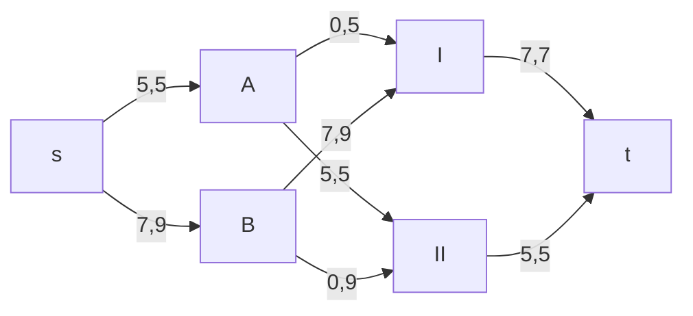

#### Шаг №2

Для нахождения максимального потока минимальной стоимости необходимо построить остаточную сеть:
**Остаточная сеть с указанием величины потока**

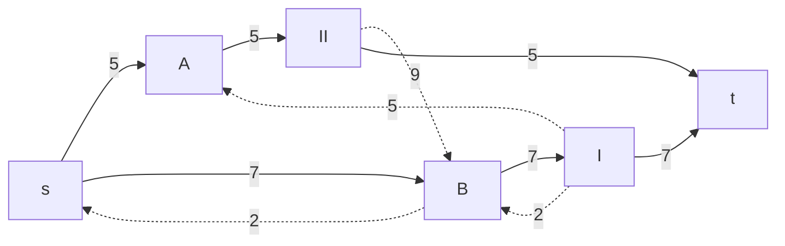

Для каждого ребра остаточной сети укажем стоимость транспортировки единицы товара.

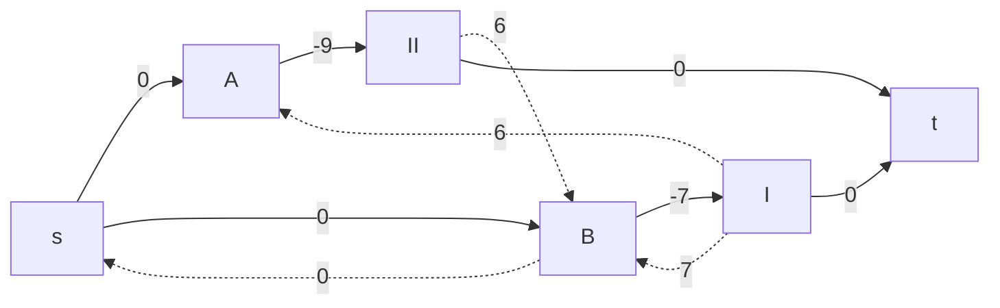

В остаточной сети найден ориентированный цикл отрицательной стоимости **s $\rightarrow$ A $\rightarrow$ II $\rightarrow$ B $\rightarrow$ s** ($0 - 9 + 6 + 0 = -3$). 
Найдем минимальный вес ребра в указанном цикле, изображенном **в остаточной сети с указанием величины потока**. 

Минимальный вес ребра в цикле 2 - это неиспользованный резерв ребра B $\rightarrow$ s.

#### Шаг №3

Перераспределяем на дугах в цикле потоки между локальными и резервными, для этого удалим найденный цикл - уменьшим на 2 вес всех ребер, входящих в цикл, таким образом новая остаточная сеть с локальными потоками:

**Остаточная сеть с указанием величины потока**:

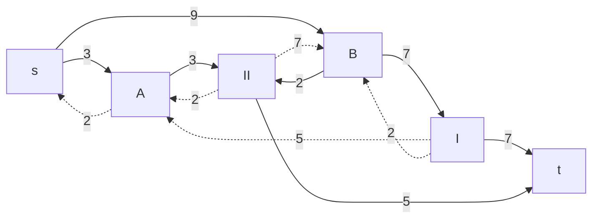

Для каждого ребра остаточной сети укажем стоимость транспортировки единицы товара.

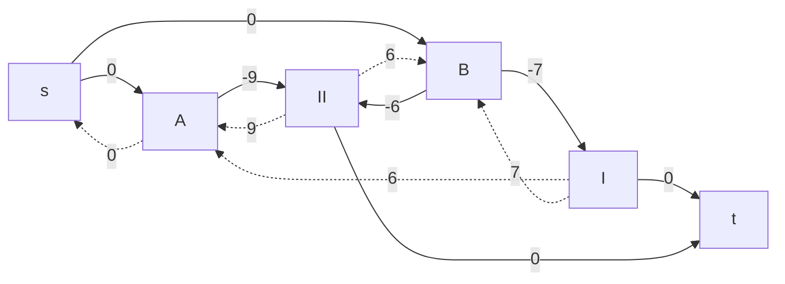

В остаточной сети найден ориентированный цикл отрицательной стоимости **s $\rightarrow$ B $\rightarrow$ I $\rightarrow$ A $\rightarrow$ s** ($0 - 7 + 6 + 0 = -1$). 
Найдем минимальный вес ребра в указанном цикле, изображенном **в остаточной сети с указанием величины потока**. 

Минимальный вес ребра в цикле 2 - это неиспользованный резерв ребра A $\rightarrow$ s.

#### Шаг №4

Перераспределяем на дугах в цикле потоки между локальными и резервными, для этого удалим найденный цикл - уменьшим на 2 вес всех ребер, входящих в цикл, таким образом новая остаточная сеть с локальными потоками:

**Остаточная сеть с указанием величины потока**:

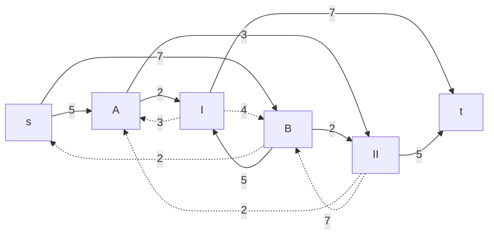

Для каждого ребра остаточной сети укажем стоимость транспортировки единицы товара.

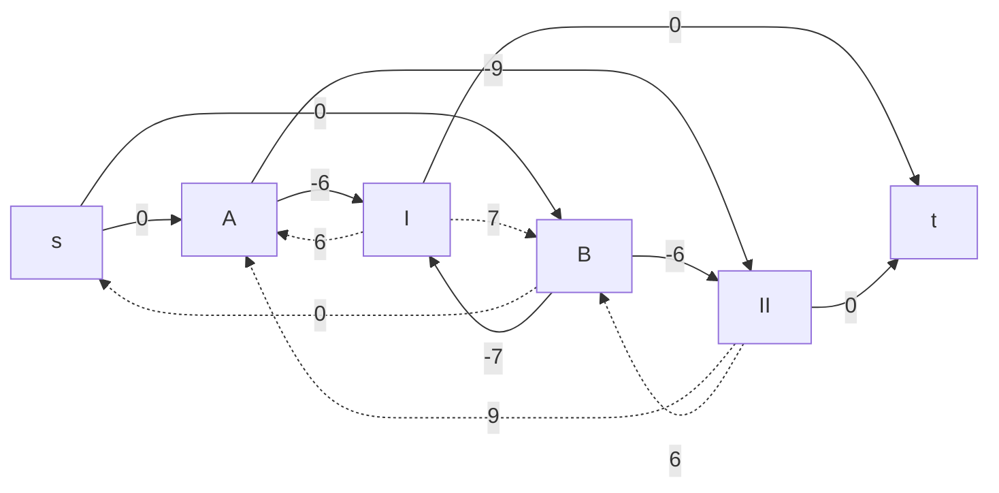
В остаточной сети найден ориентированный цикл отрицательной стоимости **A $\rightarrow$ II $\rightarrow$ B $\rightarrow$ I $\rightarrow$ A** ($-9 + 6 - 7 + 6 = -4$). 
Найдем минимальный вес ребра в указанном цикле, изображенном **в остаточной сети с указанием величины потока**. 

Минимальный вес ребра в цикле 3 - это неиспользованный резерв ребер A $\rightarrow$ II и I $\rightarrow$ A. 

#### Шаг №5

Перераспределяем на дугах в цикле потоки между локальными и резервными, для этого удалим найденный цикл - уменьшим на 3 вес всех ребер, входящих в цикл, таким образом новая остаточная сеть с локальными потоками:

**Остаточная сеть с указанием величины потока**:

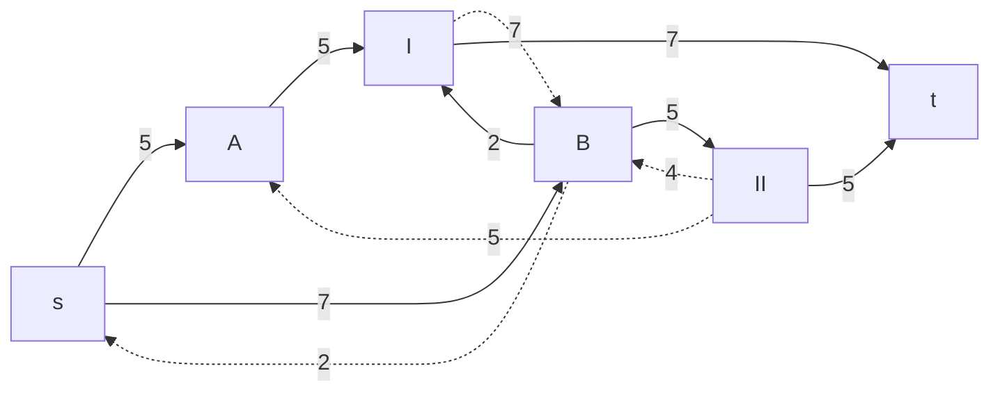

Для каждого ребра остаточной сети укажем стоимость транспортировки единицы товара.

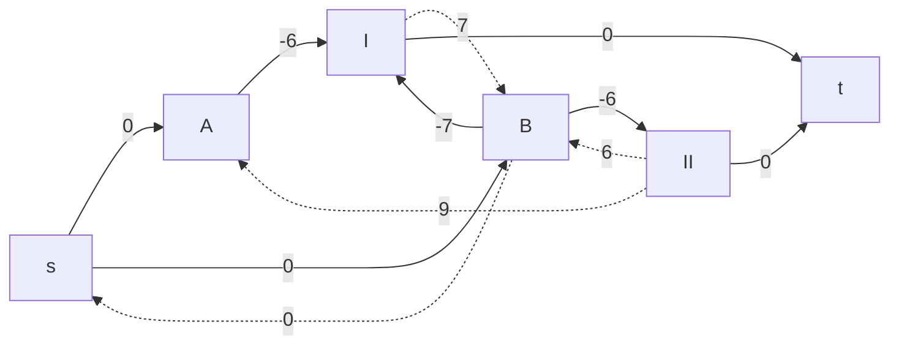

В остаточной сети отсутствуют циклы отрицательной стоимости, следовательно, стоимость потока минимальна.

#### Шаг №6 

По итогу получили перераспределенный максимальный поток в сети:

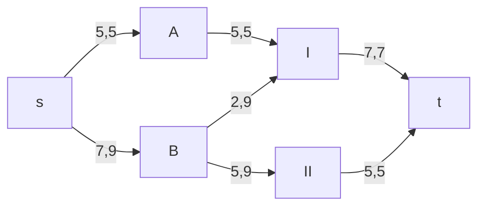
Таким образом, для перевозки 5 единиц товара на склад II с завода A и 7 единиц товара на склад I с завода B, необходимо на склад I перевезти 5 единиц товара с завода A и 2 единицы товара с завода B, а на склад II – 5 единиц товара с завода B. 

#### Итог: 

Граф транспортировки для склада I: 

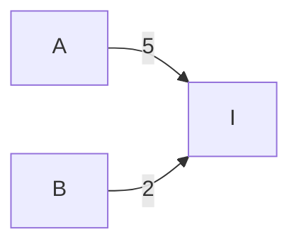

Граф транспортировки для склада II: 

**Новая стоимость перевозки:**

1. На склад I: 5 * 6 + 2 * 7 = 44
2. На склад II: 5 * 6 = 30
3. Итоговая стоимость = 30+44= 74

## Ответ: 

1. 94
2. 74 , на I склад 5 товаров из A и 2 товара из B, на II склад 5 товаров из B.