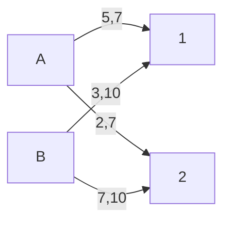
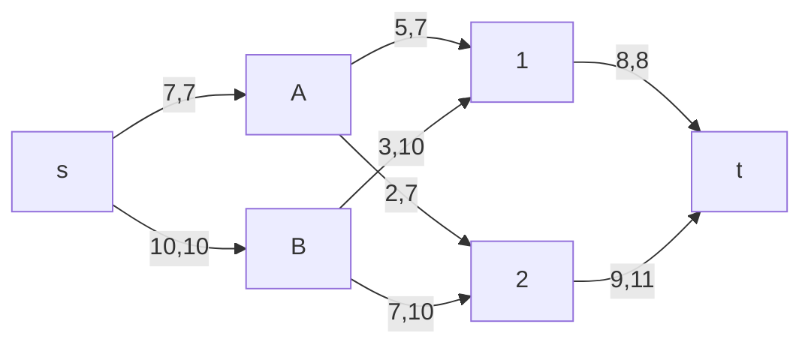
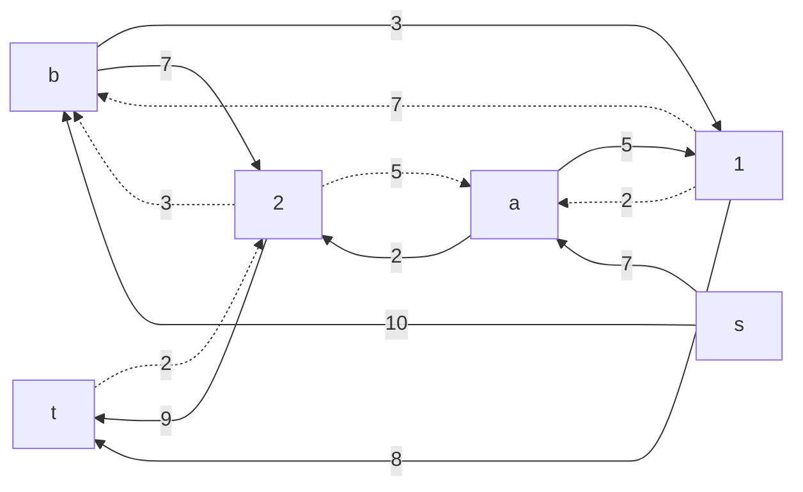
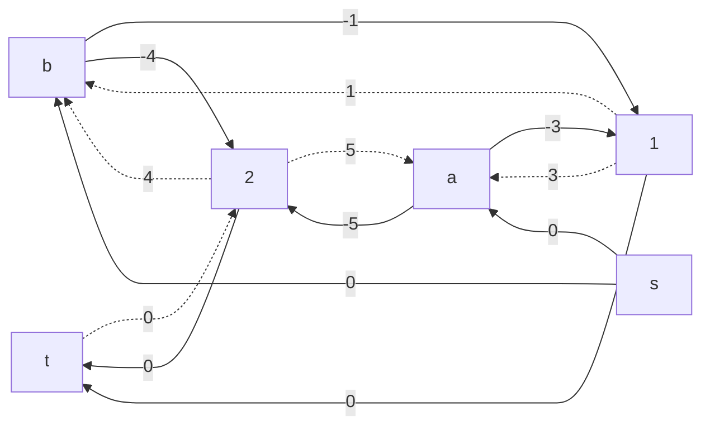
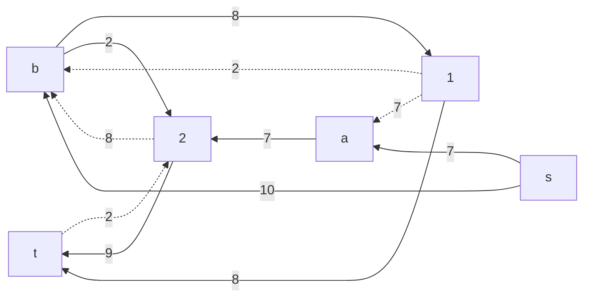
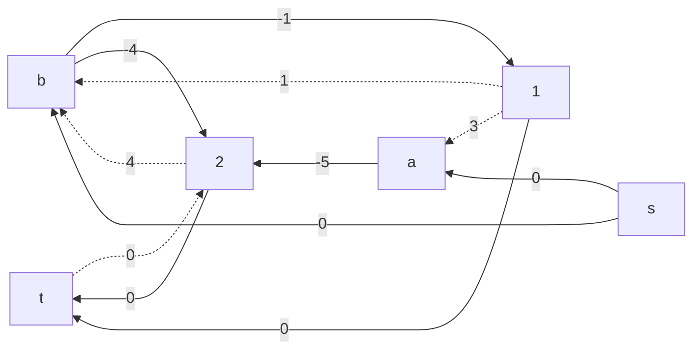
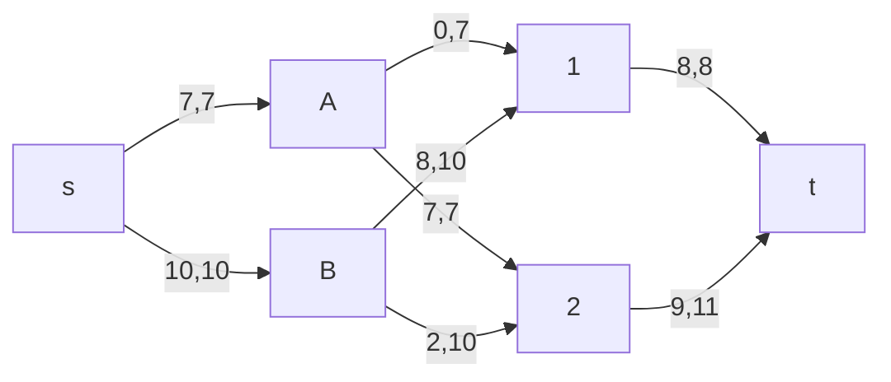

## Транспортная задача
### Вариант 3:

Два завода имеют производительность 7 и 10, а два складских помещения имеют вместимость 8 и 11. Матрица затрат на перевозку одной единицы товара (строки – это заводы, столбцы – это склады) имеет вид:

$$
 \begin{pmatrix}    
  3 & 5 \\ 
  1 & 4 \\ 
 \end{pmatrix}    
$$

Требуется:
1. Найти стоимость перевозки с первого завода на первый склад 7 единиц товара, а со второго завода на второй склад 8 единиц товара;
2. Используя алгоритм поиска максимального потока минимальной стоимости, скорректировать указанный выше вариант перевозки товаров, так чтобы объём перевозимых товаров не изменился, а стоимость их перевозки стала минимальной.

Рассмотрим произвольный вариант доставки всей продукции и вычислим его стоимость. стоимость. Пусть, например, с завода А на первый склад доставляется 5 единиц продукции, а на второй - 2 единицы; с завода В на первый склад - 3 единицы продукции, а на второй склад - 7 единиц продукции. 

Изобразим в виде двудольного графа:

### 1. Добавим в полученный двудольный граф источник s и сток t.

На дугах сети указаны пары чисел, где первое число - локальный поток, второе число - пропускная способность. Локальный поток в данном случае был выбран ранее наугад. Он является максимальным, т.к. все дуги, выходящие из источника, являются насыщенными.

### 2. Рассчитаем стоимость полученного максимального потока.

|          Дуги            | sa | sb | a1 | a2 | b1 | b2 | 1t | 2t |  Итого  |
|:------------------------:|:--:|:--:|----|:--:|:--:|:--:|:--:|:--:|:-------:|
| Пропускная способность   | 7  | 10 | 7  | 7  | 10 | 10 | 8  | 11 |         |
| Локальный поток f(e)     | 7  | 10 | 5  | 2  | 3  | 7  | 8  |  9 |         |
| Стоимость транспортировки| 0  | 0  | 3  | 5  | 1  | 4  | 0  | 0  |         |
| Суммарная стоимость f(e)*c(e) | 0 | 0 | 15 | 10 | 3  | 28 | 0  | 0| **56** |

Стоимость полученного потока составляет 56. 

### 3. Попробуем уменьшить стоимость потока для чего построим остаточную сеть.
Остаточная сеть:

Для каждого ребра остаточной сети укажем стоимость транспортировки единицы потока.

В остаточной сети найден ориентированный цикл отрицательной стоимости a -> 1 -> b -> 2 -> a (- 3 + 1 - 4 + 5 = -1). 

Найдем минимальный вес ребра в указанном цикле, изображенном **в остаточной сети с указанием величины потока**.  

Минимальный вес ребра в цикле 5 - это неиспользованный резерв ребра a -> 1.

Удалим найденный цикл - уменьшим на 5 вес всех ребер, входящих в цикл.

### 4. Проведем повторный поиск цикла отрицательной стоимости в остаточной сети.
Скорректируем остаточную сеть с указанием стоимости транспортировки единицы потока.

В остаточной сети отсутствуют циклы отрицательной стоимости, следовательно, стоимость потока минимальна. 

### 5. Рассчитаем стоимость полученного максимального потока.

|          Дуги            | sa | sb | a1 | a2 | b1 | b2 | 1t | 2t |  Итого  |
|:------------------------:|:--:|:--:|----|:--:|:--:|:--:|:--:|:--:|:-------:|
| Пропускная способность   | 7  | 10 | 7  | 7  | 10 | 10 | 8  | 11 |         |
| Локальный поток f(e)     | 7  | 10 | 0  | 7  | 8  | 2  | 8  |  9 |         |
| Стоимость транспортировки| 0  | 0  | 3  | 5  | 1  | 4  | 0  | 0  |         |
| Суммарная стоимость f(e)*c(e) | 0 | 0 | 0 | 35 | 8  | 8 | 0  | 0| **51** |

Стоимость полученного потока составляет 51. 

### Ответ:
Максимальный поток в сети равен 10, минимальная стоимость потока 51, она реализуется следующим локальными потоками:

