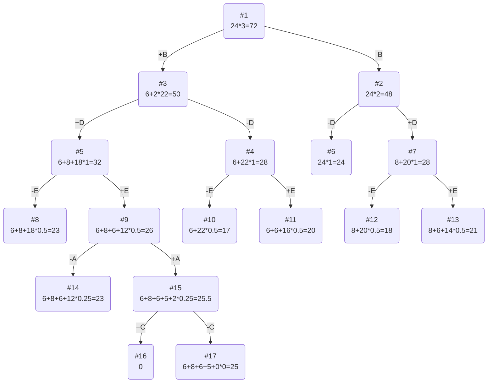

# Задание №11
# Задача о рюкзаке (Knapsack problem). Метод ветвей и границ.

## Задание
Для каждого варианта представлены условия задачи, в соответствии с которыми необходимо: 
1. Решить задачу о рюкзаке с применением метода ветвей и границ.
2. Оформить решение задачи по шагам с подробными комментариями, таблицами и диаграммами.
3. В ответе указать:
   - максимально возможную стоимость предметов в рюкзаке,
   - набор предметов, обеспечивающих максимальную стоимость,
   - общий вес предметов в рюкзаке,
   - свободное место в рюкзаке.

## Постановка задачи
Задача о рюкзаке (англ. Knapsack problem) — дано N предметов, ni предмет имеет массу wi > 0 и стоимость pi > 0. Необходимо выбрать из этих предметов такой набор, чтобы суммарная масса не превосходила заданной величины W (вместимость рюкзака), а суммарная стоимость была максимальна. 

## Вариант №9
## Условия задачи

| Предметы  |  A  | B  | C  | D  | E  |
|:----------|:---:|:--:|:--:|:--:|:--:|
| Стоимость |  5  | 6  | 3  | 8  | 6  |
| Вес       |  10 | 2  | 12 | 4  | 6  |

Ограничение вместимости: 24

## Решение
### Рассчитаем ценность каждого предмета

| Предметы  |  A  | B  | C  | D  | E  |
|:----------|:---:|:--:|:--:|:--:|:--:|
| Стоимость |  5  | 6  | 3  | 8  | 6  |
| Вес       |  10 | 2  | 12 | 4  | 6  |
| Ценность  |  1/2| 3  | 1/4| 2  | 1  |

### Отсортируем предметы по убыванию ценности

| Предметы  |  B  | D  | E  | A  | C  |
|:----------|:---:|:--:|:--:|:--:|:--:|
| Стоимость |  6  | 8  | 6  | 5  | 3  |
| Вес       |  2  | 4  | 6  | 10 | 12 |
| Ценность  |  3  | 2  | 1  | 1/2| 1/4|

### Рассчитаем оценку сверху для пустого рюкзака

Свободное место в рюкзаке: 24

Наибольшая ценность предмета: 3

Оценка сверху для пустого рюкзака: 24 * 3 = 72

### Найдем решение задачи с использованием метода ветвей и границ

Условимся среди вершин с одинаковой оценкой выбирать для ветвления первую слева-направо (самую левую).

Проведем ветвление на 2 узла (берем/не берем предмет B) из единственной вершины #1 и оценим верхнюю границу для новых вершин:
- -B (#2) = 24*2 = 48
- +B (#3) = 6 + 22*2 = 50

Проведем ветвление на 2 узла (берем/не берем предмет D) из вершины с наибольшей оценкой (#3) и оценим верхнюю границу для новых вершин:
- +D (#5) 6+8+18*1 = 32
- -D (#4) 6 + 22*1 = 28

Проведем ветвление на 2 узла (берем/не берем предмет D) из вершины с наибольшей оценкой (#2) и оценим верхнюю границу для новых вершин:
- +D (#7) 8+20*1 = 28
- -D (#6) 24*1 = 24

Проведем ветвление на 2 узла (берем/не берем предмет E) из вершины с наибольшей оценкой (#5) и оценим верхнюю границу для новых вершин:
- +E (#9) 6+8+6+12*0.5 = 26
- -E (#8) 6+8+18*0.5 = 23

Проведем ветвление на 2 узла (берем/не берем предмет E) из вершины с наибольшей оценкой (выберем самую левую, #4) и оценим верхнюю границу для новых вершин:
- +E (#11) 6+6+16*0.5 = 20
- -E (#10) 6 + 22*0.5 = 17

Проведем ветвление на 2 узла (берем/не берем предмет E) из вершины с наибольшей оценкой (#7) и оценим верхнюю границу для новых вершин:
- +E (#13) 8+6+14*0.5 = 21
- -E (#12) 8+20*0.5 = 18

Проведем ветвление на 2 узла (берем/не берем предмет A) из вершины с наибольшей оценкой (#9) и оценим верхнюю границу для новых вершин:
- +A (#15) 6+8+6+5+2*0.25 = 25.5
- -A (#14) 6+8+6+12*0.25 = 23

Проведем ветвление на 2 узла (берем/не берем предмет C) из вершины с наибольшей оценкой (#15) и оценим верхнюю границу для новых вершин:
- -C (#17) 6+8+6+5+0*0 = 25
- +C (#16) 0 (невозможно взять предмет)

Вершина #17 c максимальной верхней границей является листом дерева, предметов для рассмотрения больше не осталось.

### Ответ
- Наибольшая стоимость предметов в рюкзаке 25.
- Набор предметов, обеспечивающих максимальную стоимость, B, D, E, A, общим весом 22.
- Свободное место в рюкзаке 2.