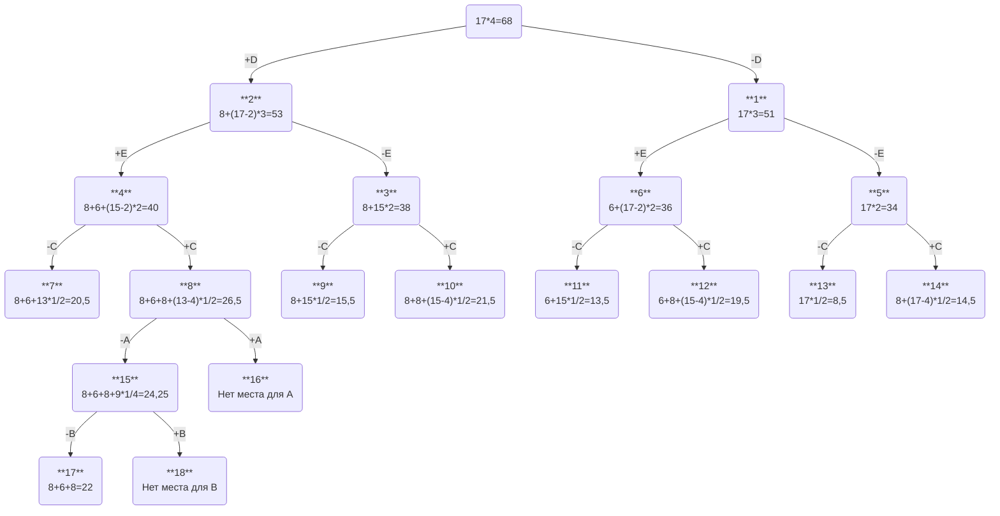

# Задание 11. Вариант 8 #
## Условие задачи ##
| Предметы  |  A  | B  | C | D | E |
|:----------|:---:|:--:|:-:|:-:|:-:|
| Стоимость |  5  | 3  | 8 | 8 | 6 |
| Вес       | 10  | 12 | 4 | 2 | 2 |

Ограничение вместимости: 17

## Решение ##
### 1. Рассчитаем ценность каждого предмета (цена за единицу). ###
| Предметы  |  A  | B  | C | D | E |
|:----------|:---:|:--:|:-:|:-:|:-:|
| Стоимость |  5  | 3  | 8 | 8 | 6 |
| Вес       | 10  | 12 | 4 | 2 | 2 |
| Ценность  | 1/2 | 1/4| 2 | 4 | 3 |
### 2. Отсортируем предметы по убыванию ценности. ###
| Предметы  |  D  | E  | C | A | B |
|:----------|:---:|:--:|:-:|:-:|:-:|
| Стоимость |  8  | 6  | 8 | 5 | 3 |
| Вес       |  2  | 2  | 4 | 10| 12|
| Ценность  |  4  | 3  | 2 |1/2|1/4|
### 3. Рассчитаем оценку сверху для пустого рюкзака. ###
Свободное место в рюкзаке: 17

Наибольшая ценность предмета: 4

Оценка сверху для пустого рюкзака: 17 * 4 = 68
### 4. Решим задачу при помощи метода ветвей и границ. ###

### Ответ ###
- Наибольшая стоимость предметов в рюкзаке 22.
- Набор предметов, обеспечивающих максимальную стоимость, D, E, C общим весом 8.
- Свободное место в рюкзаке 9.