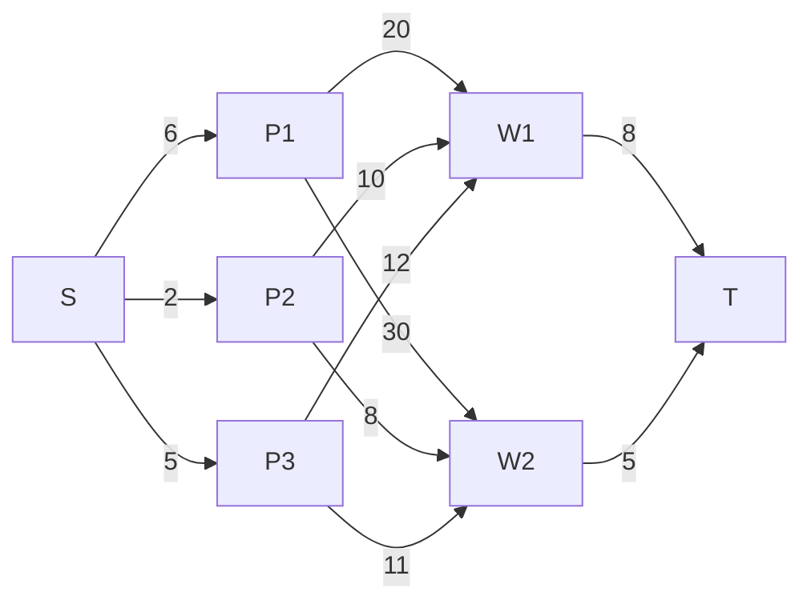
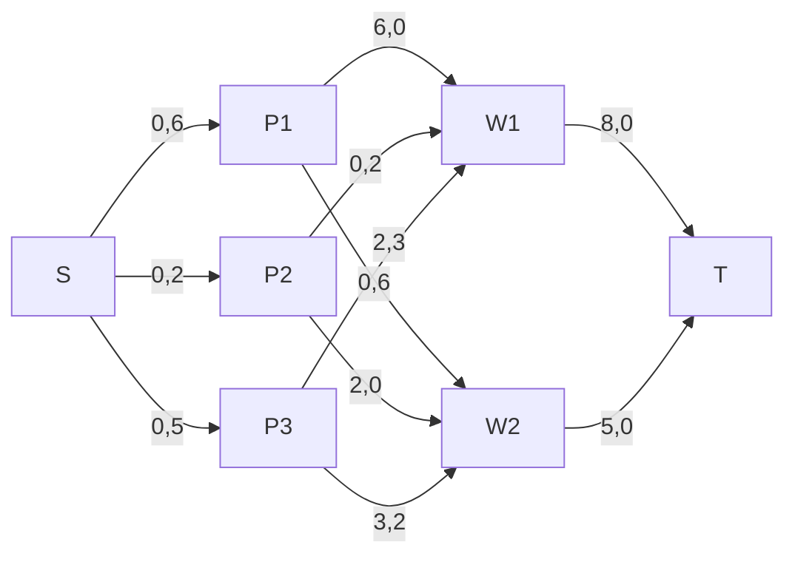
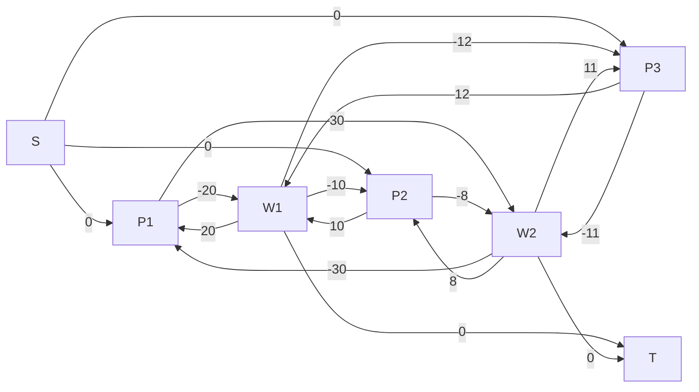

# Вариант 2
# Транспортная задача. Решение с использованием алгоритма поиска максимального потока минимальной стоимости.

## Задание
Для каждого варианта представлены условия задачи, в соответствии с которыми необходимо: 
1. Решить поставленную задачу с использованием алгоритма поиска максимального потока минимальной стоимости.
2. Оформить решение задачи по шагам с подробными комментариями и диаграммами.
3. В ответе указать:
   - объем товаров, перевозимых от каждого поставщика к каждому потребителю,
   - общую стоимость транспортировки.

## Постановка задачи

Три завода имеют производительность 6, 2 и 5, а два складских помещения имеют вместимость 8 и 5. Матрица затрат на перевозку одной единицы товара (строки – это заводы, столбцы – это склады) имеет вид:

$$
 \begin{pmatrix}    
  20 & 30 \\ 
  10 & 8 \\ 
  12 & 11 \\ 
 \end{pmatrix}    
$$

Требуется распределить весь товар производимы заводами по складам с минимально возможной стоимостью перевозки, используя алгоритм поиска максимального потока минимальной стоимости.

## Решение: 

**Введем обознчения:**

Заводы (производительность):
P1 = 6, P2 = 2, P3 = 5.

Склады (вместимость):
W1 = 8, W2 = 5.

Матрица затрат:

|    | W1 | W2 |
|:--:|:--:|:--:|
| P1 | 20 | 30 |
| P2 | 10 |  8 |
| P3 | 12 | 11 |

### Пункт №1

**Сеть по исходным данным задачи:**
Пусть перевезём:

   1. P1->W1: 6 ед. (вся производительность P1)
   2. P2->W2: 2 ед. (вся производительность P2)
   3. P3->W1: 2 ед., P3→W2: 3 ед.

**Сеть по исходным данным задачи:**

5. Стоимость перевозок:

1. P1 -> W1: 6 * 20=120
2. P2 -> W2: 2 *  8=16
3. P3 -> W1: 2 * 12=24
4. P3 -> W2: 3 * 11=33

Общая стоимость: 120+16+24+33=193.

### Пункт №2:

Транспортная задача решается при помощи алгоритма поиска максимального потока минимальной стоимости, то есть решение задачи можно представить в формате графа, вершинами которого будут являться заводы и склады, а ребрами - транспортировки товаров между ними. 

#### Шаг №1

Так как необходимо скорректировать указанный во втором пункте вариант, то можем по имеющимся данным построить сеть и при этом добавим эффективные вершины S и T.

Стоимость перевозок связанных с этими вершинами = 0.

Стоит отметить, что пропускная способность дуг, входящих в вершины заводов = производительности этих заводов, а пропускная способность дуг, входящих в склады = вместительности этих складов, а локальные потоки.

**Сеть по исходным данным задачи:**

#### Шаг №2

Для нахождения максимального потока минимальной стоимости необходимо построить остаточную сеть:
**Остаточная сеть по стоимости перевозок:**

#### Шаг №3

В остаточной сети находим цикл отрицательной стоимости:

P1 -> W2 -> P3 -> W1 -> P1

Сумма стоимостей по циклу: 30−11+(−12)+(−20)=−13

**Минимальный резерв на цикле:**
2 (по P3 -> W1)

#### Шаг №4

Уменьшаем на 2 поток по рёбрам цикла:
1. P1 -> W2 увеличиваем на 2
2. P3 -> W1 уменьшаем на 2
3. W1 -> P1 уменьшаем на 2
4. W2 -> P3 увеличиваем на 2

**Обновлённая сеть по потокам:**

**Новая стоимость перевозок:**

1. P1 -> W1: 4 * 20=80
2. P1 -> W2: 2 * 30=60
3. P2 -> W2: 2 * 8=16
4. P3 -> W2: 5 * 11=55

Общая стоимость: 80+60+16+55=211.

#### Шаг №5

В обновлённой остаточной сети ищем ещё один цикл:
P1 -> W2 -> P3 -> W1 -> P1
Сумма стоимостей по циклу: 30−11+(−12)+(−20)=−13

Минимальный резерв на цикле:
2(по P1 -> W2)

**Перераспределение потока:**
Уменьшаем на 2 поток по рёбрам цикла:
1. P1 -> W2 уменьшаем на 2
2. P3 -> W1 увеличиваем на 2
3. W1 -> P1 увеличиваем на 2
4. W2 -> P3 уменьшаем на 2

**Обновлённая сеть по потокам:**

**Новая стоимость перевозок:**

1. P1 -> W1: 6*20=120
2. P2 -> W2: 2*8=16
3. P3 -> W1: 2*12=24
4. P3 -> W2: 3*11=33
   
Общая стоимость: 120+16+24+33=193

**Проверка на наличие циклов отрицательной стоимости:**
Просматриваем остаточную сеть — циклов отрицательной стоимости больше нет.

## Итог:

Минимальная стоимость перевозок: 193
Потоки:

1. P1 -> W1: 6 единиц
2. P2 -> W2: 2 единицы
3. P3 -> W1: 2 единицы
4. P3 -> W2: 3 единицы
