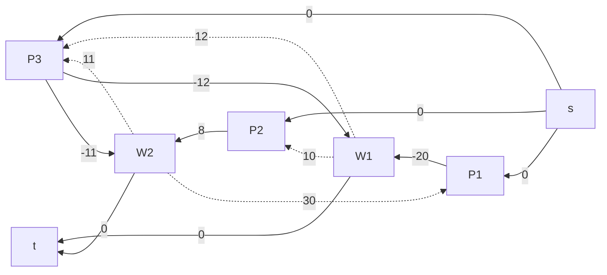

# Вариант 2
# Транспортная задача. Решение с использованием алгоритма поиска максимального потока минимальной стоимости.

## Задание
Для каждого варианта представлены условия задачи, в соответствии с которыми необходимо: 
1. Решить поставленную задачу с использованием алгоритма поиска максимального потока минимальной стоимости.
2. Оформить решение задачи по шагам с подробными комментариями и диаграммами.
3. В ответе указать:
   - объем товаров, перевозимых от каждого поставщика к каждому потребителю,
   - общую стоимость транспортировки.

## Постановка задачи

Три завода имеют производительность 6, 2 и 5, а два складских помещения имеют вместимость 8 и 5. Матрица затрат на перевозку одной единицы товара (строки – это заводы, столбцы – это склады) имеет вид:

$$
 \begin{pmatrix}    
  20 & 30 \\ 
  10 & 8 \\ 
  12 & 11 \\ 
 \end{pmatrix}    
$$

Требуется распределить весь товар производимы заводами по складам с минимально возможной стоимостью перевозки, используя алгоритм поиска максимального потока минимальной стоимости.

## Решение: 

**Введем обознчения:**

Заводы (производительность):
P1 = 6, P2 = 2, P3 = 5.

Склады (вместимость):
W1 = 8, W2 = 5.

Матрица затрат:

|    | W1 | W2 |
|:--:|:--:|:--:|
| P1 | 20 | 30 |
| P2 | 10 |  8 |
| P3 | 12 | 11 |

### Пункт №1

**Сеть по исходным данным задачи:**
Пусть перевезём:

   1. P1->W1: 6 ед. (остаток по W1: 8−6=2).
   1. P2->W1: 2 ед. (остаток по P2: 2−2=0).
   1. P3->W2: 5 ед. (остаток по P3: 2−2=0).
   
Так как необходимо скорректировать указанный во втором пункте вариант, то можем по имеющимся данным построить сеть и при этом добавим эффективные вершины S и T.

Стоимость перевозок связанных с этими вершинами = 0.

Стоит отметить, что пропускная способность дуг, входящих в вершины заводов = производительности этих заводов, а пропускная способность дуг, входящих в склады = вместительности этих складов, а локальные потоки.

**Сеть по исходным данным задачи:**

6*20 + 2*10 + 5*11 = 120 + 20 + 55 = 195

### Пункт №2:

Транспортная задача решается при помощи алгоритма поиска максимального потока минимальной стоимости, то есть решение задачи можно представить в формате графа, вершинами которого будут являться заводы и склады, а ребрами - транспортировки товаров между ними. 

#### Шаг №1

Для нахождения максимального потока минимальной стоимости необходимо построить остаточную сеть:

|           Дуги               | sP1 | sP2 | sP3 | P1W1 | P1W2 | P2W1 |	P2W2 | P3W1 | P3W2 | W1t | W2t | Итого |
|:----------------------------:|:---:|:---:|:---:|:----:|:----:|:----:|:----:|:----:|:----:|:---:|:---:|:-----:|
|Пропускная способность        |  6  |	2  |  5  |	6	|  6   |  2   |	2	 |5	    |5	   |  8  |	5  |	   |
|Локальный поток f(e)          |  6  |	2  |  5  |  6	|  0   |  2   |	0	 |0     |	5  |  8  |	5  | 	   |
|Стоимость транспортировки     |  0	 |  0  |  0  |	20	| 30   |	10|	8	 |12    |	11 |  0  |	0  |	   |
|*Суммарная стоимость f(e)c(e) |  0	 |	0  |  0  |	120	|  0   |   20 |	 0   |  0 	|  55  |  0  |	0  |  195  |

**Остаточная сеть по стоимости перевозок:**

Для каждого ребра остаточной сети укажем стоимость транспортировки единицы потока.

#### Шаг №2

Цикл:

1. P2->W1 (стоимость -10)
2. W1->P3 (стоимость 12)
3. P3->W2 (стоимость -11)
4. W2->P2 (стоимость 8)

Суммарная стоимость:

-10+12+(-11)+8=−1

#### Шаг №3
Найдем минимальный вес ребра в указанном цикле, изображенном в остаточной сети с указанием величины потока.

Минимальный вес ребра в цикле 2 - это неиспользованный резерв ребра P2 -> W1.

Удалим найденный цикл - уменьшим на 5 вес всех ребер, входящих в цикл.

Изменим граф со стоимостями транспортировки:

**Новая стоимость перевозок:**

|           Дуги               | sP1 | sP2 | sP3 | P1W1 | P1W2 | P2W1 |	P2W2 | P3W1 | P3W2 | W1t | W2t | Итого |
|:----------------------------:|:---:|:---:|:---:|:----:|:----:|:----:|:----:|:----:|:----:|:---:|:---:|:-----:|
|Пропускная способность        |  6  |	2  |  5  |	6	|  6   |  2   |	2	 |5	    |5	   |  8  |	5  |	   |
|Локальный поток f(e)          |  6  |	2  |  5  |  6	|  0   |  0   |	2	 |2     |	3  |  8  |	5  | 	   |
|Стоимость транспортировки     |  0	 |  0  |  0  |	20	| 30   |	10|	8	 |12    |  11  |  0  |	0  |	   |
|*Суммарная стоимость f(e)c(e) |  0	 |	0  |  0  |	120	|   0  |    0 |	 16  |  24 	|  33  |  0  |	0  |  195  |

1. P1 -> W1: 4*20=80
2. P2 -> W2: 2*8=16
3. P3 -> W1: 2*12=24
4. P3 -> W2: 3*11=33
   
Общая стоимость: 80+60+48+11=193

**Проверка на наличие циклов отрицательной стоимости:**
Просматриваем остаточную сеть — циклов отрицательной стоимости больше нет.

## Итог:

Минимальная стоимость перевозок: 193
Потоки:

1. P1 -> W1: 6 единиц
2. P2 -> W2: 2 единицы
3. P3 -> W1: 2 единицы
4. P3 -> W2: 3 единицы
