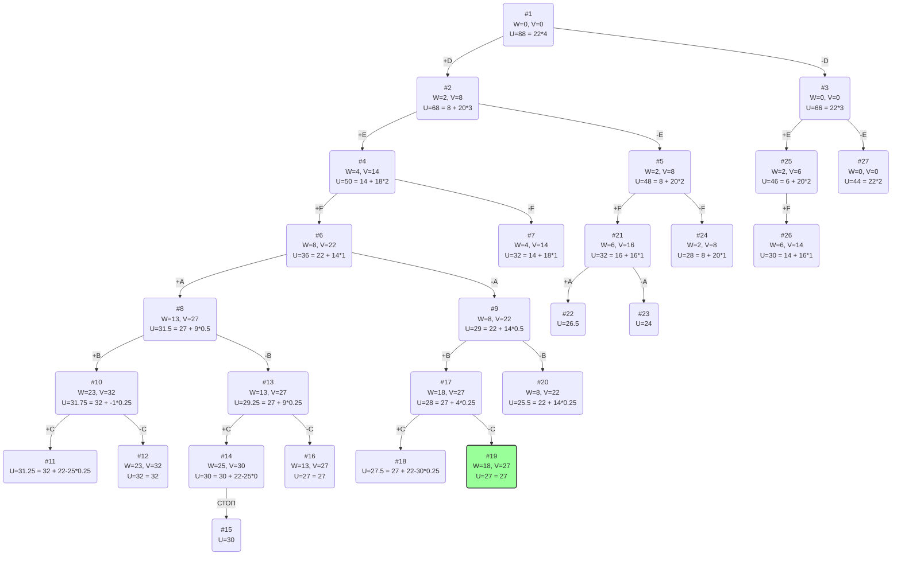

# Задание №11 Вариант 2
# Задача о рюкзаке (Knapsack problem). Метод ветвей и границ.

## Задание
Для каждого варианта представлены условия задачи, в соответствии с которыми необходимо: 
1. Решить задачу о рюкзаке с применением метода ветвей и границ.
2. Оформить решение задачи по шагам с подробными комментариями, таблицами и диаграммами.
3. В ответе указать:
- максимально возможную стоимость предметов в рюкзаке,
- набор предметов, обеспечивающих максимальную стоимость,
- общий вес предметов в рюкзаке,
- свободное место в рюкзаке.

## Постановка задачи
Задача о рюкзаке (англ. Knapsack problem) — дано N предметов, ni предмет имеет массу wi > 0 и стоимость pi > 0. Необходимо выбрать из этих предметов такой набор, чтобы суммарная масса не превосходила заданной величины W (вместимость рюкзака), а суммарная стоимость была максимальна. 

## Пример решения задачи о рюкзаке
## Условия задачи

| Предметы  | A | B  |  C  | D | E | F |
|:----------|:-:|:--:|:---:|:-:|:-:|:-:|
| Стоимость | 5 | 5  |  3  | 8 | 6 | 8 |
| Вес       | 5 | 10 | 12  | 2 | 2 | 4 |

Ограничение вместимости: 22

## Решение
### 1. Рассчитаем ценность каждого предмета
| Предметы  | A | B  |  C  | D | E | F |
|:----------|:-:|:--:|:---:|:-:|:-:|:-:|
| Стоимость | 5 | 5  |  3  | 8 | 6 | 8 |
| Вес       | 5 | 10 | 12  | 2 | 2 | 4 |
| Ценность  | 1 | 1/2| 1/4 | 4 | 3 | 2 |

### 2. Отсортируем предметы по убыванию ценности
| Предметы  | D | E  |  F  | A |  B  |  C  |
|:----------|:-:|:--:|:---:|:-:|:---:|:---:|
| Стоимость | 8 |  6 |  8  | 5 |  5  |  3  |
| Вес       | 2 |  2 |  4  | 5 |  10 |  12 |
| Ценность  | 4 |  3 |  2  | 1 | 1/2 | 1/4 |

### 3. Рассчитаем оценку сверху для пустого рюкзака

Свободное место в рюкзаке: 22

Наибольшая ценность предмета: 4

Оценка сверху для пустого рюкзака: 22 * 4 = 88

### 4. Найдем решение задачи с использованием метода ветвей и границ

### Ответ
- Наибольшая стоимость предметов в рюкзаке 27.
- Набор предметов, обеспечивающих максимальную стоимость, D, E, F, B общим весом 18.
- Свободное место в рюкзаке 4.
