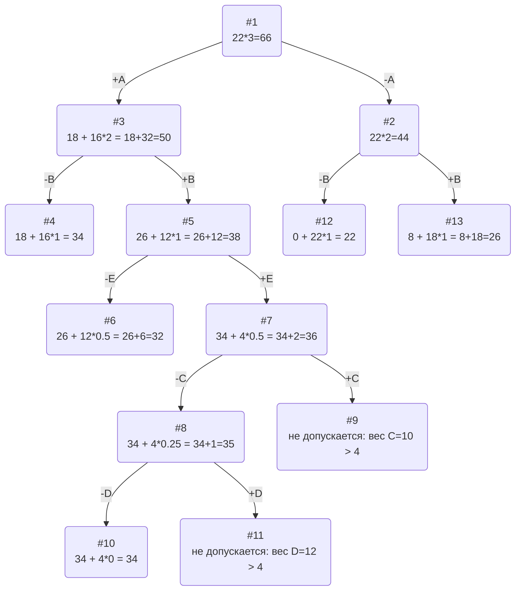

## Исходные данные (Вариант 10)
| Предметы  | A  | B | C  | D  | E |
|:---------:|:--:|:-:|:--:|:--:|:-:|
| Стоимость | 18 | 8 | 5  | 3  | 8 |
| Вес       | 6  | 4 | 10 | 12 | 8 |

Ограничение вместимости: **22**

## Шаг 1: Вычисление ценности предметов
Ценность рассчитывается как отношение стоимости к весу:
- **A:** 18 / 6 = **3**
- **B:** 8 / 4 = **2**
- **C:** 5 / 10 = **0.5**
- **D:** 3 / 12 ≈ **0.25**
- **E:** 8 / 8 = **1**

Получаем таблицу:

| Предметы  | A  | B |  C  |  D   | E |
|:---------:|:--:|:-:|:---:|:----:|:-:|
| Стоимость | 18 | 8 |  5  |  3   | 8 |
| Вес       | 6  | 4 | 10  |  12  | 8 |
| Ценность  | 3  | 2 | 0.5 | 0.25 | 1 |

## Шаг 2: Сортировка предметов по убыванию ценности
Отсортируем предметы по убыванию ценности:
1. **A** (ценность 3)
2. **B** (ценность 2)
3. **E** (ценность 1)
4. **C** (ценность 0.5)
5. **D** (ценность 0.25)

Получаем таблицу:

| Предметы  | A  | B | E |  C  |  D   |
|:---------:|:--:|:-:|:-:|:---:|:----:|
| Стоимость | 18 | 8 | 8 |  5  |  3   |
| Вес       | 6  | 4 | 8 | 10  |  12  |
| Ценность  | 3  | 2 | 1 | 0.5 | 0.25 |

## Шаг 3: Вычисление верхней оценки для пустого рюкзака
При пустом рюкзаке свободно 22 единицы, максимальная ценность – 3 (предмет A).

**Верхняя оценка = 22 × 3 = 66**

## Шаг 4: Решение методом ветвей и границ

Ниже приведено схематическое дерево решений, где каждая вершина отражает текущее состояние и выбор включить или исключить предмет

## Итоговое решение

- Наибольшая стоимость предметов в рюкзаке **34**. 
- Набор предметов, обеспечивающих максимальную стоимость, **A, B, E**, общим весом **18**. 
- Свободное место в рюкзаке **4**.