# Задание 11
> Команда Imposters, вариант 4.
## Условия
Необходимо решить задачу о рюкзаке с применением метода ветвей и границ.

| Предметы  |  A  | B  | C | D | E |
|:----------|:---:|:--:|:-:|:-:|:-:|
| Стоимость |  5  | 3  | 8 | 6 | 8 |
| Вес       | 10  | 12 | 4 | 2 | 2 |

Ограничение вместимости: 16

В ответе указать:
- максимально возможную стоимость предметов в рюкзаке,
- набор предметов, обеспечивающих максимальную стоимость,
- общий вес предметов в рюкзаке,
- свободное место в рюкзаке.

## Решение
### Расчет удельной стоимости предметов

| Предметы           |        A      |        B      | C | D | E |
|:-------------------|:-------------:|:-------------:|:-:|:-:|:-:|
| Стоимость          |        5      |        3      | 8 | 6 | 8 |
| Вес                |       10      |       12      | 4 | 2 | 2 |
| Удельная стоимость | $\frac{1}{2}$ | $\frac{1}{4}$ | 2 | 3 | 4 |

### Сортировка предметов по их удельной стоимости в порядке убывания

| Предметы           | E | D | C |        A      |        B      |
|:-------------------|:-:|:-:|:-:|:-------------:|:-------------:|
| Стоимость          | 8 | 6 | 8 |        5      |        3      |
| Вес                | 2 | 2 | 4 |       10      |       12      |
| Удельная стоимость | 4 | 3 | 2 | $\frac{1}{2}$ | $\frac{1}{4}$ |

### Расчет оценок
Изначально в рюкзаке свободно $16$ единиц вместимости, наибольшая удельная стоимость равна $4$ единицы за единицу веса, тогда *оценка сверху* для *пустого* (корень дерева 0) рюкзака вычисляется как $16 \cdot 4 = 64$

Вычислять оценку вершины можно как сумму стоимостей взятых предметов и оценки оставшегося веса, которая вычисляется как произведение свободного веса на максимальную удельную стоимость из доступных для взятия предметов.
### Построение дерева методом ветвей и границ

```mermaid
graph TB
    0("64")-->|+E|1("**1**<br>8+(16-2)*3= 50")
    0-->|-E|2("**2**<br>16*3= 48")
    1-->|+D|3("**3**<br>8+6+(16-2-2)*2= 38")
    1-->|-D|4("**4**<br>8+(16-2)*2= 36")
    2-->|+D|5("**5**<br>6+(16-2)*2= 34")
    2-->|-D|6("**6**<br>16*2= 32")
    3-->|+C|7("**7**<br>8+6+8+(16-2-2-4)*0.5= 26")
    3-->|-C|8("**8**<br>8+6+(16-2-2)*0.5= 20")
    4-->|+C|9("**9**<br>8+8+(16-2-4)*0.5= 21")
    4-->|-C|10("**10**<br>8+(16-2)*0.5= 15")
    5-->|+C|11("**11**<br>6+8+(16-2-4)*0.5= 19")
    5-->|-c|12("**12**<br>6+(16-2)*0.5= 13")
    6-->|+C|13("**13**<br>8+(16-4)*0.5= 14")
    6-->|-C|14("**14**<br>16*0.5= 8")
    7-->|+A|15("**15**<br>Нет места для А. Доступно 8")
    7-->|-A|16("**16**<br>8+6+8+(16-2-2-4)*0.25= 24")
    16-->|+B|17("**17**<br>Нет места для B. Доступно 8")
    16-->|-B|18("**18**<br>8+6+8= 22, свободно 8 места")
```

Лист с оценкой 22 является самым выгодным, значит это ответ.
## Ответ
Максимально возможная стоимость предметов в рюкзаке: $22$

Набор предметов, обеспечивающих максимальную стоимость: предметы $E,\ D,\ C$

Общий вес предметов в рюкзаке: $8$

Свободное место в рюкзаке: $8$