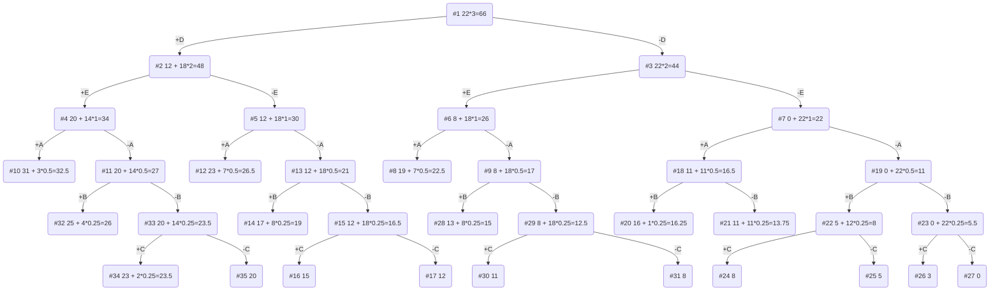

# Задание №11
# Задача о рюкзаке (Knapsack problem). Метод ветвей и границ
# Вариант 3
## Постановка задачи
Задача о рюкзаке (англ. Knapsack problem) — дано N предметов, ni предмет имеет массу wi > 0 и стоимость pi > 0. Необходимо выбрать из этих предметов такой набор, чтобы суммарная масса не превосходила заданной величины W (вместимость рюкзака), а суммарная стоимость была максимальна. 
| Предметы  | A  | B  | C  | D  | E |
|:----------|:--:|:--:|:--:|:--:|:-:|
| Стоимость | 11 | 5  | 3  | 12 | 8 |
| Вес       | 11 | 10 | 12 | 4  | 4 |

Ограничение вместимости: 22

## Решение
### 1. Рассчитаем ценность каждого предмета

| Предметы  | A  | B  | C  | D  | E |
|:----------|:--:|:--:|:--:|:--:|:-:|
| Стоимость | 11 | 5  | 3  | 12 | 8 |
| Вес       | 11 | 10 | 12 | 4  | 4 |
| Ценность  | 1  | 1/2| 1/4| 3  | 2 |
### 2. Отсортируем предметы по убыванию ценности
| Предметы  | D  | E  | A  | B  | C  |
|:----------|:--:|:--:|:--:|:--:|:--:|
| Стоимость | 12 | 8  | 11 | 5  | 3  |
| Вес       | 4  | 4  | 11 | 10 | 12 |
| Ценность  | 3  | 2  | 1  | 1/2| 1/4|
### 3. Рассчитаем оценку сверху для пустого рюкзака
Свободное место в рюкзаке: 22
Наибольшая ценность предмета: 3
Оценка сверху для пустого рюкзака: 21 * 3 = 66

### 4. Найдем решение задачи с использованием метода ветвей и границ

### Ответ
- Наибольшая стоимость предметов в рюкзаке 31.
- Набор предметов, обеспечивающих максимальную стоимость: A, D, E, общим весом 19.
- Свободное место в рюкзаке: 3.