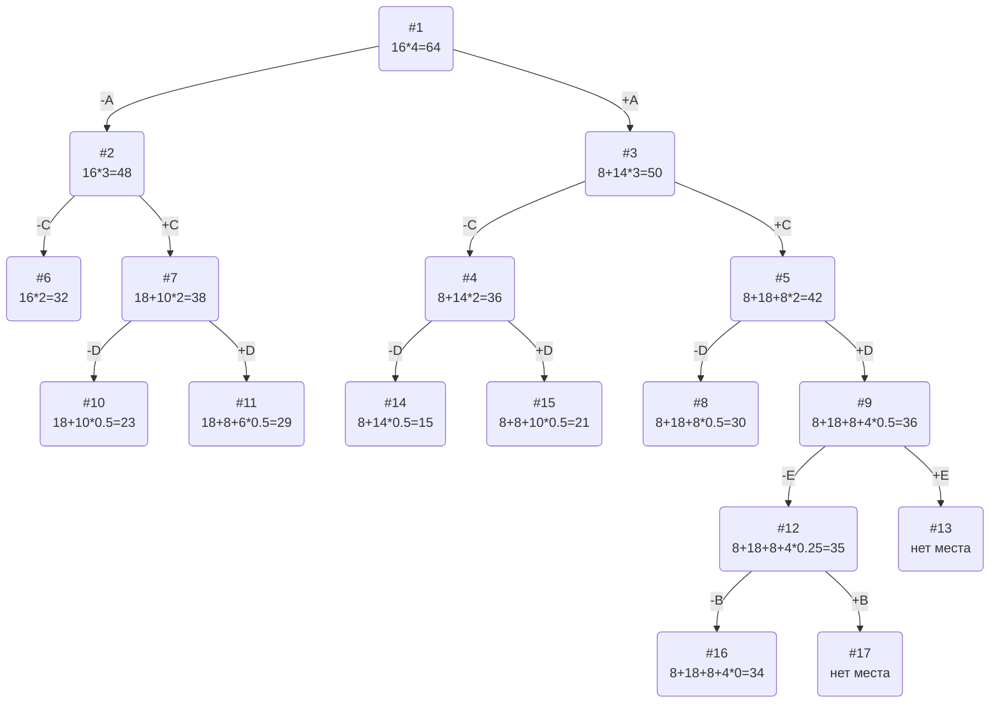

# Задание 11. Вариант 6

## Условия задачи

| Предметы  | A | B  | C  | D | E  |
|:----------|:-:|:--:|:--:|:-:|:--:|
| Стоимость | 8 | 3  | 18 | 8 | 5  |
| Вес       | 2 | 12 | 6  | 4 | 10 |

Ограничение вместимости: 16

## Решение

### Шаг №1. Рассчитаем ценность каждого предмета

Ценность расчитывается как частное стоимости предмета и его веса.

| Предметы  | A |  B  | C  | D |  E  |
|:----------|:-:|:---:|:--:|:-:|:---:|
| Стоимость | 8 |  3  | 18 | 8 |  5  |
| Вес       | 2 |  12 |  6 | 4 |  10 |
| Ценность  | 4 | 1/4 |  3 | 2 | 1/2 |

### Шаг №2. Отсортируем предметы по убыванию ценности

| Предметы  | A | C  | D |  E  |  B  |
|:----------|:-:|:--:|:-:|:---:|:---:|
| Стоимость | 8 | 18 | 8 |  5  |  3  |
| Вес       | 2 |  6 | 4 |  10 |  12 |
| Ценность  | 4 |  3 | 2 | 1/2 | 1/4 |

### Шаг №3. Рассчитаем оценку сверху для пустого рюкзака

Свободное место в рюкзаке: 16
Наибольшая ценность предмета: 4
Оценка сверху для пустого рюкзака: 16 * 4 = 64

### Шаг №4. Найдем решение задачи с использованием метода ветвей и границ

### Ответ
- Наибольшая стоимость предметов в рюкзаке 34.
- Набор предметов, обеспечивающих максимальную стоимость: A, C, D - общим весом 12.
- Свободное место в рюкзаке 4.