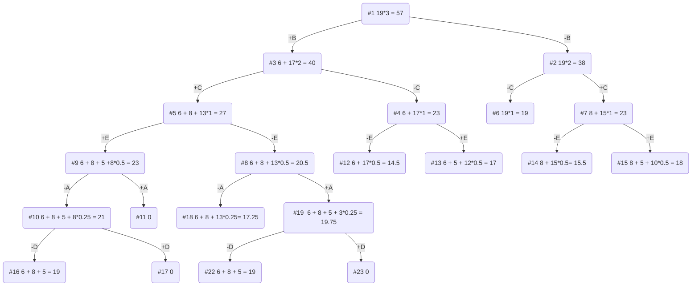

# Вариант 1

| Предметы  |  A  | B | C | D  | E |
|:----------|:---:|:-:|:-:|:--:|:-:|
| Стоимость |  5  | 6 | 8 | 3  | 5 |
| Вес       | 10  | 2 | 4 | 12 | 5 |

Ограничение вместимости: 19

## Решение

### 1. Рассчитаем стоимость за единицу веса для каждого предмета

| Предметы  |  A  | B | C | D  | E |
|:----------|:---:|:-:|:-:|:--:|:-:|
| Стоимость |  5  | 6 | 8 | 3  | 5 |
| Вес       | 10  | 2 | 4 | 12 | 5 |
| Ценность  | 1/2 | 3 | 2 | 1/4  | 1  |

### 2. Отсортируем предметы по убыванию ценности

| Предметы  |  B  | C | E | A  | D  |
|:----------|:---:|:-:|:-:|:--:|:-:|
| Стоимость |  6  | 8 | 5 |  5 | 3 |
| Вес       |  2  | 4 | 5 | 10 | 12|
| Ценность  |  3  | 2 | 1 | 1/2 | 1/4 |

### 3. Рассчитаем оценку сверху для пустого рюкзака

Свободное место в рюкзаке: 19

Наибольшая ценность предмета: 3

Оценка сверху для пустого рюкзака: 19 * 3 = 57

### 4. Найдем решение задачи с использованием метода ветвей и границ

Заметим, что два узла имеют итоговую одинаковую стоимость, это узлы №16 и №22 - в такой ситуации можно выбрать любой из получившихся результатов, так как они равны.

### 5. Ответ

Наибольшая стоимость предметов в рюкзаке: 19.
Набор предметов, обеспечивающих максимальную стоимость: B, C, E.
Общий вес предметов в рюкзаке: 11.
Свободное место в рюкзаке: 8.
