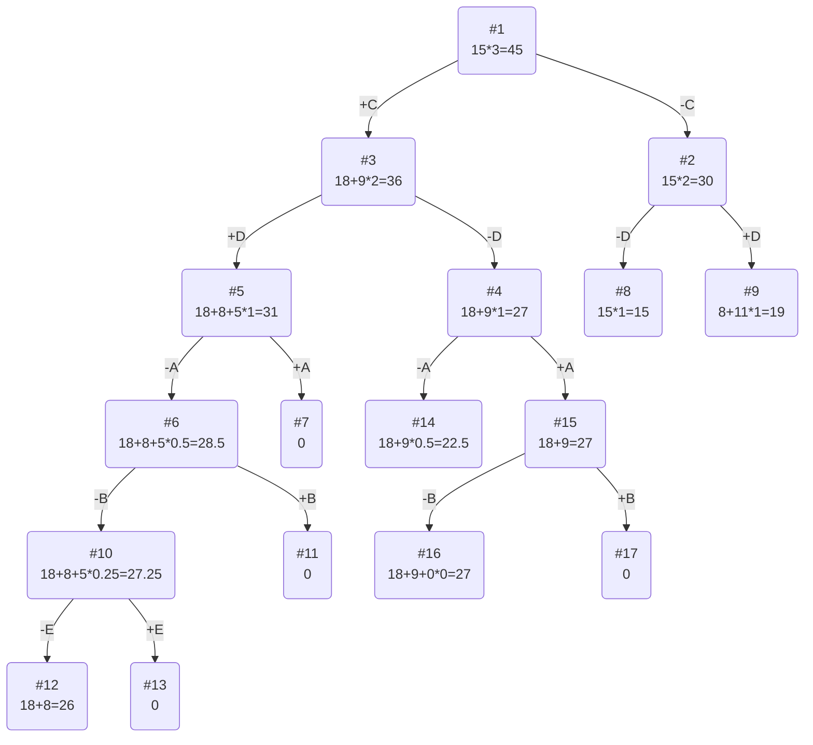

## Решение седьмого варианта
## Условие задачи

| Предметы  | A | B  | C  | D | E  |
|:----------|:-:|:--:|:--:|:-:|:--:|
| Стоимость | 9 | 5  | 18 | 8 | 3  |
| Вес       | 9 | 10 | 6  | 4 | 12 |

Ограничение вместимости: 15

## Решение
### 1. Рассчитаем ценность каждого предмета
| Предметы  | A | B  | C  | D  | E  |
|:----------|:-:|:--:|:--:|:--:|:--:|
| Стоимость | 9 | 5  | 18 | 8  | 3  |
| Вес       | 9 | 10 | 6  | 4  | 12 |
| Ценность  | 1 | 1/2 | 3 | 2  | 1/4|

### 2. Отсортируем предметы по убыванию ценности
| Предметы  | С  | D | A  |  B  |  E  |
|:----------|:--:|:-:|:--:|:---:|:---:|
| Стоимость | 18 | 8 | 9 |  5  |  3  |
| Вес       | 6 | 4 | 9  | 10  | 12  |
| Ценность  | 3  | 2 | 1  | 1/2 | 1/4 |

### 3. Рассчитаем оценку сверху для пустого рюкзака

Свободное место в рюкзаке: 15

Наибольшая ценность предмета: 3

Оценка сверху для пустого рюкзака: 15 * 3 = 45

### 4. Найдем решение задачи с использованием метода ветвей и границ

    
    

### Ответ
- Наибольшая стоимость предметов в рюкзаке 27.
- Набор предметов, обеспечивающих максимальную стоимость, C, A, общим весом 15.
- Свободное место в рюкзаке 0.
