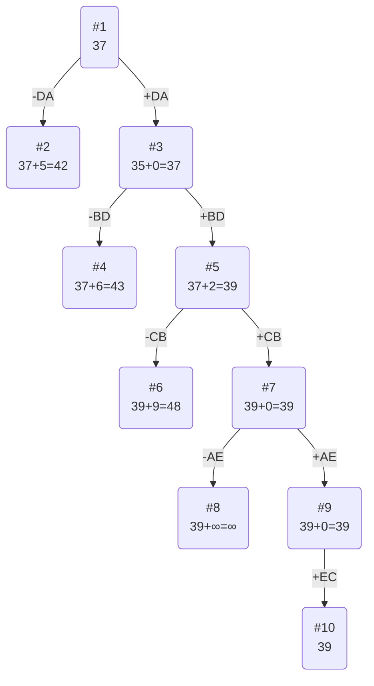

# Постановка задачи
Для каждого варианта представлены условия задачи, в соответствии с которыми необходимо: 
1. Решить задачу коммивояжера с применением метода ветвей и границ.
2. Оформить решение задачи по шагам с подробными комментариями, таблицами и диаграммами.
3. В ответе указать:
   - найденный маршрут,
   - длину найденного маршрута.

# Вариант №2

Матрица расстояний:

|       | **A** | **B** | **C** | **D** | **E** |
|:------|:-----:|:-----:|:-----:|:-----:|:-----:|
| **A** | **∞** |  15   |  11   |  12   |  11   |
| **B** |   6   | **∞** |  11   |   5   |  14   |
| **C** |   7   |  10   | **∞** |   6   |  11   |
| **D** |   6   |  14   |  10   | **∞** |  15   |
| **E** |  14   |  15   |   7   |   5   | **∞** |

# Решение

## 1. Проведем редукцию строк матрицы

|       | **A** | **B** | **C** | **D** | **E** |
|:------|:-----:|:-----:|:-----:|:-----:|:-----:|
| **A** | **∞** |  15   |  11   |  12   |  11   |
| **B** |   6   | **∞** |  11   |   5   |  14   |
| **C** |   7   |  10   | **∞** |   6   |  11   |
| **D** |   6   |  14   |  10   | **∞** |  15   |
| **E** |  14   |  15   |   7   |   5   | **∞** |

Сумма констант редукции по строкам 33

Матрица после редукции строк:

|       | **A** | **B** | **C** | **D** | **E** |
|:------|:-----:|:-----:|:-----:|:-----:|:-----:|
| **A** | **∞** |   4   |   0   |   1   |   0   |
| **B** |   1   | **∞** |   6   |   0   |   9   |
| **C** |   1   |   4   | **∞** |   0   |   5   |
| **D** |   0   |   8   |   4   | **∞** |   9   |
| **E** |   9   |  10   |   2   |   0   | **∞** |

## 2. Проведем редукцию столбцов матрицы

|       | **A** | **B** | **C** | **D** | **E** |
|:------|:-----:|:-----:|:-----:|:-----:|:-----:|
| **A** | **∞** |   4   |   0   |   1   |   0   |
| **B** |   1   | **∞** |   6   |   0   |   9   |
| **C** |   1   |   4   | **∞** |   0   |   5   |
| **D** |   0   |   8   |   4   | **∞** |   9   |
| **E** |   9   |  10   |   2   |   0   | **∞** |

Сумма констант редукции по столбцам 4

Матрица после редукции столбцов:

|       | **A** | **B** | **C** | **D** | **E** |
|:------|:-----:|:-----:|:-----:|:-----:|:-----:|
| **A** | **∞** |   0   |   0   |   1   |   0   |
| **B** |   1   | **∞** |   6   |   0   |   9   |
| **C** |   1   |   0   | **∞** |   0   |   5   |
| **D** |   0   |   4   |   4   | **∞** |   9   |
| **E** |   9   |   6   |   2   |   0   | **∞** |

## 3. Оценка длины маршрута

Оценка длины маршрута снизу соответствует сумме констант редукции по строкам и по столбцам

33 + 4 = 37

## 4. Найдем решение задачи с использованием метода ветвей и границ

Чтобы определить ребро, по которому будет произведено ветвление из корневого узла рассчитаем штрафы для ребер с нулевой оценкой:

|        | **Штраф** |
|:-------|:---------:|
| AB     |     0     |
| AC     |     2     |
| AE     |     5     |
| BD     |     1     |
| CB     |     0     |
| CD     |     0     |
| **DA** |   **5**   |
| ED     |     2     |

Так как у AE и DA одинаковые штрафы, без разницы какой выбирать - выберем DA, штраф которого равен 5

### Узел №2
Узел №2 с исключением ребра DA имеет оценку 37 (сумма констант редукций родительской матрицы) + 5 (штраф) = 42

### Узел №3
Для получения оценки узла 3 необходимо рассчитать сумму констант редукции для матрицы с учетом включения ребра DA, для этого в матрице:
- удалим строку D,
- удалим столбец A,
- Заменим на бесконечность значение AD.

|       | **B** | **C** | **D** | **E** |
|:------|:-----:|:-----:|:-----:|:-----:|
| **A** |    0   |   0   |   **∞**   |   0   |
| **B** |    **∞** |   6   |   0   |   9   |
| **C** |      0   | **∞** |   0   |   5   |
| **E** |      6   |   2   |   0   | **∞** |

Сумма констант редукции 0

Оценка узла №3 = 37 + 0 (редукция) = 37

Продолжим поиск из узла 3, так как оценка узла№2 = 42 > оценка узла №3 = 37

### Выбор ребра
Чтобы определить ребро, по которому будет произведено ветвление из узла 3 рассчитаем штрафы для ребер с нулевой оценкой:

|        | **Штраф** |
|:-------|:---------:|
| AB     |     0     |
| AC     |     2     |
| AE     |     5     |
| **BD** |   **6**   |
| CB     |     0     |
| CD     |     0     |
| ED     |     2     |

Максимальный штраф 6, выберем ребро BD, как ребро с максимальным штрафом.

### Узел №4
Узел №4 с исключением ребра BD имеет оценку 37 + 6 (штраф) = 43

### Узел №5
Для получения оценки узла 5 необходимо рассчитать сумму констант редукции для матрицы с учетом включения ребра BD, для этого в матрице:
- удалим строку B,
- удалим столбец D,
- Заменим на бесконечность значение AB.

|       | **B** | **C** | **E**  |
|:------|:-----:|:-----:|:------:|
| **A** |    **∞**   |   0   |   0    |
| **C** |      0   | **∞** |   5    |
| **E** |      6   |   2   |  **∞** |

Константа редукции равна 2

Матрица после редукции:

|       | **B** | **C** | **E**  |
|:------|:-----:|:-----:|:------:|
| **A** | **∞** |   0   |   0    |
| **C** |   0   | **∞** |   5    |
| **E** |   4   |   0   |  **∞** |

Оценка узла 5 = 37 + 2 (редукция) = 39

Продолжим поиск из узла 5, так как минимальная оценка в дереве.

### Выбор ребра
Чтобы определить ребро, по которому будет произведено ветвление из узла 5 рассчитаем штрафы для ребер с нулевой оценкой:

|        | **Штраф** |
|:-------|:---------:|
| AC     |     0     |
| AE     |     1     |
| **CB** |   **9**   |
| EC    |     0     |

Максимальный штраф 9, выберем ребро CB, как ребро с максимальным штрафом.

### Узел №6
Узел №6 с исключением ребра CB имеет оценку 39 + 9 (штраф) = 48

### Узел №7
Для получения оценки узла 7 необходимо рассчитать сумму констант редукции для матрицы с учетом включения ребра CB, для этого в матрице:
- удалим строку C,
- удалим столбец B,
- Заменим на бесконечность значение AC.

|       | **C** | **E**  |
|:------|:-----:|:------:|
| **A** | **∞** |   0    |
| **E** |   0   |  **∞** |

Константа редукции = 0
Оценка узла 7 = 39 + 0 (редукция) = 39

Продолжим поиск из узла 7, так как минимальная оценка в дереве.

### Выбор ребра
Чтобы определить ребро, по которому будет произведено ветвление из узла 7 рассчитаем штрафы для ребер с нулевой оценкой:

|        | **Штраф** |
|:-------|:---------:|
| AE     |     **∞**     |
| EC    |     **∞**     |

Штрафы равны бесконечности, поэтому без разницы какой узел берем, поэтому возьмем AE

### Узел №8
Узел №8 с исключением ребра AE имеет оценку 39 + ∞ (штраф) = ∞

### Узел №9
Для получения оценки узла 9 необходимо рассчитать сумму констант редукции для матрицы с учетом включения ребра CB, для этого в матрице:
- удалим строку A,
- удалим столбец E,

|       | **C** |
|:------|:-----:|
| **E** |   0   |

Константа редукции = 0
Оценка узла 9 = 39 + 0 (редукция) = 39

Выбираем EC так как самая маленькая оценка в дереве.

### Выбор ребра

Альтернатив у ребра EC нет

### Узел №10
Ребро EC включается в маршрут, длина которого составляет 39

# Ответ
- Кратчайший маршрут CBDAE.
- Длина маршрута 39.