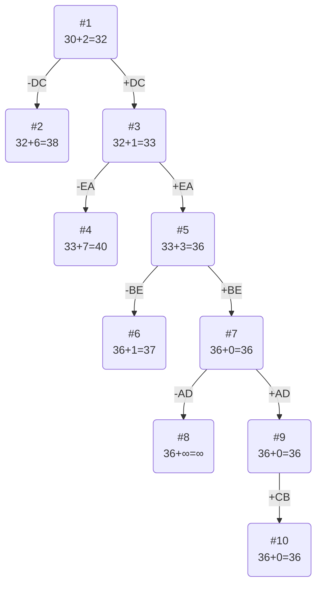

# Задание №12
# Задача коммивояжера (Traveling salesman problem). Метод ветвей и границ.

## Постановка задачи
Имеется N городов, связанных дорогами. Расстояния между городами известны. Коммивояжер (бродячий торговец) должен выйти из первого города, посетить по одному разу в некотором порядке города 2,3..n и вернуться в первый город. В каком порядке следует посещать города, чтобы замкнутый путь коммивояжера имел кратчайшее расстояние?

## Математическая модель
Для моделирования задачи можно использовать теорию графов. Города можно перенумеровать и представить в виде вершин графа, а рёбра (*i*, *j*) между вершинами *i* и *j* будут соответствовать пути между этими городами. Каждому ребру (*i*, *j*) можно сопоставить расстояние между городами Сij ⩾ 0. Таким образом, задачу можно сформулировать так: 

Дан полный граф с n вершинами, длина ребра (i,j)= Сij. Найти гамильтонов цикл минимальной длины.

Гамильтоновым циклом называется маршрут, включающий ровно по одному разу каждую вершину графа.

## Пример решения задачи коммивояжера
## Вариант №7

Матрица расстояний:

|       | **A** | **B** | **C** | **D** | **E** |
|:------|:-----:|:-----:|:-----:|:-----:|:-----:|
| **A** | **∞** |   5   |   13  |  5    |   7   |
| **B** |   12  | **∞** |   15  |  6    |   11  |
| **C** |   12  |   6   | **∞** |  5    |   12  |
| **D** |   9   |   14  |   8   | **∞** |   13  |
| **E** |   6   |   7   |   11  |  15   | **∞** |

## Решение
### Проведем редукцию строк матрицы

|       | **A** | **B** | **C** | **D** | **E** | Min |
|:------|:-----:|:-----:|:-----:|:-----:|:-----:|:---:|
| **A** | **∞** |   5   |   13  |  5    |   7   |  5  |
| **B** |   12  | **∞** |   15  |  6    |   11  |  6  |
| **C** |   12  |   6   | **∞** |   5   |   12  |  5  |
| **D** |   9   |   14  |   8   | **∞** |   13  |  8  |
| **E** |   6   |   7   |   11  |  15   | **∞** |  6  |
| Sum   |       |       |       |       |       |  30 |

Сумма констант редукции по строкам: 30

Марица после редукции строк:

|       | **A** | **B** | **C** | **D** | **E** |
|:------|:-----:|:-----:|:-----:|:-----:|:-----:|
| **A** | **∞** |   0   |   8   |   0   |   2   |
| **B** |   6   | **∞** |   9   |   0   |   5   |
| **C** |   7   |   1   | **∞** |   0   |   7   |
| **D** |   1   |   6   |   0   | **∞** |   5   |
| **E** |   0   |   1   |   5   |   9   | **∞** |

### Проведем редукцию столбцов матрицы

|       | **A** | **B** | **C** | **D** | **E** | Sum |
|:------|:-----:|:-----:|:-----:|:-----:|:-----:|:---:|
| **A** | **∞** |   0   |   8   |   0   |   2   |     |
| **B** |   6   | **∞** |   9   |   0   |   5   |     |
| **C** |   7   |   1   | **∞** |   0   |   7   |     |
| **D** |   1   |   6   |   0   | **∞** |   5   |     |
| **E** |   0   |   1   |   5   |   9   | **∞** |     |
| Min   |   0   |   0   |   0   |   0   |   2   |     |

Сумма констант редукции по столбцам: 2

Марица после редукции столбцов:

|       | **A** | **B** | **C** | **D** | **E** |
|:------|:-----:|:-----:|:-----:|:-----:|:-----:|
| **A** | **∞** |   0   |   8   |   0   |   0   |
| **B** |   6   | **∞** |   9   |   0   |   3   |
| **C** |   7   |   1   | **∞** |   0   |   5   |
| **D** |   1   |   6   |   0   | **∞** |   3   |
| **E** |   0   |   1   |   5   |   9   | **∞** |

### Оценка длины маршрута

Оценка длины маршрута снизу соответствует сумме констант редукции по строкам и по столбцам
$$
30 + 2 = 32
$$

### Найдем решение задачи с использованием метода ветвей и границ

Чтобы определить ребро, по которому будет произведено ветвление из корневого узла рассчитаем штрафы для ребер с нулевой оценкой:

|        | **Штраф** |
|:-------|:---------:|
| **AB** |     1     |
| **AD** |     0     |
| **AE** |     3     |
| **BD** |     3     |
| **CD** |     6     |
| **DC** |     2     |
| **EA** |     3     |

Максимальный штраф 6, выберем ребро DC, как ребро с максимальным штрафом.

#### Узел №2
Узел №2 с исключением ребра DC имеет оценку 32 + 6 (штраф) = 38

#### Узел №3

Для получения оценки узла №3 необходимо рассчитать сумму констант редукции для матрицы с учетом включения ребра DC.
Для этого в матрице:
- удалим строку D,
- удалим столбец C,
- Заменим на бесконечность значение CD.

|       | **A** | **B** | **D** | **E** | Min |
|:------|:-----:|:-----:|:-----:|:-----:|-----|
| **A** | **∞** |   0   |   0   |   0   |     |
| **B** |   6   | **∞** |   0   |   3   |     |
| **C** |   7   |   1   | **∞** |   5   | 1   |
| **E** |   0   |   1   |   9   | **∞** |     |
| Sum   |       |       |       |       | 1   |

Матрица после редукции:

|       | **A** | **B** | **D** | **E** |
|:------|:-----:|:-----:|:-----:|:-----:|
| **A** | **∞** |   0   |   0   |   0   |
| **B** |   6   | **∞** |   0   |   3   |
| **C** |   6   |   0   | **∞** |   4   |
| **E** |   0   |   1   |   9   | **∞** |

Сумма констант редукции 1

Оценка узла 3 = 32 + 1 (редукция) = 33

Продолжим поиск из узла 3

#### Выбор ребра
Чтобы определить ребро, по которому будет произведено ветвление из узла 3 рассчитаем штрафы для ребер с нулевой оценкой:

|        | **Штраф** |
|:-------|:---------:|
| **AB** |     0     |
| **AD** |     0     |
| **AE** |     3     |
| **BD** |     3     |
| **CB** |     4     |
| **EA** |     7     |

Максимальный штраф 7, выберем ребро EA, как ребро с максимальным штрафом.

#### Узел №4
Узел №4 с исключением ребра EA имеет оценку 33 + 7 (штраф) = 40

#### Узел №5

Для получения оценки узла 5 необходимо рассчитать сумму констант редукции для матрицы с учетом включения ребра EA.
Для этого в матрице:
- удалим строку E,
- удалим столбец A,
- Заменим на бесконечность значение AE.

|       | **B** | **D** | **E** | Sum |
|:------|:-----:|:-----:|:-----:|-----|
| **A** |   0   |   0   | **∞** |     |
| **B** | **∞** |   0   |   3   |     |
| **C** |   0   | **∞** |   4   |     |
| Min   |       |       |   3   |  3  |

Матрица после редукции:

|       | **B** | **D** | **E** |
|:------|:-----:|:-----:|:-----:|
| **A** |   0   |   0   | **∞** |
| **B** | **∞** |   0   |   0   |
| **C** |   0   | **∞** |   1   |

Сумма констант редукции 3

Оценка узла 5 = 33 + 3 (редукция) = 36

Продолжим поиск из узла 5

#### Выбор ребра

Чтобы определить ребро, по которому будет произведено ветвление из узла 5 рассчитаем штрафы для ребер с нулевой оценкой:

|        | **Штраф** |
|:-------|:---------:|
| **AB** |     0     |
| **AD** |     0     |
| **BD** |     0     |
| **BE** |     1     |
| **CB** |     1     |

Максимальный штраф 1, выберем ребро BE, как ребро с максимальным штрафом.

#### Узел №6
Узел №6 с исключением ребра BE имеет оценку 36 + 1 (штраф) = 37

#### Узел №7

Для получения оценки узла 7 необходимо рассчитать сумму констант редукции для матрицы с учетом включения ребра BE.
Для этого в матрице:
- удалим строку B,
- удалим столбец E,
- Заменим на бесконечность значение EB.

|       | **B** | **D** |
|:------|:-----:|:-----:|
| **A** |   0   |   0   |
| **C** |   0   | **∞** |

Заметим, что яечйки EB нет в матрице, ибо строка E удалена.

Сумма констант редукции 0

Оценка узла 7 = 36 + 0 (редукция) = 36

Продолжим поиск из узла 7

#### Выбор ребра
Чтобы определить ребро, по которому будет произведено ветвление из узла 7 рассчитаем штрафы для ребер с нулевой оценкой:

|        | **Штраф** |
|:-------|:---------:|
| **AB** |     0     |
| **AD** |     ∞     |
| **CB** |     ∞     |

Максимальный штраф ∞, выберем ребро AD, как ребро с максимальным штрафом.

#### Узел №8
Узел №8 с исключением ребра AD имеет оценку 36 + ∞ (штраф) = ∞

#### Узел №9

Для получения оценки узла 9 необходимо рассчитать сумму констант редукции для матрицы с учетом включения ребра AD.
Для этого в матрице:
- удалим строку A,
- удалим столбец D,
- Заменим на бесконечность значение DA.

|       | **B** |
|:------|:-----:|
| **C** |   0   |

Заметим, что яечйки DA нет в матрице, ибо строка D удалена.

Редукция матрицы не требуется, ведь в каждой строке и каждом столбце есть 0.

Сумма констант редукции 0

Оценка узла 9 = 36 + 0 = 36

Продолжим поиск из узла 9.

Альтернатив у ребра CB нет.

Ребро CB включается в маршрут, длина которого 36.

### Ответ
- Кратчайший маршрут: DCBEAD.
- Длина маршрута: 36.
