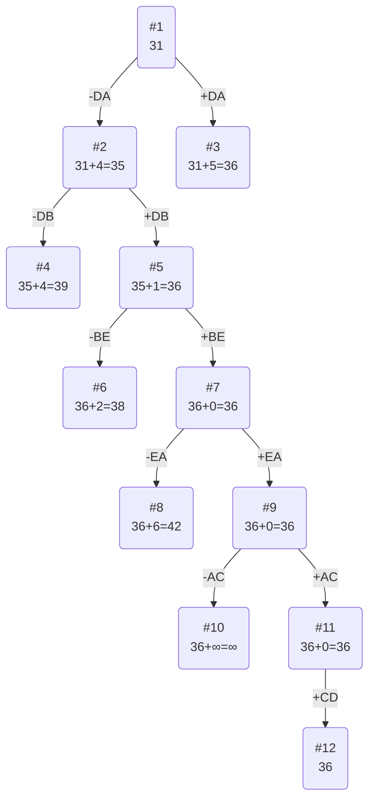

# Задание №12. Вариант 5 #

Матрица расстояний:

|       | **A** | **B** | **C** | **D** | **E** |
|-------|:-----:|:-----:|:-----:|:-----:|:-----:|
| **A** | **∞** |   9   |   6   |   5   |  14   |
| **B** |  14   | **∞** |   9   |  12   |   7   |
| **C** |  11   |  13   | **∞** |   5   |   6   |
| **D** |   8   |   8   |   8   | **∞** |  12   |
| **E** |  10   |  13   |  11   |   6   | **∞** |

## Решение
### 1. Проведём редукцию матрицы по строкам.

|       | **A** | **B** | **C** | **D** | **E** | Min |
|-------|:-----:|:-----:|:-----:|:-----:|:-----:|:---:|
| **A** | **∞** |   9   |   6   |   5   |  14   |  5  |
| **B** |  14   | **∞** |   9   |  12   |   7   |  7  |
| **C** |  11   |  13   | **∞** |   5   |   6   |  5  |
| **D** |   8   |   8   |   8   | **∞** |  12   |  8  |
| **E** |  10   |  13   |  11   |   6   | **∞** |  6  |
| Sum   |       |       |       |       |       | 31  |

Сумма констрант редукции по строкам: 31

Матрица после редукции строк:

|       | **A** | **B** | **C** | **D** | **E** |
|-------|:-----:|:-----:|:-----:|:-----:|:-----:|
| **A** | **∞** |   4   |   1   |   0   |   9   |
| **B** |   7   | **∞** |   2   |   5   |   0   |
| **C** |   6   |   8   | **∞** |   0   |   1   |
| **D** |   0   |   0   |   0   | **∞** |   4   |
| **E** |   4   |   7   |   5   |   0   | **∞** |

### 2. Проведём редукцию матрицы по столбцам.

Редукцию по столбцам не производим: в каждом столбце матрицы присутствует 0.

### 3. Оценка длины маршрута.

Оценка длины маршрута снизу соответствует сумме констант редукции по строкам и по столбцам - 31

### 4. Найдем решение задачи с использованием метода ветвей и границ.

Чтобы определить ребро, по которому будет произведено ветвление из корневого узла рассчитаем штрафы для ребер с нулевой оценкой:

|        | **Штраф** |
|:-------|:---------:|
| **AD** |     1     |
| **BE** |     3     |
| **CD** |     1     |
| **DA** |     4     |
| **DB** |     4     |
| **DC** |     1     |
| **ED** |     4     |

Максимальный штраф 4, выберем ребро **DA**, как одно из ребер с максимальным штрафом.

#### Узел №2 ####
Узел №2 с исключением ребра **DA** имеет оценку 31 + 4 (штраф) = 35

#### Узел №3
Для получения оценки узла 3 необходимо рассчитать сумму констант редукции для матрицы с учетом включения ребра **DA**, для этого в матрице узла #1:
- удалим строку D,
- удалим столбец A,
- заменим на бесконечность значение AD.

|       | **B** | **C** | **D** | **E** | Sum |
|-------|:-----:|:-----:|:-----:|:-----:|:---:|
| **A** |   4   |   1   | **∞** |   9   |     |
| **B** | **∞** |   2   |   5   |   0   |     |
| **C** |   8   | **∞** |   0   |   1   |     |
| **E** |   7   |   5   |   0   | **∞** |     |
|  Min  |   4   |   1   |   0   |   0   |  5  |

Матрица после редукции:

|       | **B** | **C** | **D** | **E** |
|-------|:-----:|:-----:|:-----:|:-----:|
| **A** |   0   |   0   | **∞** |   9   |
| **B** | **∞** |   1   |   5   |   0   |
| **C** |   4   | **∞** |   0   |   1   |
| **E** |   3   |   4   |   0   | **∞** |

Сумма констант редукции 5

Оценка узла 3 = 31 + 5 (редукция) = 36

Продолжим поиск из узла 2

#### Выбор ребра ####

Работаем с матрицей узла 1, ячейку DA заменим на **∞**, так как её не берём в цикл

|       | **A** | **B** | **C** | **D** | **E** |  Sum  |
|-------|:-----:|:-----:|:-----:|:-----:|:-----:|:-----:|
| **A** | **∞** |   4   |   1   |   0   |   9   |       |
| **B** |   7   | **∞** |   2   |   5   |   0   |       |
| **C** |   6   |   8   | **∞** |   0   |   1   |       |
| **D** | **∞** |   0   |   0   | **∞** |   4   |       |
| **E** |   4   |   7   |   5   |   0   | **∞** |       |
|  Min  |   4   |       |       |       |       |   4   |

Матрица после редукции: 

|       | **A** | **B** | **C** | **D** | **E** |
|-------|:-----:|:-----:|:-----:|:-----:|:-----:|
| **A** | **∞** |   4   |   1   |   0   |   9   |
| **B** |   3   | **∞** |   2   |   5   |   0   |
| **C** |   2   |   8   | **∞** |   0   |   1   |
| **D** | **∞** |   0   |   0   | **∞** |   4   |
| **E** |   0   |   7   |   5   |   0   | **∞** |

Чтобы определить ребро, по которому будет произведено ветвление из узла 2 рассчитаем штрафы для ребер с нулевой оценкой:
|        | **Штраф** |
|:-------|:---------:|
| **AD** |     1     |
| **BE** |     3     |
| **CD** |     1     |
| **DB** |     4     |
| **DC** |     1     |
| **EA** |     2     |
| **ED** |     0     |

Максимальный штраф 4, выберем ребро **DB**, как ребро с максимальным штрафом.

#### Узел №4 ####
Узел №4 с исключением ребра **DB** имеет оценку 35 + 4 (штраф) = 39

#### Узел №5 ####
Для получения оценки узла 5 необходимо рассчитать сумму констант редукции для матрицы с учетом включения ребра **DB**, для этого в матрице:
- удалим строку D,
- удалим столбец B,
- заменим на бесконечность значение BD.

|       | **A** | **C** | **D** | **E** |  Sum  |
|-------|:-----:|:-----:|:-----:|:-----:|:-----:|
| **A** | **∞** |   1   |   0   |   9   |       |
| **B** |   3   |   2   | **∞** |   0   |       |
| **C** |   2   | **∞** |   0   |   1   |       |
| **E** |   0   |   5   |   0   | **∞** |       |
|  Min  |       |   1   |       |       |   1   |

Матрица после редукции:

|       | **A** | **C** | **D** | **E** |
|-------|:-----:|:-----:|:-----:|:-----:|
| **A** | **∞** |   0   |   0   |   9   |
| **B** |   3   |   1   | **∞** |   0   |
| **C** |   2   | **∞** |   0   |   1   |
| **E** |   0   |   4   |   0   | **∞** |

Сумма констант редукции 1

Оценка узла 5 = 35 + 1 (редукция) = 36

Продолжим поиск из узла 5

#### Выбор ребра ####

Работаем с матрицей узла 5

|       | **A** | **C** | **D** | **E** |
|-------|:-----:|:-----:|:-----:|:-----:|
| **A** | **∞** |   0   |   0   |   9   |
| **B** |   3   |   1   | **∞** |   0   |
| **C** |   2   | **∞** |   0   |   1   |
| **E** |   0   |   4   |   0   | **∞** |

Чтобы определить ребро, по которому будет произведено ветвление из узла 5 рассчитаем штрафы для ребер с нулевой оценкой:
|        | **Штраф** |
|:-------|:---------:|
| **AC** |     1     |
| **AD** |     0     |
| **BE** |     2     |
| **CD** |     1     |
| **EA** |     2     |
| **ED** |     0     |

Максимальный штраф 2, выберем ребро **BE**, как одно из ребер с максимальным штрафом.

#### Узел №6 ####
Узел №6 с исключением ребра **BE** имеет оценку 36 + 2 (штраф) = 38

#### Узел №7 ####
Для получения оценки узла 7 необходимо рассчитать сумму констант редукции для матрицы с учетом включения ребра **BE**, для этого в матрице:
- удалим строку B,
- удалим столбец E,
- заменим на бесконечность значение ED, чтобы избежать цикла.

|       | **A** | **C** | **D** |
|-------|:-----:|:-----:|:-----:|
| **A** | **∞** |   0   |   0   |
| **C** |   2   | **∞** |   0   |
| **E** |   0   |   4   | **∞** |

Сумма констант редукции 0

Оценка узла 7 = 36 + 0 (редукция) = 36

Продолжим поиск из узла 7

#### Выбор ребра ####

Работаем с матрицей узла 7

|       | **A** | **C** | **D** |
|-------|:-----:|:-----:|:-----:|
| **A** | **∞** |   0   |   0   |
| **C** |   2   | **∞** |   0   |
| **E** |   0   |   4   | **∞** |

Чтобы определить ребро, по которому будет произведено ветвление из узла 7 рассчитаем штрафы для ребер с нулевой оценкой:
|        | **Штраф** |
|:-------|:---------:|
| **AC** |     4     |
| **AD** |     0     |
| **CD** |     2     |
| **EA** |     6     |

Максимальный штраф 6, выберем ребро **EA**, как ребро с максимальным штрафом.

#### Узел №8 ####
Узел №8 с исключением ребра **EA** имеет оценку 36 + 6 (штраф) = 42

#### Узел №9 ####
Для получения оценки узла 9 необходимо рассчитать сумму констант редукции для матрицы с учетом включения ребра **EA**, для этого в матрице:
- удалим строку E,
- удалим столбец A,
- заменим на бесконечность значение AD, чтобы избежать цикла.

|       | **C** | **D** |
|-------|:-----:|:-----:|
| **A** |   0   | **∞** |
| **C** | **∞** |   0   |

Сумма констант редукции 0

Оценка узла 9 = 36 + 0 (редукция) = 36

Продолжим поиск из узла 9

#### Выбор ребра ####

Работаем с матрицей узла 9

|       | **C** | **D** |
|-------|:-----:|:-----:|
| **A** |   0   | **∞** |
| **C** | **∞** |   0   |

Чтобы определить ребро, по которому будет произведено ветвление из узла 9 рассчитаем штрафы для ребер с нулевой оценкой:
|        | **Штраф** |
|:-------|:---------:|
| **AC** |   **∞**   |
| **CD** |   **∞**   |

Максимальный штраф ∞, выберем ребро **AC**, как одно из ребер с максимальным штрафом.

#### Узел №10 ####
Узел №10 с исключением ребра **AC** имеет оценку 36 + ∞ (штраф) = ∞

#### Узел №11 ####
Для получения оценки узла 11 необходимо рассчитать сумму констант редукции для матрицы с учетом включения ребра **AC**, для этого в матрице:
- удалим строку A,
- удалим столбец C,
- заменим на бесконечность значение CD, чтобы избежать цикла.

|       | **D** |
|-------|:-----:|
| **C** |   0   |

Сумма констант редукции 0

Оценка узла 11 = 36 + 0 (редукция) = 36

Продолжим поиск из узла 11

#### Выбор ребра ####

Альтернатив у ребра CD нет

#### Узел №12 ####
Ребро CD включается в маршрут, длина которого составляет 36

## Ответ ##
- кратчайший маршрут ACDBEA
- длина маршрута 36