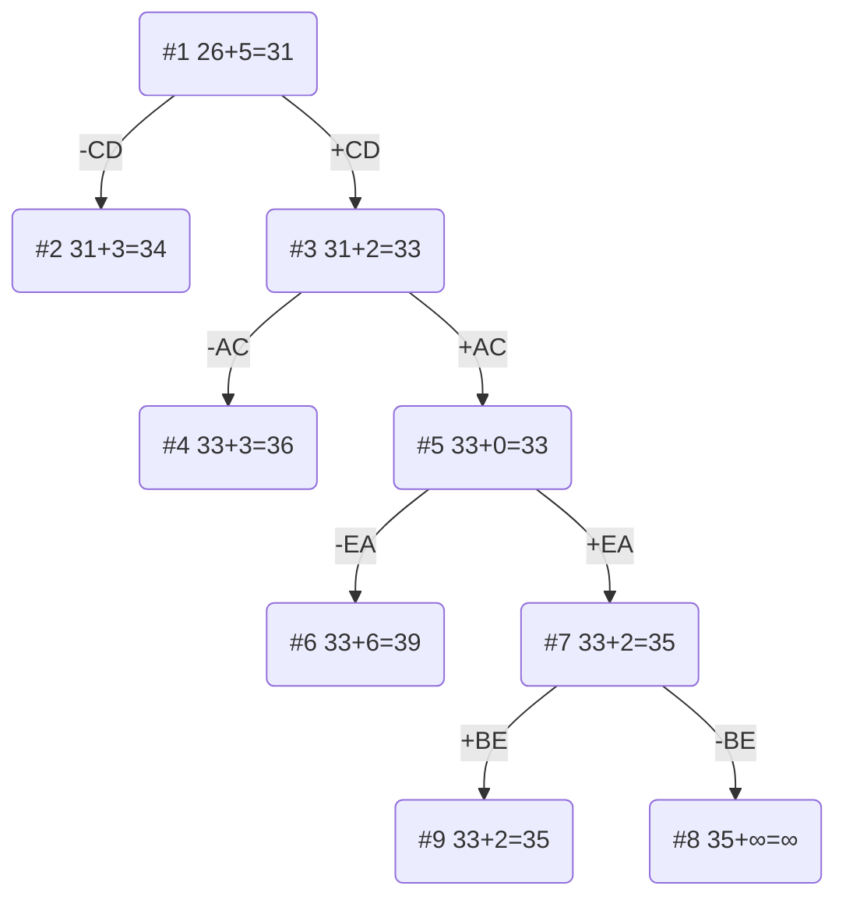

# Задание №12 Вариант 10
# Задача коммивояжера (Traveling salesman problem). Метод ветвей и границ.

## Задание
Для каждого варианта представлены условия задачи, в соответствии с которыми необходимо: 
1. Решить задачу коммивояжера с применением метода ветвей и границ.
2. Оформить решение задачи по шагам с подробными комментариями, таблицами и диаграммами.
3. В ответе указать:
   - найденный маршрут,
   - длину найденного маршрута.

## Постановка задачи
Имеется N городов, связанных дорогами. Расстояния между городами известны. Коммивояжер (бродячий торговец) должен выйти из первого города, посетить по одному разу в некотором порядке города 2,3..n и вернуться в первый город. В каком порядке следует посещать города, чтобы замкнутый путь коммивояжера имел кратчайшее расстояние?

## Математическая модель
Для моделирования задачи можно использовать теорию графов. Города можно перенумеровать и представить в виде вершин графа, а рёбра (*i*, *j*) между вершинами *i* и *j* будут соответствовать пути между этими городами. Каждому ребру (*i*, *j*) можно сопоставить расстояние между городами Сij ⩾ 0. Таким образом, задачу можно сформулировать так: 

Дан полный граф с n вершинами, длина ребра (i,j)= Сij. Найти гамильтонов цикл минимальной длины.

Гамильтоновым циклом называется маршрут, включающий ровно по одному разу каждую вершину графа.

## Пример решения задачи коммивояжера
## Условия задачи

Матрица расстояний:

|       | **A** | **B** | **C** | **D** | **E** |
|:------|:-----:|:-----:|:-----:|:-----:|:-----:|
| **A** | **∞** |   9   |   9   |   5   |  15   |
| **B** |   12  | **∞** |   11  |   8   |   6   |
| **C** |   15  |   12  | **∞** |   5   |   8   |
| **D** |   5   |   9   |   8   | **∞** |   5   |
| **E** |   5   |   7   |   14  |  10   | **∞** |

## Решение
### 1. Проведем редукцию строк матрицы

|       | **A** | **B** | **C** | **D** | **E** | Min |
|:------|:-----:|:-----:|:-----:|:-----:|:-----:|:---:|
| **A** | **∞** |   9   |   9   |   5   |  15   |  5  |
| **B** |   12  | **∞** |   11  |   8   |   6   |  6  |
| **C** |   15  |   12  | **∞** |   5   |   8   |  5  |
| **D** |   5   |   9   |   8   | **∞** |   5   |  5  |
| **E** |   5   |   7   |   14  |  10   | **∞** |  5  |
| Sum   |       |       |       |       |       | 26  |

Сумма констант редукции по строкам 26

Марица после редукции строк:

|       | **A** | **B** | **C** | **D** | **E** |
|:------|:-----:|:-----:|:-----:|:-----:|:-----:|
| **A** | **∞** |   4   |   4   |   0   |  10   |
| **B** |   6   | **∞** |   5   |   2   |   0   |
| **C** |  10   |   7   | **∞** |   0   |   3   |
| **D** |   0   |   4   |   3   | **∞** |   0   |
| **E** |   0   |   2   |   9   |   5   | **∞** |

### 2. Проведем редукцию столбцов матрицы

|       | **A** | **B** | **C** | **D** | **E** | Sum |
|:------|:-----:|:-----:|:-----:|:-----:|:-----:|:---:|
| **A** | **∞** |   4   |   4   |   0   |  10   |     |
| **B** |   6   | **∞** |   5   |   2   |   0   |     |
| **C** |  10   |   7   | **∞** |   0   |   3   |     |
| **D** |   0   |   4   |   3   | **∞** |   0   |     |
| **E** |   0   |   2   |   9   |   5   | **∞** |     |
| Min   |   0   |   2   |   3   |   0   |   0   |  5  |

Сумма констант редукции по столбцам 5

Марица после редукции столбцов:

|       | **A** | **B** | **C** | **D** | **E** |
|:------|:-----:|:-----:|:-----:|:-----:|:-----:|
| **A** | **∞** |   2   |   1   |   0   |   10  |
| **B** |   6   | **∞** |   2   |   2   |   0   |
| **C** |  10   |   5   | **∞** |   0   |   3   |
| **D** |   0   |   2   |   0   | **∞** |   0   |
| **E** |   0   |   0   |   6   |   5   | **∞** |

### 3. Оценка длины маршрута

Оценка длины маршрута снизу соответствует сумме констант редукции по строкам и по столбцам

26 + 5 = 31

### 4. Найдем решение задачи с использованием метода ветвей и границ

Чтобы определить ребро, по которому будет произведено ветвление из корневого узла рассчитаем штрафы для ребер с нулевой оценкой:

|        | **Штраф** |
|:-------|:---------:|
| **AD** |     1     |
| **CD** |     3     |
| **DA** |     0     |
| **DC** |     1     |
| **DE** |     0     |
| **EA** |     0     |
| **EB** |     2     |
| **BE** |     2     |

Максимальный штраф 3, выберем ребро CD, как одно из ребер с максимальным штрафом.

#### Узел №2
Узел №2 с исключением ребра CD имеет оценку 31 + 3 (штраф) = 34

#### Узел №3
Для получения оценки узла 3 необходимо рассчитать сумму констант редукции для матрицы с учетом включения ребра CD, для этого в матрице:
- удалим строку C,
- удалим столбец D,
- Заменим на бесконечность значение DC.

|       | **A** | **B** | **C** | **E** | Min |
|:------|:-----:|:-----:|:-----:|:-----:|-----|
| **A** | **∞** |   2   |   1   |   10  |  1  |
| **B** |   6   | **∞** |   2   |   0   |     |
| **D** |   0   |   2   | **∞** |   0   |     |
| **E** |   0   |   0   |   6   | **∞** |     |
| Sum   |       |       |       |       |  1  |

Матрица после редукции:

|       | **A** | **B** | **C** | **E** |
|:------|:-----:|:-----:|:-----:|:-----:|
| **A** | **∞** |   1   |   0   |   9   |
| **B** |   6   | **∞** |   2   |   0   |
| **D** |   0   |   2   | **∞** |   0   |
| **E** |   0   |   0   |   6   | **∞** |

Сумма констант редукции 2

Оценка узла 3 = 31 + 2 (редукция) = 33

Продолжим поиск из узла 3

#### Выбор ребра
Чтобы определить ребро, по которому будет произведено ветвление из узла 3 рассчитаем штрафы для ребер с нулевой оценкой:

|        | **Штраф** |
|:-------|:---------:|
| **AC** |     3     |
| **BE** |     2     |
| **DA** |     0     |
| **DE** |     0     |
| **EA** |     0     |
| **EB** |     1     |

Максимальный штраф 3, выберем ребро AC, как ребро с максимальным штрафом.

#### Узел №4
Узел №4 с исключением ребра AC имеет оценку 33 + 3 (штраф) = 36

#### Узел №5
Для получения оценки узла 5 необходимо рассчитать сумму констант редукции для матрицы с учетом включения ребра AC, для этого в матрице:
- удалим строку A,
- удалим столбец C,
- Заменим на бесконечность значение DA.

|       | **A** | **B** | **E** | Sum |
|:------|:-----:|:-----:|:-----:|-----|
| **B** |   6   | **∞** |   0   |     |
| **D** |   0   |   2   |   0   |     |
| **E** |   0   |   0   | **∞** |     |
| Min   |       |       |       |  0  |

Матрица после редукции:

|       | **A** | **B** | **E** |
|:------|:-----:|:-----:|:-----:|
| **B** |   6   | **∞** |   0   |     
| **D** |   0   |   2   |   0   |     
| **E** |   0   |   0   | **∞** |     

Сумма констант редукции 2

Оценка узла 5 = 33 + 0 (редукция) = 33

Продолжим поиск из узла 5

#### Выбор ребра
Для узла X необходимо преобразовать матрицу:
- Заменить значение DA на бесконечность,
- Провести редукцию матрицы (сумма констант уже учтена в штрафе).

|       | **A** | **B** | **E** |
|:------|:-----:|:-----:|:-----:|
| **B** |   6   | **∞** |   0   |     
| **D** | **∞** |   2   |   0   |     
| **E** |   0   |   0   | **∞** | 

Матрица после редукции:

|       | **A** | **B** | **E** |
|:------|:-----:|:-----:|:-----:|
| **B** |   6   | **∞** |   0   |     
| **D** | **∞** |   2   |   0   |     
| **E** |   0   |   0   | **∞** | 

Чтобы определить ребро, по которому будет произведено ветвление из узла 2 рассчитаем штрафы для ребер с нулевой оценкой:

|        | **Штраф** |
|:-------|:---------:|
| **BA** |     6     |
| **DE** |     2     |
| **EA** |     6     |
| **EB** |     2     |

Максимальный штраф 6, выберем ребро EA, как одно из ребер с максимальным штрафом.

#### Узел №6
Узел №X с исключением ребра EA имеет оценку 33 + 6 (штраф) = 39

#### Узел №7
Для получения оценки узла 7 необходимо рассчитать сумму констант редукции для матрицы с учетом включения ребра EA, для этого в матрице:
- удалим строку E,
- удалим столбец A,
- Заменим на бесконечность значение AE.

|       | **B** | **E** |  Sum  |
|:------|:-----:|:-----:|:-----:|
| **B** | **∞** |   0   |       |     
| **D** |   2   |   0   |       |     
|  Min  |   2   |       |   2   |

Матрица после редукции:

|       | **B** | **E** |
|:------|:-----:|:-----:|
| **B** | **∞** |   0   |            
| **D** |   0   | **∞** |          

Сумма констант редукции 2

Оценка узла X = 33 + 2 (редукция) = 35

Продолжим поиск из узла X

#### Выбор ребра
Чтобы определить ребро, по которому будет произведено ветвление из узла 11 рассчитаем штрафы для ребер с нулевой оценкой:

|        | **Штраф** |
|:-------|:---------:|
| **BE** |   **∞**   |
| **DB** |   **∞**   |

Максимальный штраф бесконечность, выберем ребро BE, как одно из ребер с максимальным штрафом.

#### Узел №8
Узел №X с исключением ребра BE имеет оценку 35 + **∞** (штраф) = **∞**

#### Узел №9
Для получения оценки узла X необходимо рассчитать сумму констант редукции для матрицы с учетом включения ребра BE, для этого в матрице:
- удалим строку B,
- удалим столбец E,
- Заменим на бесконечность значение EB,
- **Ребро BE исходит из ранее задействованной вершины B, то есть у нас есть часть маршрута BEAC, чтобы избежать преждевременного замыкания цикла, ребро BE (при наличии) также следует заменить на бесконечность.**

|       | **B** |
|:------|:-----:|
| **D** |   0   |

Сумма констант редукции 0, следовательно, оценка узла X = 35 + 0 = 35

Продолжим поиск из узла X

#### Выбор ребра
Альтернатив у ребра DB нет

#### Узел №10
Ребро DB включается в маршрут, длина которого составляет 35

### Ответ
- Кратчайший маршрут CDBEAC.
- Длина маршрута 34.
