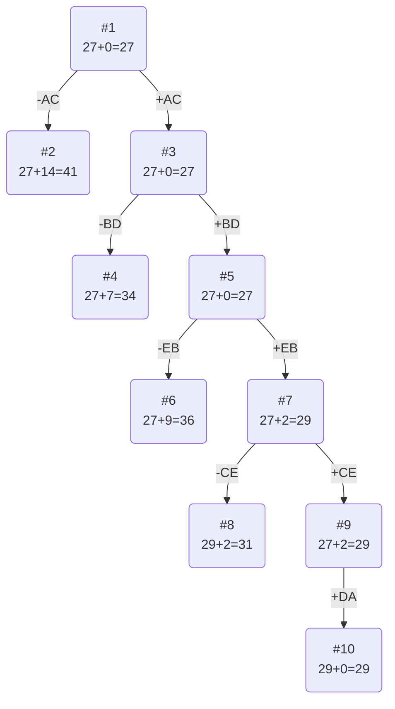

# Решение задачи коммивояжёра (Вариант 8)

## Условия задачи
Имеется 5 городов с обозначениями A, B, C, D, E. Матрица расстояний для варианта 8 выглядит следующим образом:

|     | **A** | **B** | **C** | **D** | **E** |
|:---:|:-----:|:-----:|:-----:|:-----:|:-----:|
| **A** | **∞** |  15   |   5   |  14   |  14   |
| **B** |  11   | **∞** |  11   |   6   |  11   |
| **C** |  10   |   6   | **∞** |   6   |   8   |
| **D** |   5   |  12   |  12   | **∞** |   5   |
| **E** |  14   |   5   |  12   |   6   | **∞** |

---

## 1. Редукция строк матрицы

Для каждой строки находим минимальное значение (исключая **∞**) и вычитаем его из всех элементов строки.

- **Строка A:** Минимум = 5
  A: [∞, 15–5 = 10, 5–5 = **0**, 14–5 = 9, 14–5 = 9]

- **Строка B:** Минимум = 6
  B: [11–6 = 5, **∞**, 11–6 = 5, 6–6 = **0**, 11–6 = 5]

- **Строка C:** Минимум = 6
  C: [10–6 = 4, 6–6 = **0**, **∞**, 6–6 = **0**, 8–6 = 2]

- **Строка D:** Минимум = 5
  D: [5–5 = **0**, 12–5 = 7, 12–5 = 7, **∞**, 5–5 = **0**]

- **Строка E:** Минимум = 5
  E: [14–5 = 9, 5–5 = **0**, 12–5 = 7, 6–5 = 1, **∞**]

**Матрица после редукции строк:**

|     | **A** | **B** | **C** | **D** | **E** |
|:---:|:-----:|:-----:|:-----:|:-----:|:-----:|
| **A** | **∞** |  10   |   **0**   |   9   |   9   |
| **B** |   5   | **∞** |   5   |  **0**  |   5   |
| **C** |   4   |   **0**  | **∞** |  **0**  |   2   |
| **D** |  **0**  |   7   |   7   | **∞** |  **0**  |
| **E** |   9   |  **0**  |   7   |   1   | **∞** |

Суммарная редукция по строкам: 5 + 6 + 6 + 5 + 5 = **27**

---

## 2. Редукция столбцов матрицы

Для полученной матрицы определяем минимальные значения по каждому столбцу (исключая **∞**):

- **Столбец A:** Значения = {∞, 5, 4, 0, 9} → минимум = 0
- **Столбец B:** Значения = {10, ∞, 0, 7, 0} → минимум = 0
- **Столбец C:** Значения = {0, 5, ∞, 7, 7} → минимум = 0
- **Столбец D:** Значения = {9, 0, 0, ∞, 1} → минимум = 0
- **Столбец E:** Значения = {9, 5, 2, 0, ∞} → минимум = 0

Суммарная редукция по столбцам: **0**

Матрица после редукции столбцов остается без изменений:

|     | **A** | **B** | **C** | **D** | **E** |
|:---:|:-----:|:-----:|:-----:|:-----:|:-----:|
| **A** | **∞** |  10   |   **0**   |   9   |   9   |
| **B** |   5   | **∞** |   5   |  **0**  |   5   |
| **C** |   4   |   **0**  | **∞** |  **0**  |   2   |
| **D** |  **0**  |   7   |   7   | **∞** |  **0**  |
| **E** |   9   |  **0**  |   7   |   1   | **∞** |

---

## 3. Оценка нижней границы маршрута

Нижняя граница (оценка длины маршрута) равна сумме редукций строк и столбцов:

27 + 0 = **27**.

---

## 4. Построение дерева поиска (метод ветвей и границ)

Чтобы определить ребро, по которому будет произведено ветвление из корневого узла рассчитаем штрафы для ребер с нулевой оценкой:

|        | **Штраф** |
|:-------|:---------:|
| **AC** |     9 + 5 = 14     |
| **BD** |     5 + 0 = 5     |
| **CB** |     0 + 0 = 0     |
| **CD** |     0 + 0 = 0     |
| **DA** |     0 + 4 = 4     |
| **DE** |     0 + 2 = 2     |
| **EB** |     0 + 1 = 1     |

Максимальный штраф 14, выберем ребро AC, как одно из ребер с максимальным штрафом.

---

#### Узел №2
Узел №2 с исключением ребра AC имеет оценку 27 + 14 (штраф) = 41

#### Узел №3
Для получения оценки узла 3 необходимо рассчитать сумму констант редукции для матрицы с учетом включения ребра AC, для этого в матрице:
- удалим строку A,
- удалим столбец C,
- Заменим на бесконечность значение CA.

|     | **A** | **B** |  **D**| **E** |Min  |
|:---:|:-----:|:-----:|:-----:|:-----:|-----|
| **B** |**∞**| **∞** | **0** |  5    |     |
| **C** |   4 | **0** |  **0**|  2    |     |
| **D** |**0**|   7   |  **∞**|  **0**|     |
| **E** |   9 |  **0**|    1  | **∞** |     |
| Sum   |     |       |       |       |0    |

Матрица после редукции:

|     | **A** | **B** |  **D**| **E** |
|:---:|:-----:|:-----:|:-----:|:-----:|
| **B** |**∞**| **∞** | **0** |  5    |
| **C** |   4 | **0** |  **0**|  2    |
| **D** |**0**|   7   |  **∞**|  **0**|
| **E** |   9 |  **0**|    1  | **∞** |

Сумма констант редукции 0

Оценка узла 3 = 27 + 0 (редукция) = 27

Продолжим поиск из узла 3

#### Выбор ребра
Чтобы определить ребро, по которому будет произведено ветвление из узла 3 рассчитаем штрафы для ребер с нулевой оценкой:

|        | **Штраф** |
|:-------|:---------:|
| **BD** |     5+0=7 |
| **CB** |    0+0=0     |
| **CD** |     0+0=0     |
| **DA** |     4+0=4     |
| **DE** |     0+2=2     |
| **EB** |     1+0=1     |

Максимальный штраф 7, выберем ребро BD, как ребро с максимальным штрафом.

#### Узел №4
Узел №4 с исключением ребра BD имеет оценку 27 + 7 (штраф) = 34

#### Узел №5
Для получения оценки узла 5 необходимо рассчитать сумму констант редукции для матрицы с учетом включения ребра BD, для этого в матрице:
- удалим строку B,
- удалим столбец D,
- Заменим на бесконечность значение DB.

|     | **A** | **B** | **E** |Min  |
|:---:|:-----:|:-----:|:-----:|-----|
| **C** |   4 | **0** |  2    |     |
| **D** |**0**|  **∞**|  **0**|     |
| **E** |   9 |  **0**| **∞** |     |
| Sum   |     |       |       |0    |

Матрица после редукции:

|     | **A** | **B** | **E** |
|:---:|:-----:|:-----:|:-----:|
| **C** |   4 | **0** |  2    |
| **D** |**0**|  **∞**|  **0**|
| **E** |   9 |  **0**| **∞** |

Сумма констант редукции 0

Оценка узла 5 = 27 + 0 (редукция) = 27

Продолжим поиск из узла 5

#### Выбор ребра
Чтобы определить ребро, по которому будет произведено ветвление из узла 5 рассчитаем штрафы для ребер с нулевой оценкой:

|        | **Штраф** |
|:-------|:---------:|
| **CB** |     2+0=2     |
| **DA** |     0+4=4     |
| **DE** |     0+2=2    |
| **EB** |     9+0=9     |

Максимальный штраф 9, выберем ребро EB, как ребро с максимальным штрафом.

#### Узел №6
Узел №6 с исключением ребра EB имеет оценку 27 + 9 (штраф) = 36

#### Узел №7
Для получения оценки узла 7 необходимо рассчитать сумму констант редукции для матрицы с учетом включения ребра EB, для этого в матрице:
- удалим строку E,
- удалим столбец B,
- Заменим на бесконечность значение BE.

|     | **A** | **E** |Min  |
|:---:|:-----:|:-----:|-----|
| **C** |   4 |  2    |2    |
| **D** |**0**|  **0**|     |
| Sum   |     |       |2    |

Матрица после редукции:

|     | **A** | **E** |
|:---:|:-----:|:-----:|
| **C** |   2 |  **0**|
| **D** |**0**|  **0**|

Сумма констант редукции 2

Оценка узла 7 = 27 + 2 (редукция) = 29

Продолжим поиск из узла 7

#### Выбор ребра
Чтобы определить ребро, по которому будет произведено ветвление из узла 7 рассчитаем штрафы для ребер с нулевой оценкой:

|        | **Штраф** |
|:-------|:---------:|
| **CE** |     2+0=2     |
| **DA** |     0+2=2     |
| **DE** |     0     |

Максимальный штраф 2, выберем ребро CE, как ребро с максимальным штрафом.

#### Узел №8
Узел №8 с исключением ребра CE имеет оценку 29 + 2 (штраф) = 31

#### Узел №9
Для получения оценки узла 9 необходимо рассчитать сумму констант редукции для матрицы с учетом включения ребра CE, для этого в матрице:
- удалим строку C,
- удалим столбец E,
- Заменим на бесконечность значение EC.

|     | **A** |
|:---:|:-----:|
| **D** |**0**|

Сумма констант редукции 0, следовательно, оценка узла 9 = 27 + 0 = 27

Продолжим поиск из узла 9

#### Выбор ребра

Альтернатив у ребра DA нет

#### Узел №10

Ребро DA включается в маршрут, длина которого составляет 29

В результате пошагового ветвления и редукций оптимальный набор включённых ребер получается следующим:

- **Включены ребра:**
  A → C,
  C → E,
  E → B,
  B → D,
  D → A.

Построив маршрут из включённых ребер, получаем полный гамильтонов цикл.

#### Итоговый расчёт маршрута

Проверим стоимость маршрута по исходной матрице:

- A → C: 5
- C → E: 8
- E → B: 5
- B → D: 6
- D → A: 5

**Суммарная длина маршрута:** 5 + 8 + 5 + 6 + 5 = **29**

### Ответ

**Кратчайший маршрут:** A → C → E → B → D → A

**Длина маршрута:** 29