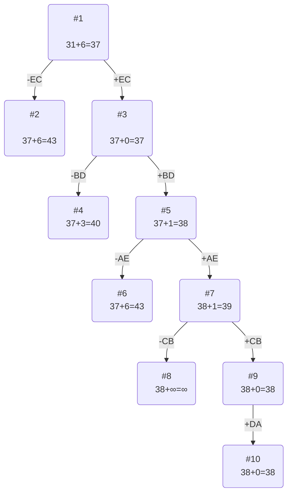

# Задача коммивояжера (Traveling salesman problem). Метод ветвей и границ.

### Вариант 4:
### Матрица расстояний:
---

|       | **A** | **B** | **C** | **D** | **E** |
| ----- | :---: | :---: | :---: | :---: | :---: |
| **A** | **∞** |  10   |   9   |  15   |   6   |
| **B** |   6   | **∞** |   9   |   9   |  12   |
| **C** |   7   |   9   | **∞** |  12   |   6   |
| **D** |   7   |  10   |  11   | **∞** |   6   |
| **E** |  10   |  15   |   7   |  14   | **∞** |

### Решение
---

Все маршруты начинаются в первом городе 
Все пространство решений n-1!

Ответ это 5 ячеек из матрицы  
Нужно найти Гамильтонов цикл

#### 1. Проведем редукцию матрицы по строкам
---

|       | **A** | **B** | **C** | **D** | **E** | MIN |
| ----- | :---: | :---: | :---: | :---: | :---: | --- |
| **A** | **∞** |  10   |   9   |  15   |   6   | 6   |
| **B** |   6   | **∞** |   9   |   9   |  12   | 6   |
| **C** |   7   |   9   | **∞** |  12   |   6   | 6   |
| **D** |   7   |  10   |  11   | **∞** |   6   | 6   |
| **E** |  10   |  15   |   7   |  14   | **∞** | 7   |
| SUM   |       |       |       |       |       | 31  |

Сумма констант редукции по строкам 31

Матрица после редукции строк:

|       | **A** | **B** | **C** | **D** | **E** |
| ----- | :---: | :---: | :---: | :---: | :---: |
| **A** | **∞** |   4   |   3   |   9   |   0   |
| **B** |   0   | **∞** |   3   |   3   |   6   |
| **C** |   1   |   3   | **∞** |   6   |   0   |
| **D** |   1   |   4   |   7   | **∞** |   0   |
| **E** |   3   |   8   |   0   |   7   | **∞** |

#### 2. Проведем редукцию столбцов матрицы
---

|       | **A** | **B** | **C** | **D** | **E** | SUM |
| ----- | :---: | :---: | :---: | :---: | :---: | --- |
| **A** | **∞** |   4   |   3   |   9   |   0   |     |
| **B** |   0   | **∞** |   3   |   3   |   6   |     |
| **C** |   1   |   3   | **∞** |   6   |   0   |     |
| **D** |   1   |   4   |   7   | **∞** |   0   |     |
| **E** |   3   |   8   |   0   |   7   | **∞** |     |
| MIN   |   0   |   3   |   0   |   3   |   0   | 6   |

Сумма констант редукции по столбцам 6

Матрица после редукции столбцов:

|       | **A** | **B** | **C** | **D** | **E** |
| ----- | :---: | :---: | :---: | :---: | :---: |
| **A** | **∞** |   1   |   3   |   6   |   0   |
| **B** |   0   | **∞** |   3   |   0   |   6   |
| **C** |   1   |   0   | **∞** |   3   |   0   |
| **D** |   1   |   1   |   7   | **∞** |   0   |
| **E** |   3   |   5   |   0   |   4   | **∞** |

#### 3. Оценка длины маршрута
---

Оценка длины маршрута снизу соответствует сумме констант редукции по строкам и по столбцам

31 + 6 = 37

#### 4. Найдем решение задачи с использованием метода ветвей и границ
---

Основная идея алгоритма:

Мы смотрим по каким ребрам можем точно пойти (зарезервировать их), а какие можем исключить (заменить на бесконечность), так чтобы составить минимальный цикл. При постепенном добавлении самое важное следить, чтобы цикл не замкнулся досрочно, поэтому после добавления ребра нужно заменять противоположное ребро на противоположное.

Чтобы определить ребро, по которому будет произведено ветвление из корневого узла рассчитаем штрафы для ребер с нулевой оценкой:

|        | **Штраф** |
| ------ | :-------: |
| **AE** |   **1**   |
| **BA** |     1     |
| **BD** |     3     |
| **CB** |     1     |
| **CE** |     0     |
| **DE** |   **1**   |
| **EC** |   **6**   |

Далее выбираем любое ребро с максимальным штрафом, те EC

##### Узел №2
---
Узел №2 с исключением ребра EC имеет оценку 37 + 6 (штраф) = 43

##### Узел №3
---
Для получения оценки узла 3 необходимо рассчитать сумму констант редукции для матрицы с учетом включения ребра EC, для этого в матрице:

- удалим строку E,
- удалим столбец C,
- Заменим на бесконечность значение CE. (это очень важно сделать, чтобы избежать досрочного зацикливания!)

|       | **A** | **B** | **D** |  **E**   | MIN |
| ----- | :---: | :---: | :---: | :------: | --- |
| **A** | **∞** |   1   |   6   |    0     | 0   |
| **B** |   0   | **∞** |   0   |    6     | 0   |
| **C** |   1   |   0   |   3   | $\infty$ | 0   |
| **D** |   1   |   1   | **∞** |    0     | 0   |
| SUM   |       |       |       |          | 0   |

|       | **A** | **B** | **D** |  **E**   | SUM |
| ----- | :---: | :---: | :---: | :------: | --- |
| **A** | **∞** |   1   |   6   |    0     |     |
| **B** |   0   | **∞** |   0   |    6     |     |
| **C** |   1   |   0   |   3   | $\infty$ |     |
| **D** |   1   |   1   | **∞** |    0     |     |
| SUM   |   0   |   0   |   0   |    0     | 0   |

Матрица после редукции:

|       | **A** | **B** | **D** |  **E**   |
| ----- | :---: | :---: | :---: | :------: |
| **A** | **∞** |   1   |   6   |    0     |
| **B** |   0   | **∞** |   0   |    6     |
| **C** |   1   |   0   |   3   | $\infty$ |
| **D** |   1   |   1   | **∞** |    0     |

Сумма констант редукции 0

Оценка узла 3 = 37 + 0 (редукция) = 37

Продолжим поиск из узла 3

Нужно пересчитать штрафы, так как матрица изменилась

#### Штрафы

|        | **Штраф** |
| ------ | :-------: |
| **AE** |   **1**   |
| **BA** |   **1**   |
| **BD** |   **3**   |
| **CB** |   **2**   |
| **DE** |   **1**   |

Максимальный штраф 3, выберем ребро BD, как ребро с максимальным штрафом.
##### Узел №4
---
Узел №4 с исключением ребра BD имеет оценку 37 + 3 (штраф) = 40
##### Узел №5
---
Для получения оценки узла 5 необходимо рассчитать сумму констант редукции для матрицы с учетом включения ребра BD, для этого в матрице:

- удалим строку B,
- удалим столбец D,
- Заменим на бесконечность значение DB.

|       | **A** |  **B**   |  **E**   | MIN |
| ----- | :---: | :------: | :------: | --- |
| **A** | **∞** |    1     |    0     | 0   |
| **C** |   1   |    0     | $\infty$ | 0   |
| **D** |   1   | $\infty$ |    0     | 0   |
| SUM   |       |          |          | 0   |

|       | **A** |  **B**   |  **E**   | SUM |
| ----- | :---: | :------: | :------: | --- |
| **A** | **∞** |    1     |    0     |     |
| **C** |   1   |    0     | $\infty$ |     |
| **D** |   1   | $\infty$ |    0     |     |
| MIN   |   1   |    0     |    0     | 1   |

Матрица после редукции:

|       | **A** |  **B**   |  **E**   |
| ----- | :---: | :------: | :------: |
| **A** | **∞** |    1     |    0     |
| **C** |   0   |    0     | $\infty$ |
| **D** |   0   | $\infty$ |    0     |

Сумма констант редукции 0

Оценка узла 5 = 37 + 1 (редукция) = 38

Продолжим поиск из узла 5

Нужно пересчитать штрафы, так как матрица изменилась

#### Штрафы

|        | **Штраф** |
| ------ | :-------: |
| **AE** |     1     |
| **CA** |   **0**   |
| **CB** |   **1**   |
| **DA** |   **0**   |
| DE     |     0     |

Максимальный штраф 1, выберем ребро AE, как ребро с максимальным штрафом.

##### Узел №6
---
Узел №6 с исключением ребра AE имеет оценку 38 + 1 (штраф) = 39

##### Узел №7
---
Для получения оценки узла 7 необходимо рассчитать сумму констант редукции для матрицы с учетом включения ребра AE, для этого в матрице:

- удалим строку A,
- удалим столбец E,
- Заменим на бесконечность значение EA. (сейчас цикл AEC, те нужно заменить CA на бесконечность)

|       |  **A**   |  **B**   |
| ----- | :------: | :------: |
| **C** | $\infty$ |    0     |
| **D** |    0     | $\infty$ |

Матрица после редукции:

|       |  **A**   |  **B**   |
| ----- | :------: | :------: |
| **C** | $\infty$ |    0     |
| **D** |    0     | $\infty$ |

Сумма констант редукции 0

Оценка узла 7 = 38 + 0 (редукция) = 38

Продолжим поиск из узла 7

Нужно пересчитать штрафы, так как матрица изменилась

#### Штрафы

|        | **Штраф** |
| ------ | :-------: |
| **CB** |   **∞**   |
| **DA** |   **∞**   |

Максимальный штраф ∞, выберем ребро CB, как ребро с максимальным штрафом.
##### Узел №8
---
Узел №8 с исключением ребра CB имеет оценку 38 + ∞ (штраф) = ∞

##### Узел №9
---
Для получения оценки узла 9 необходимо рассчитать сумму констант редукции для матрицы с учетом включения ребра CB, для этого в матрице:

- удалим строку C,
- удалим столбец B,
- Заменим на бесконечность значение BC.

|       | **A** |
| ----- | :---: |
| **D** |   0   |

Матрица после редукции:

|       | **A** |
| ----- | :---: |
| **D** |   0   |

Сумма констант редукции 0

Оценка узла 9 = 38 + 0 (редукция) = 38

Продолжим поиск из узла 9

Альтернатив у ребра DA нет

##### Узел №10
---
Ребро DA включается в маршрут, длина которого составляет 38

### Ответ

- Кратчайший маршрут AECBDA.
- Длина маршрута 38.

### Проверка

Сложим стоимость в изначальной матрице и проверим полученный результат

- ребро AE - 6
- ребро EC - 7
- ребро CB - 9
- ребро BD - 9
- ребро DA - 7

Сумма: **38**