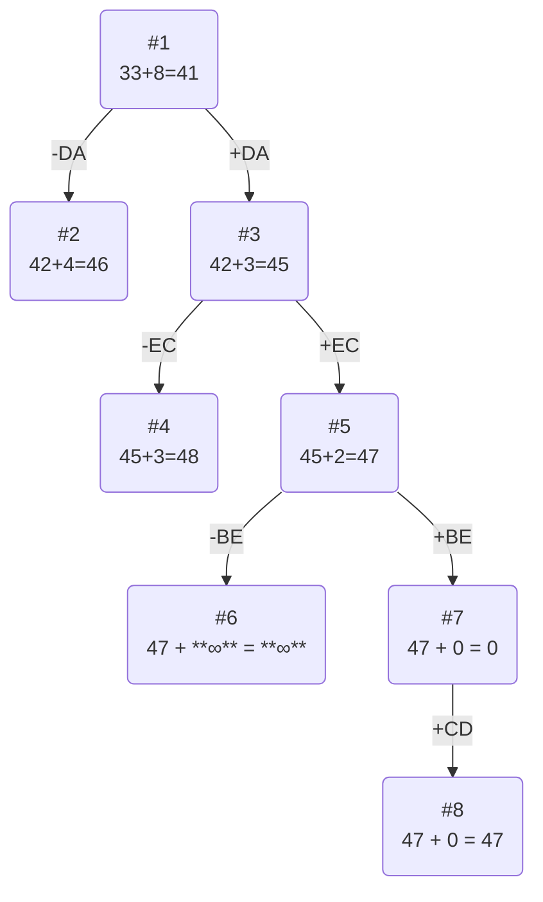

## Задача о коммивояжера. Метод ветвей и границ.

Для выполнения задания необходимо: 
1. Решить задачу коммивояжера с применением метода ветвей и границ.
2. Оформить решение задачи по шагам с подробными комментариями, таблицами и диаграммами.
3. В ответе указать:
   - найденный маршрут,
   - длину найденного маршрута.

## Вариант 9

Матрица расстояний:

|       | **A** | **B** | **C** | **D** | **E** |
|-------|:-----:|:-----:|:-----:|:-----:|:-----:|
| **A** | **∞** |   6   |  11   |  13   |  15   |
| **B** |   6   | **∞** |   8   |  10   |   8   |
| **C** |  14   |   8   | **∞** |  15   |  11   |
| **D** |   8   |  11   |  15   | **∞** |  14   |
| **E** |   5   |  15   |  10   |  15   | **∞** |

## Решение

### 1. Проведем редукцию строк матрицы

|       | **A** | **B** | **C** | **D** | **E** | **Min** |
|-------|:-----:|:-----:|:-----:|:-----:|:-----:| :-----: |
| **A** | **∞** |   6   |  11   |  13   |  15   |    6    |
| **B** |   6   | **∞** |   8   |  10   |   8   |    6    |
| **C** |  14   |   8   | **∞** |  15   |  11   |    8    |
| **D** |   8   |  11   |  15   | **∞** |  14   |    8    |
| **E** |   5   |  15   |  10   |  15   | **∞** |    5    |

Сумма констрант редукции по строкам: 33

---

#### Матрица после редукции строк:

|       | **A** | **B** | **C** | **D** | **E** |
|-------|:-----:|:-----:|:-----:|:-----:|:-----:|
| **A** | **∞** |   0   |   5   |   7   |   9   |
| **B** |   0   | **∞** |   2   |   4   |   2   |
| **C** |   6   |   0   | **∞** |   7   |   3   |
| **D** |   0   |   3   |   7   | **∞** |   6   |
| **E** |   0   |  10   |   5   |  10   | **∞** |

### 2. Проведём редукцию матрицы по столбцам.

|       | **A** | **B** | **C** | **D** | **E** |**Sum**|
|-------|:-----:|:-----:|:-----:|:-----:|:-----:|  ---  |
| **A** | **∞** |   0   |   5   |   7   |   9   |       |
| **B** |   0   | **∞** |   2   |   4   |   2   |       |
| **C** |   6   |   0   | **∞** |   7   |   3   |       |
| **D** |   0   |   3   |   7   | **∞** |   6   |       |
| **E** |   0   |  10   |   5   |  10   | **∞** |       |
|**Min**|   0   |   0   |   2   |   4   |   2   |   8   |

Сумма констант редукции по столбцам 8

#### Матрица после редукции по столбцам.

|       | **A** | **B** | **C** | **D** | **E** |
|-------|:-----:|:-----:|:-----:|:-----:|:-----:|
| **A** | **∞** |   0   |   3   |   3   |   7   |
| **B** |   0   | **∞** |   0   |   0   |   0   |
| **C** |   6   |   0   | **∞** |   3   |   1   |
| **D** |   0   |   3   |   5   | **∞** |   4   |
| **E** |   0   |  10   |   3   |   6   | **∞** |

---

### 3. Оценка длины маршрута

Оценка длины маршрута снизу соответствует сумме констант редукции по строкам и по столбцам

#### 33 + 8 = 41

---

### 4. Найдем решение задачи с использованием метода ветвей и границ

|        | **Штраф** |
|:-------|:---------:|
| **AB** |     3     |
| **BA** |     0     |
| **BC** |     3     |
| **BD** |     3     |
| **BE** |     1     |
| **CB** |     1     |
| **DA** |     3     |
| **EA** |     3     |

Максимальный штраф 3, выберем ребро AB, как одно из ребер с максимальным штрафом.

### Узел №2
Узел №2 с исключением ребра AB имеет оценку 41 (сумма констант редукций родительской матрицы) + 3 (штраф) = 44

### Узел №3
Для получения оценки узла 3 необходимо рассчитать сумму констант редукции для матрицы с учетом включения ребра AB, для этого в матрице:
- удалим строку A,
- удалим столбец B,
- Заменим на бесконечность значение BA.

|       | **A** | **C** | **D** | **E** |**Min**|
|-------|:-----:|:-----:|:-----:|:-----:|:-----:|
| **B** | **∞** |   0   |   0   |   0   |       |
| **C** |   6   | **∞** |   3   |   1   |   1   |
| **D** |   0   |   5   | **∞** |   4   |       |
| **E** |   0   |   3   |   6   | **∞** |       |
|**Sum**|       |       |       |       |   1   |

#### Матрица после редукции:
|       | **A** | **C** | **D** | **E** |
|-------|:-----:|:-----:|:-----:|:-----:|
| **B** | **∞** |   0   |   0   |   0   |
| **C** |   5   | **∞** |   2   |   0   | 
| **D** |   0   |   5   | **∞** |   4   |
| **E** |   0   |   3   |   6   | **∞** | 

#### Сумма констант редукции 1

Оценка узла 3 = 41 + 1 = 42
 
 Продолжим поиск из узла 3.

### Выбор ребра
Чтобы определить ребро, по которому будет произведено ветвление из узла 3 рассчитаем штрафы для ребер с нулевой оценкой:

|        | **Штраф** |
|:-------|:---------:|
| **BC** |     3     |
| **BD** |     2     |
| **BE** |     0     |
| **CE** |     2     |
| **DA** |     4     |
| **EA** |     3     |

Максимальный штраф 4, выберем ребро DA, как ребро с максимальным штрафом.

---

### 4. Найдем решение задачи с использованием метода ветвей и границ

### Узел №2

Узел №2 с исключением ребра DA имеет оценку 42 + 4 (штраф) = 46

### Узел №3

Для получения оценки узла 5 необходимо рассчитать сумму констант редукции для матрицы с учетом включения ребра DA, для этого в матрице:

- удалим строку D,
- удалим столбец A,
- Заменим на бесконечность значение BD.

|       | **C** | **D** | **E** |**Min**|
|-------|:-----:|:-----:|:-----:|:-----:|
| **B** |   0   | **∞** |   0   |       |
| **C** | **∞** |   2   |   0   |   0   |
| **E** |   3   |   6   | **∞** |   3   |
|**Sum**|       |       |       |   3   | 

Матрица после редукции:

|       | **C** | **D** | **E** |
|-------|:-----:|:-----:|:-----:|
| **B** |   0   | **∞** |   0   |
| **C** | **∞** |   2   |   0   |
| **E** |   0   |   3   | **∞** |

#### Сумма констант редукции 3

Оценка узла 3 = 42 + 3 = 45

Продолжим из узла 3

#### Выбор ребра

Чтобы определить ребро, по которому будет произведено ветвление из узла 5 рассчитаем штрафы для ребер с нулевой оценкой:

|        | **Штраф** |
|:-------|:---------:|
| **BC** |     0     |
| **BE** |     0     |
| **CE** |     2     |
| **EC** |     3     |

Максимальный штраф 3, выберем ребро EC, как ребро с максимальным штрафом.

### Узел №4

Узел №4 с исключением ребра EC имеет оценку 45 + 3 (штраф) = 48

### Узел №5

Для получения оценки узла 5 необходимо рассчитать сумму констант редукции для матрицы с учетом включения ребра EC, для этого в матрице:

- удалим строку E,
- удалим столбец C,
- Заменим на бесконечность значение CE, чтобы избежать образования преждевременного цикла.

|       | **D** | **E** |**Min**|
|-------|:-----:|:-----:|:-----:|
| **B** | **∞** |   0   |       |
| **C** |   2   | **∞** |   2   |
|**Sum**|       |       |   2   |

Матрица после редукции:
|       | **D** | **E** |
|-------|:-----:|:-----:|
| **B** | **∞** |   0   |
| **C** |   0   | **∞** |

Сумма констант редукции 2, следовательно, оценка узла = 45 + 2 = 47

Продолжим из узла 5

####  Выбор ребра

Чтобы определить ребро, по которому будет произведено ветвление из узла 7 рассчитаем штрафы для ребер с нулевой оценкой:

|        | **Штраф** |
|:-------|:---------:|
| **BE** |  **∞**    |
| **CD** |  **∞**    |

Максимальный штраф **∞**, выберем ребро BE, как одно из ребер с максимальным штрафом.

Продолжим из узла №5

### Узел №6

Узел №6 с исключением ребра BE имеет оценку 47 + **∞** = **∞**

### Узел №7

Для получения оценки узла 7 необходимо рассчитать сумму констант редукции для матрицы с учетом включения ребра BE, для этого в матрице:

- удалим строку B,
- удалим столбец E,

|       | **D** |
|-------|:-----:|
| **C** |   0   |

Сумма констант редукции 0, следовательно, оценка узла 7 = 47 + 0 = 47

Продолжим поиск из узла 7

#### Выбор ребра

Альтернатив у ребра CD нет

### Узел №8

Ребро CD включается в маршрут, длина которого составляет 47

## Ответ

- Кратчайший маршрут DAECBD.

- Длина маршрута 47.