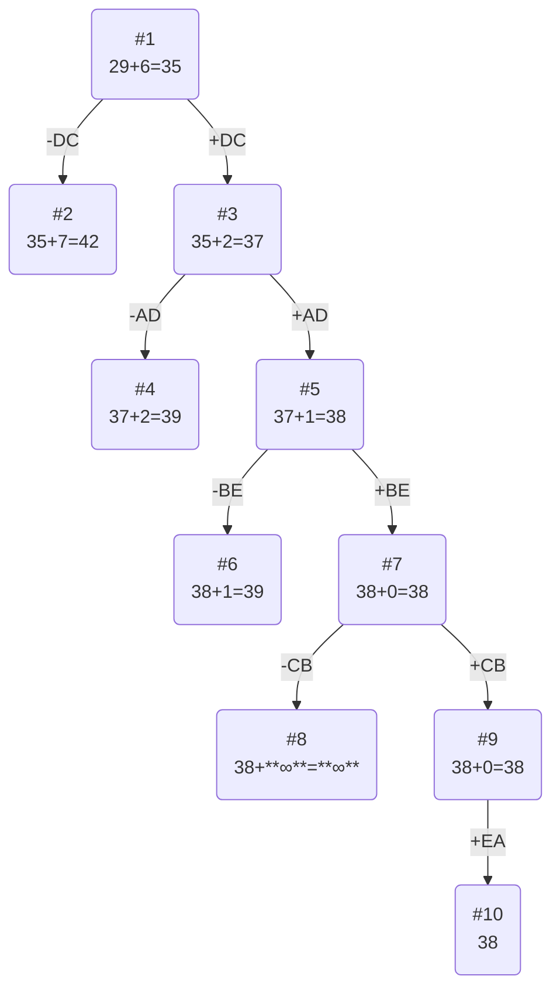

# Постановка задачи
Для каждого варианта представлены условия задачи, в соответствии с которыми необходимо: 
1. Решить задачу коммивояжера с применением метода ветвей и границ.
2. Оформить решение задачи по шагам с подробными комментариями, таблицами и диаграммами.
3. В ответе указать:
   - найденный маршрут,
   - длину найденного маршрута.

# Вариант №6

Матрица расстояний:

|       | **A** | **B** | **C** | **D** | **E** |
|:------|:-----:|:-----:|:-----:|:-----:|:-----:|
| **A** | **∞** |   5   |  13   |   8   |  13   |
| **B** |   6   | **∞** |  13   |  11   |  11   |
| **C** |   8   |   9   | **∞** |  12   |  14   |
| **D** |   5   |  11   |   5   | **∞** |   8   |
| **E** |   5   |   6   |  12   |  15   | **∞** |

# Решение

## 1. Проведем редукцию строк матрицы

|       | **A** | **B** | **C** | **D** | **E** | Min |
|:------|:-----:|:-----:|:-----:|:-----:|:-----:|:---:|
| **A** | **∞** |   5   |   13  |   8   |  13   |  5  |
| **B** |   6   | **∞** |   13  |  11   |   5   |  6  |
| **C** |   8   |   9   | **∞** |   12  |   9   |  8  |
| **D** |   5   |   11  |   5   | **∞** |   3   |  5  |
| **E** |   5   |   6   |   12  |  15   | **∞** |  5  |
| Sum   |       |       |       |       |       | 29  |

Сумма констант редукции по строкам 29

Марица после редукции строк:

|       | **A** | **B** | **C** | **D** | **E** |
|:------|:-----:|:-----:|:-----:|:-----:|:-----:|
| **A** | **∞** |   0   |   8   |   3   |   8   |
| **B** |   0   | **∞** |   7   |   5   |   5   |
| **C** |   0   |   1   | **∞** |   4   |   6   |
| **D** |   0   |   6   |   0   | **∞** |   3   |
| **E** |   0   |   1   |   7   |   10  | **∞** |

## 2. Проведем редукцию столбцов матрицы

|       | **A** | **B** | **C** | **D** | **E** | Sum |
|:------|:-----:|:-----:|:-----:|:-----:|:-----:|:---:|
| **A** | **∞** |   0   |   8   |   3   |   8   |     |
| **B** |   0   | **∞** |   7   |   5   |   5   |     |
| **C** |   0   |   1   | **∞** |   4   |   6   |     |
| **D** |   0   |   6   |   0   | **∞** |   3   |     |
| **E** |   0   |   1   |   7   |   10  | **∞** |     |
| Min   |       |       |       |   3   |   3   |  6  |

Сумма констант редукции по столбцам 6

Марица после редукции столбцов:

|       | **A** | **B** | **C** | **D** | **E** |
|:------|:-----:|:-----:|:-----:|:-----:|:-----:|
| **A** | **∞** |   0   |   8   |   0   |   5   |
| **B** |   0   | **∞** |   7   |  2    |   2   |
| **C** |   0   |   1   | **∞** |   1   |   3   |
| **D** |   0   |   6   |   0   | **∞** |   0   |
| **E** |   0   |   1   |   7   |   7   | **∞** |

## 3. Оценка длины маршрута

Оценка длины маршрута снизу соответствует сумме констант редукции по строкам и по столбцам

29 + 6 = 35

## 4. Найдем решение задачи с использованием метода ветвей и границ

Чтобы определить ребро, по которому будет произведено ветвление из корневого узла рассчитаем штрафы для ребер с нулевой оценкой:

|        | **Штраф** |
|:-------|:---------:|
| AB |     1     |
| AD |     1     |
| BA |     2     |
| CA |     1     |
| DA |     0     |
|**DC**| **7**   |
| DE |     2     |
| EA |     1     |

Максимальный штраф 7 у ребра DC.

### Узел №2
Узел №2 с исключением ребра DC имеет оценку 35 (сумма констант редукций родительской матрицы) + 7 (штраф) = 42

### Узел №3
Для получения оценки узла 3 необходимо рассчитать сумму констант редукции для матрицы с учетом включения ребра DC, для этого в матрице:
- удалим строку D,
- удалим столбец C,
- Заменим на бесконечность значение CD.

|       | **A** | **B** | **D** | **E** | Sum |
|:------|:-----:|:-----:|:-----:|:-----:|-----|
| **A** | **∞** |   0   |  0    |   5   |     |
| **B** |   0   | **∞** |   2   |   2   |     |
| **C** |   0   |   1   | **∞** |   3   |     |
| **E** |   0   |   1   |   7   | **∞** |     |
| Min   |       |       |       |   2   |  2  |

Матрица после редукции:

|       | **A** | **B** | **D** | **E** |
|:------|:-----:|:-----:|:-----:|:-----:|
| **A** | **∞** |   0   |  0    |   3   |
| **B** |   0   | **∞** |   2   |   0   |
| **C** |   0   |   1   | **∞** |   1   |
| **E** |   0   |   1   |   7   | **∞** |

Сумма констант редукции 2

Оценка узла 3 = 35 + 2 (редукция) = 37

Продолжим поиск из узла 3, так как оценка узла№2 = 42 > оценка узла №3 = 37

### Выбор ребра
Чтобы определить ребро, по которому будет произведено ветвление из узла 3 рассчитаем штрафы для ребер с нулевой оценкой:

|        | **Штраф** |
|:-------|:---------:|
| **AB** |     1     |
| **AD** |    2      |
| **BA** |     0     |
| **BE** |     1     |
| **CA** |     1     |
| **EA** |     1     |

Максимальный штраф 2, выберем ребро AD, как ребро с максимальным штрафом.

### Узел №4
Узел №4 с исключением ребра AD имеет оценку 37 + 2 (штраф) = 39

### Узел №5
Для получения оценки узла 5 необходимо рассчитать сумму констант редукции для матрицы с учетом включения ребра AD, для этого в матрице:
- удалим строку A,
- удалим столбец D,
- Заменим на бесконечность значение CA.

|       | **A** | **B** | **E** | Min |
|:------|:-----:|:-----:|:-----:|-----|
| **B** | 0     | **∞** |   0   |     |
| **C** | **∞** |   1   |   1   |  1  |
| **E** |   0   |   1   | **∞** |     |
|  Sum  |       |       |       |  1  |

Матрица после редукции:

|       | **A** | **B** | **E** |
|:------|:-----:|:-----:|:-----:|
| **B** | 0     | **∞** |   0   |
| **C** | **∞** |   0   |   0   |
| **E** |   0   |   1   | **∞** |

Сумма констант редукции 1

Оценка узла 5 = 37 + 1 (редукция) = 38

Продолжим поиск из узла 5, так как оценка узла №2 = 42 > оценка узла №4 = 39 > оценка узла №5 = 38

### Выбор ребра
Чтобы определить ребро, по которому будет произведено ветвление из узла 5 рассчитаем штрафы для ребер с нулевой оценкой:

|        | **Штраф** |
|:-------|:---------:|
| **BA** |     0     |
| **BE** |    1      |
| **CB** |     1     |
| **CE** |     0     |
| **EA** |     1     |

Максимальный штраф 1, выберем ребро BE, как ребро с максимальным штрафом.

### Узел №6
Узел №6 с исключением ребра BE имеет оценку 38 + 1 (штраф) = 39

### Узел №7
Для получения оценки узла 7 необходимо рассчитать сумму констант редукции для матрицы с учетом включения ребра BE, для этого в матрице:
- удалим строку B,
- удалим столбец E.

|       | **A** | **B** |
|:------|:-----:|:-----:|
| **C** | **∞** |   0   |
| **E** |   0   |   1   |

Проводить редукцию не нужно, так как в каждой строке и в каждом столбце есть ребро с нулевой оценкой.

Сумма констант редукции 0

Оценка узла 7 = 38 + 0 (редукция) = 38

Продолжим поиск из узла 7, так как оценка узла №2 = 42 > оценка узла №4 = 39 > оценка узла №6 = 39 > оценка узла №7 = 38

### Выбор ребра
Чтобы определить ребро, по которому будет произведено ветвление из узла 7 рассчитаем штрафы для ребер с нулевой оценкой:

|        | **Штраф** |
|:-------|:---------:|
| **CB** |   **∞**   |
| **EA** |   **∞**   |

Максимальный штраф **∞**, выберем ребро CB, как ребро с максимальным штрафом.

### Узел №8
Узел №8 с исключением ребра CB имеет оценку 38 + **∞** (штраф) = **∞**

### Узел №9
Для получения оценки узла 9 необходимо рассчитать сумму констант редукции для матрицы с учетом включения ребра CB, для этого в матрице:
- удалим строку С,
- удалим столбец B.

|       | **A** |
|:-------|:---------:|
| **E** |   0   |

Проводить редукцию не нужно, так как в каждой строке и в каждом столбце есть ребро с нулевой оценкой.

Сумма констант редукции 0

Оценка узла 9 = 38 + 0 (редукция) = 38

Продолжим поиск из узла 9, так как оценка узла №8 = **∞** > оценка узла №2 = 42 > оценка узла №4 = 39 > оценка узла №6 = 39 > оценка узла № 9 = 38

### Выбор ребра

Альтернатив у ребра EA нет

### Узел №10
Ребро EA включается в маршрут, длина которого составляет 38

# Ответ
- Кратчайший маршрут ADCBEA.
- Длина маршрута 38.