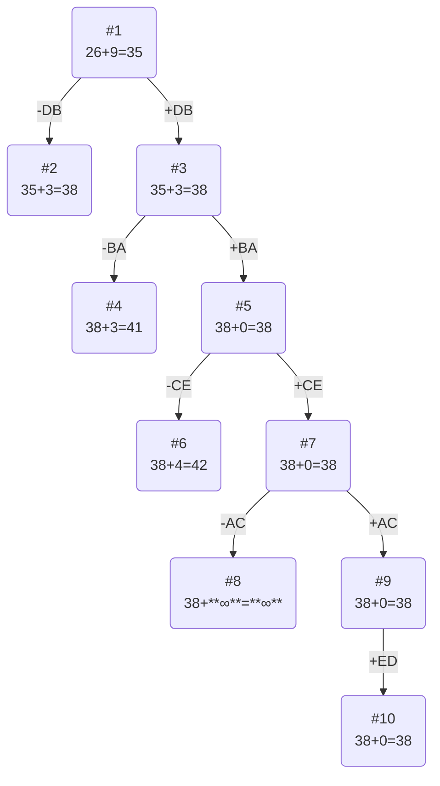

### Вариант 3:
Матрица расстояний:

|       | **A** | **B** | **C** | **D** | **E** |
|-------|:-----:|:-----:|:-----:|:-----:|:-----:|
| **A** | **∞** |   6   |   10  |   10  |  10   |
| **B** |   9   | **∞** |  10   |   5   |  11   |
| **C** |  10   |   5   | **∞** |  10   |   7   |
| **D** |  13   |   5   |  13   | **∞** |  10   |
| **E** |  13   |   5   |   8   |   7   | **∞** |

## Решение
### 1. Проведем редукцию строк матрицы

|       | **A** | **B** | **C** | **D** | **E** |  Min  |
|-------|:-----:|:-----:|:-----:|:-----:|:-----:|:-----:|
| **A** | **∞** |   6   |   10  |   10  |  10   |   6   |
| **B** |   9   | **∞** |  10   |   5   |  11   |   5   |
| **C** |  10   |   5   | **∞** |  10   |   7   |   5   |
| **D** |  13   |   5   |  13   | **∞** |  10   |   5   |
| **E** |  13   |   5   |   8   |   7   | **∞** |   5   |
| Sum   |       |       |       |       |       |  26   |

Сумма констант редукции по строкам 26

Марица после редукции строк:

|       | **A** | **B** | **C** | **D** | **E** |
|-------|:-----:|:-----:|:-----:|:-----:|:-----:|
| **A** | **∞** |   0   |   4   |   4   |   4   |
| **B** |   4   | **∞** |   5   |   0   |   6   |
| **C** |   5   |   0   | **∞** |   5   |   2   |
| **D** |   8   |   0   |   8   | **∞** |   5   |
| **E** |   8   |   0   |   3   |   2   | **∞** |

### 2. Проведем редукцию столбцов матрицы

|       | **A** | **B** | **C** | **D** | **E** |  SUM  |
|-------|:-----:|:-----:|:-----:|:-----:|:-----:|:-----:|
| **A** | **∞** |   0   |   4   |   4   |   4   |       |
| **B** |   4   | **∞** |   5   |   0   |   6   |       |
| **C** |   5   |   0   | **∞** |   5   |   2   |       |
| **D** |   8   |   0   |   8   | **∞** |   5   |       |
| **E** |   8   |   0   |   3   |   2   | **∞** |       | 
| Min   |   4   |   0   |   3   |   0   |   2   |  9    |

Сумма констант редукции по столбцам 4

Марица после редукции столбцов:

|       | **A** | **B** | **C** | **D** | **E** |
|-------|:-----:|:-----:|:-----:|:-----:|:-----:|
| **A** | **∞** |   0   |   1   |   4   |   2   |
| **B** |   0   | **∞** |   2   |   0   |   4   |
| **C** |   1   |   0   | **∞** |   5   |   0   |
| **D** |   4   |   0   |   5   | **∞** |   3   |
| **E** |   4   |   0   |   0   |   2   | **∞** |

### 3. Оценка длины маршрута

Оценка длины маршрута снизу соответствует сумме констант редукции по строкам и по столбцам

26 + 9 = 35

### 4. Найдем решение задачи с использованием метода ветвей и границ

Чтобы определить ребро, по которому будет произведено ветвление из корневого узла рассчитаем штрафы для ребер с нулевой оценкой:

|        | **Штраф** |
|:-------|:---------:|
| **AB** |     1     |
| **BA** |     1     |
| **BD** |     2     |
| **CB** |     0     |
| **CE** |     2     |
| **DB** |     3     |
| **EB** |     0     |
| **EC** |     1     |

Максимальный штраф 3, выберем ребро DB, как одно из ребер с максимальным штрафом.

#### Узел №2
Узел №2 с исключением ребра DB имеет оценку 35 + 3 (штраф) = 38

#### Узел №3
Для получения оценки узла 3 необходимо рассчитать сумму констант редукции для матрицы с учетом включения ребра DB, для этого в матрице:
- удалим строку D,
- удалим столбец B,
- Заменим на бесконечность значение BD.

|       | **A** | **C** | **D** | **E** |  Min  |
|-------|:-----:|:-----:|:-----:|:-----:|:-----:|
| **A** | **∞** |   1   |   4   |   2   |   1   |
| **B** |   0   |   2   | **∞** |   4   |       |
| **C** |   1   | **∞** |   5   |   0   |       |
| **E** |   4   |   0   |   2   | **∞** |       |
| Sum   |       |       |       |       |  1    |

Матрица после редукции по строкам:

|       | **A** | **C** | **D** | **E** |  SUM  |
|-------|:-----:|:-----:|:-----:|:-----:|:-----:|
| **A** | **∞** |   0   |   3   |   1   |       |
| **B** |   0   |   2   | **∞** |   4   |       |
| **C** |   1   | **∞** |   5   |   0   |       |
| **E** |   4   |   0   |   2   | **∞** |       |
|  MIN  |       |       |   2   |       |  2    |

Матрица после редукции по столбцам:

|       | **A** | **C** | **D** | **E** |
|-------|:-----:|:-----:|:-----:|:-----:|
| **A** | **∞** |   0   |   1   |   1   |
| **B** |   0   |   2   | **∞** |   4   |
| **C** |   1   | **∞** |   3   |   0   |
| **E** |   4   |   0   |   0   | **∞** |

Сумма констант редукции 3

Оценка узла 3 = 35 + 3 (редукция) = 38

Продолжим поиск из узла 3

#### Выбор ребра
Чтобы определить ребро, по которому будет произведено ветвление из узла 3 рассчитаем штрафы для ребер с нулевой оценкой:

|        | **Штраф** |
|:-------|:---------:|
| **AC** |     1     |
| **BA** |     3     |
| **CE** |     2     |
| **EC** |     0     |
| **ED** |     1     |

Максимальный штраф 3, выберем ребро BA, как ребро с максимальным штрафом.

#### Узел №4
Узел №4 с исключением ребра BA имеет оценку 38 + 3 (штраф) = 41

#### Узел №5
Для получения оценки узла 5 необходимо рассчитать сумму констант редукции для матрицы с учетом включения ребра BA, для этого в матрице:
- удалим строку B,
- удалим столбец A,
- Заменим на бесконечность значение AD, чтобы избежать образования преждевременного цикла.

|       | **C** | **D** | **E** |
|:------|:-----:|:-----:|:-----:|
| **A** |   0   | **∞** |   1   |
| **C** | **∞** |   3   |   0   |
| **E** |   0   |   0   | **∞** |

Сумма констант редукции 0

Оценка узла 5 = 38 + 0 (редукция) = 38

Продолжим поиск из узла 5

#### Выбор ребра
Чтобы определить ребро, по которому будет произведено ветвление из узла 5 рассчитаем штрафы для ребер с нулевой оценкой:

|        | **Штраф** |
|:-------|:---------:|
| **AC** |     1     |
| **CE** |     4     |
| **EC** |     0     |
| **ED** |     3     |

Максимальный штраф 4, выберем ребро CE, как ребро с максимальным штрафом.

#### Узел №6
Узел №6 с исключением ребра CE имеет оценку 38 + 4 (штраф) = 42

#### Узел №7
Для получения оценки узла 7 необходимо рассчитать сумму констант редукции для матрицы с учетом включения ребра CE, для этого в матрице:
- удалим строку C,
- удалим столбец E,
- Заменим на бесконечность значение EC, чтобы избежать образования преждевременного цикла.

|       | **C** | **D** | 
|:------|:-----:|:-----:|
| **A** |   0   | **∞** |
| **E** | **∞** |   0   |

Сумма констант редукции 0

Оценка узла 7 = 38 + 0 (редукция) = 38

Продолжим поиск из узла 7

#### Выбор ребра
Чтобы определить ребро, по которому будет произведено ветвление из узла 7 рассчитаем штрафы для ребер с нулевой оценкой:

|        | **Штраф** |
|:-------|:---------:|
| **AC** |   **∞**   |
| **ED** |   **∞**   |

Максимальный штраф **∞**, выберем ребро AC, как ребро с максимальным штрафом.

#### Узел №8
Узел №8 с исключением ребра AC имеет оценку 38 + **∞** (штраф) = **∞**

#### Узел №9
Для получения оценки узла 9 необходимо рассчитать сумму констант редукции для матрицы с учетом включения ребра AC, для этого в матрице:
- удалим строку A,
- удалим столбец C,

|       | **D** | 
|:------|:-----:|
| **E** |   0   |

Сумма констант редукции 0

Оценка узла 9 = 38 + 0 (редукция) = 38

Продолжим поиск из узла 9

#### Выбор ребра
Альтернатив у ребра ED нет

#### Узел №14
Ребро ED включается в маршрут, длина которого составляет 38

### Ответ
- Кратчайший маршрут DBACED.
- Длина маршрута 38.
