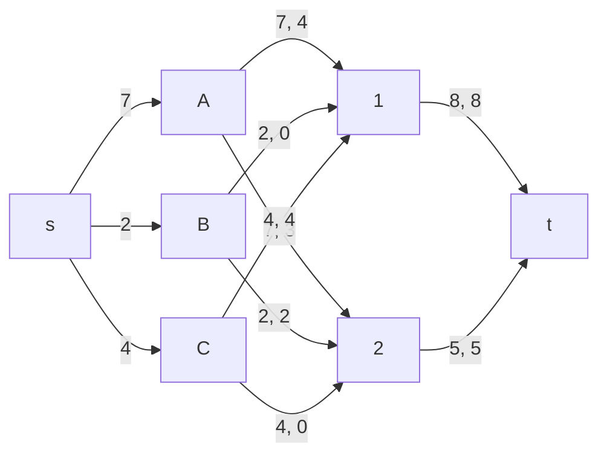
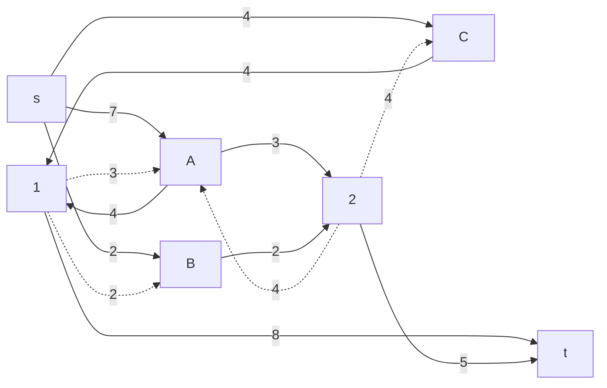
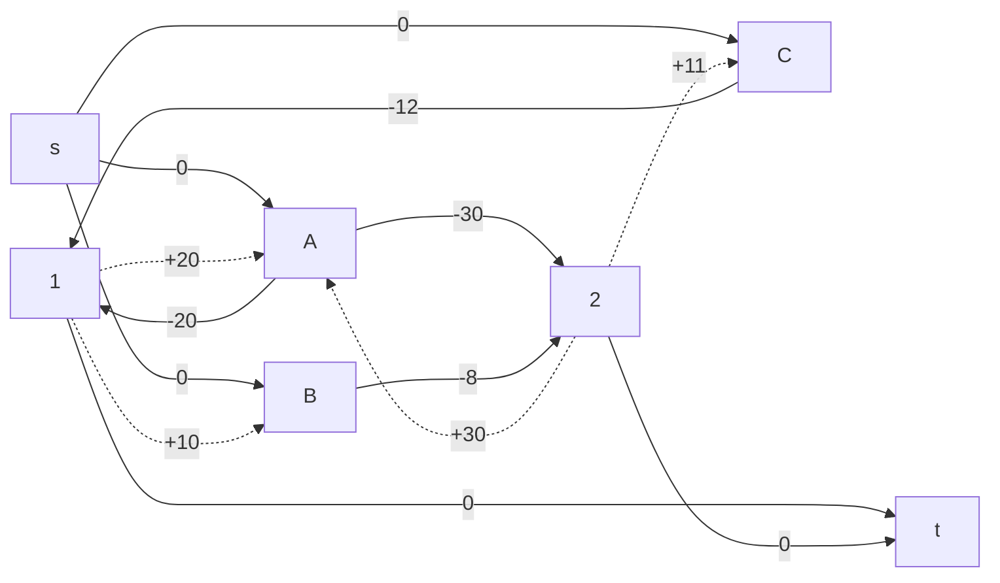
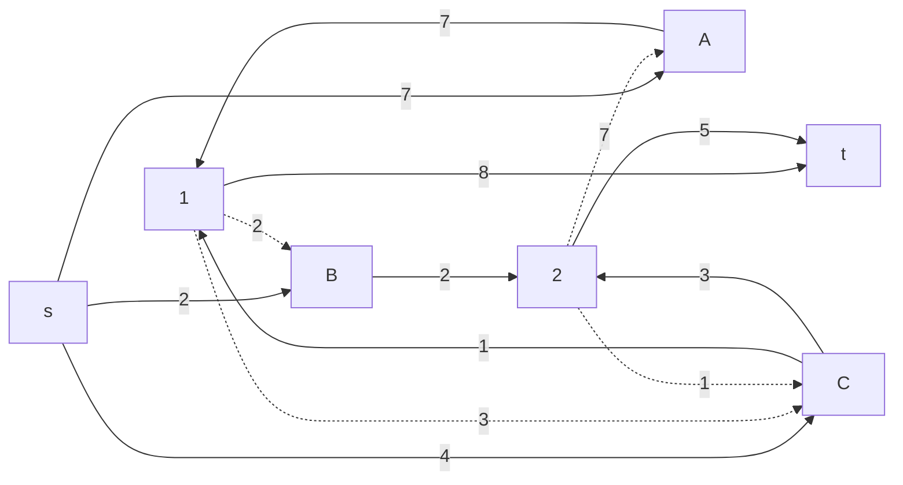
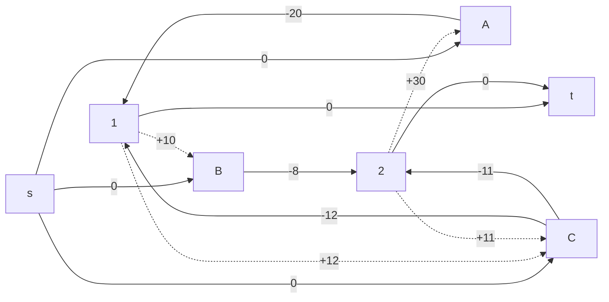

# Задание 14. Вариант №2 #
## Условие ##
Три завода имеют производительность 7, 2 и 4, а два складских помещения имеют вместимость 8 и 5.
Матрица затрат на перевозку
|     |**1**|**2**|
|:---:|:---:|:---:|
|**A**| 20  | 30  |
|**B**| 10  |  8  |
|**C**| 12  | 11  |
## Решение ##
### Задание 1 ###
$$ A → 1 $$
$$ A → 2 $$ 
$$ B → 2 $$ 
$$ C → 1 $$
S = 4 * 20 + 3 * 30 + 2 * 8 + 4 * 12 = 234 (у.е.)
### Задание 2 ###

На дугах указаны пары чисел, где первое число - локальный поток, а второе - пропускная способность. Локальные потоки выбраны из условия задания 1. Локальные потоки дуг, входящих и исходящих из вершин левой доли графа, являются производительностью заводов, а исходящих из вершин правой доли - вместимостью складов.

Остаточная сеть с абсолютными величинами стоимости.

В построенном графе присутствует цикл отрицательной стоимости
$$ 1 → A → 2 → C → 1 $$
Данный цикл указывает на возможность альтернативной менее затратной транспортировки. 
Сумма стоимостей равна -11 Минимальный вес среди представленных дуг равен 3 
Таким образом, уничтожая отрицательный цикл, мы перенаправляем 3 единицы товара и экономим 11 единиц товара.

Остаточная сеть с абсолютными величинами стоимости.

Нет циклов отрицательной стоимости. Следовательно, мы уже имеем оптимальное решение для транспортировки товаров с минимальными затратами.
$$ A → 1 $$
$$ B → 2 $$ 
$$ C → 1 $$
$$ C → 2 $$
S = 7 * 20 + 2 * 8 + 3 * 11 + 1 * 12 = 201 (у.е.)
### Ответ ###
Минимальная стоимость: 201