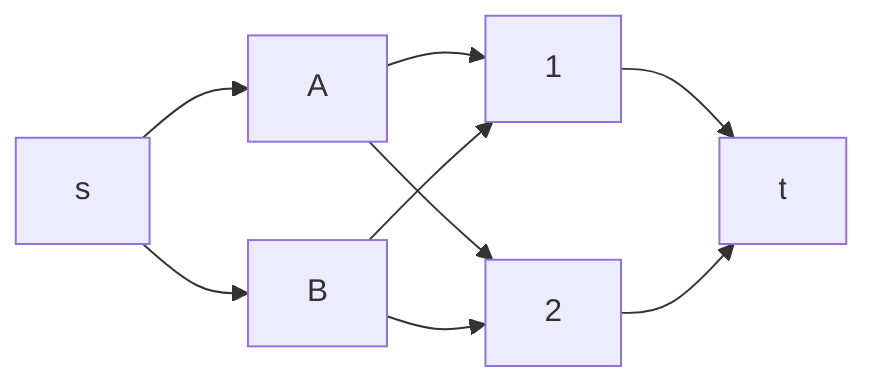
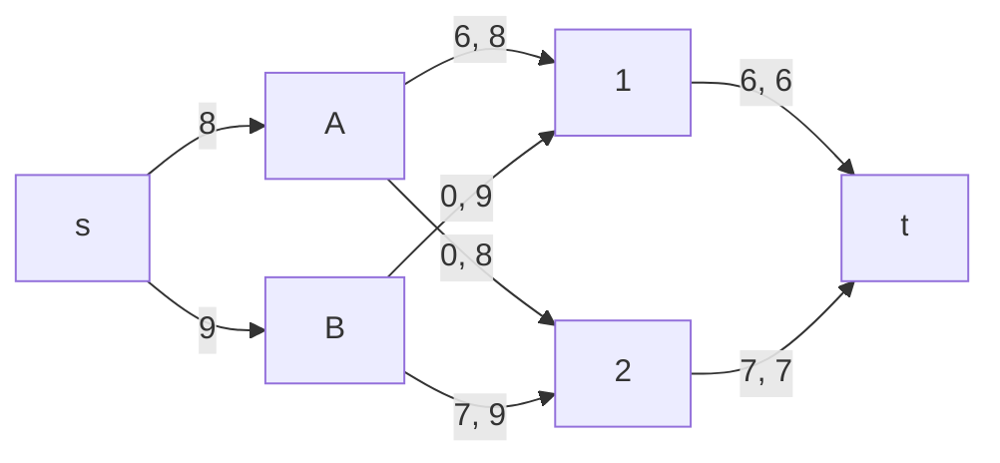
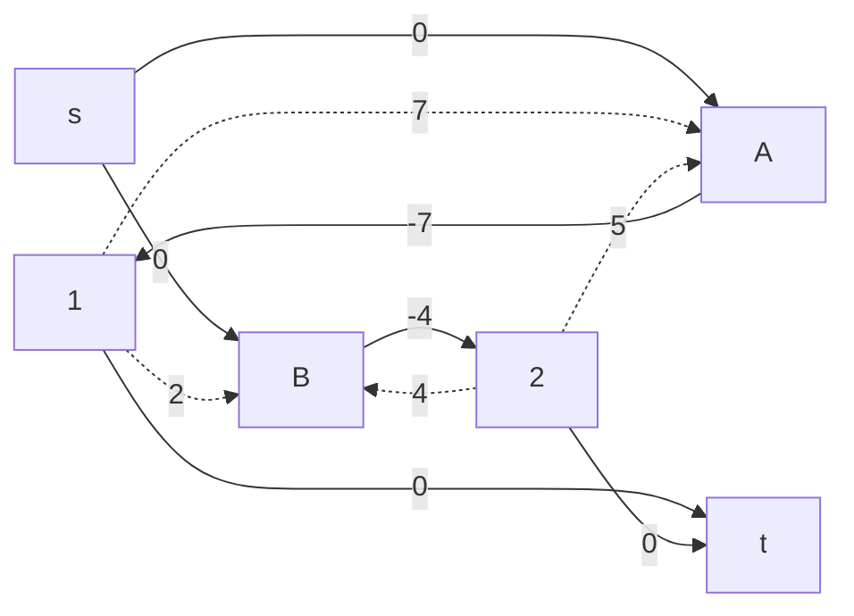
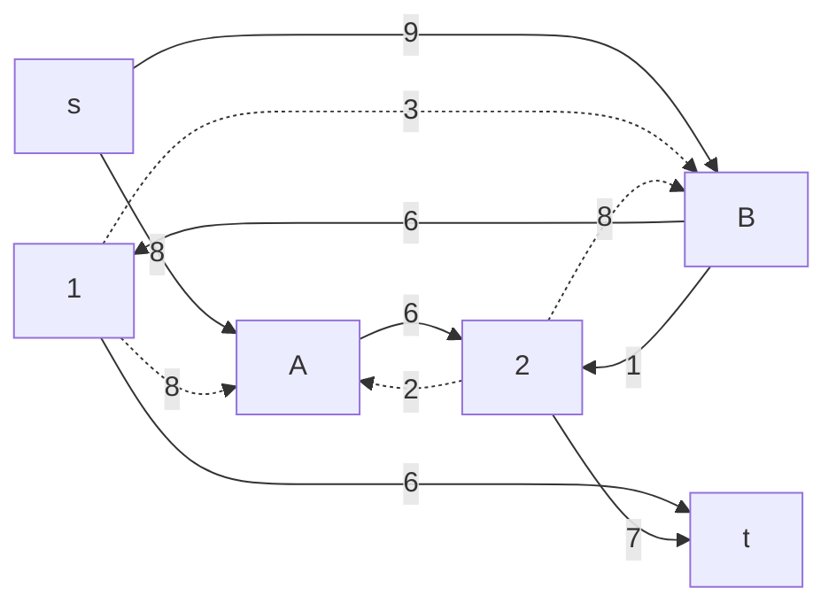
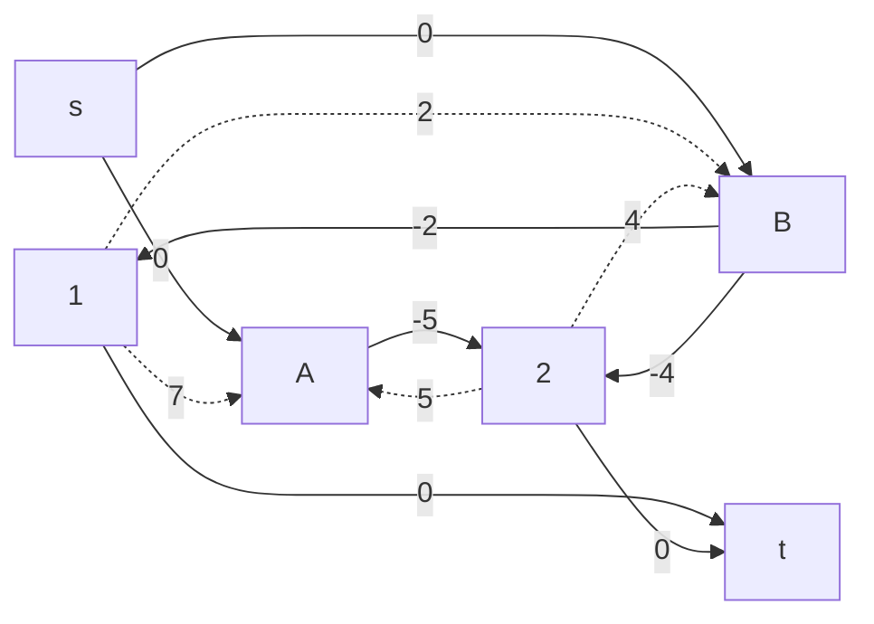
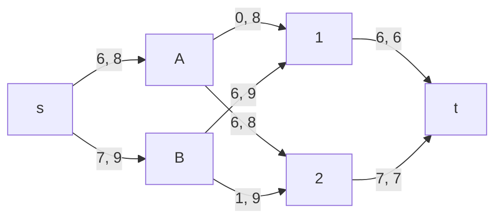

# Задание 14. Вариант №5 #
## Условие ##
Два завода имеют производительность 8, 9 а два складских помещения имеют вместимость 6 и 7.
Матрица затрат на перевозку:

|       | **1** | **2** |
|-------|-------|-------|
| **A** | 7     | 5     |
| **B** | 2     | 4     |

## Решение ##

### Задача 1 ###

$$ A → 1 $$
$$ B → 2 $$

Итого 42 + 28 = 70

**Ответ: 70**

### Задача 2 ###

Представим задачу в виде сети для решения с помощью алгоритма поиска максимального потока минимальной стоимости:

Веса дуг, выходящие из истока - производительность заводов; Локальные потоки, входящие в сток - вместимость складов.
Локальные потоки выбраны из условия задания 1.
Первое число на графе - локальный поток, второе - пропускная способность.

Остаточная сеть:

Остаточная сеть с величинами стоимости:

Ищем цикл отрицательной стоимости: 
1 -> B -> 2 -> A -> 1 
Сумма стоимостей = -4 
Минимальный вес дуги в цикле = 6 
Уменьшим вес всех дуг цикла на 6:

Остаточная сеть с величинами стоимости:

Отрицательный цикл не найден.
Мы уже имеем оптимальное решение для транспортировки товаров с минимальными затратами.

$$ A → 2 $$
$$ B → 1 $$
$$ B → 2 $$

Итого минимальная сумма максимального потока = 6*5 + 6*2 + 1*4 = 46