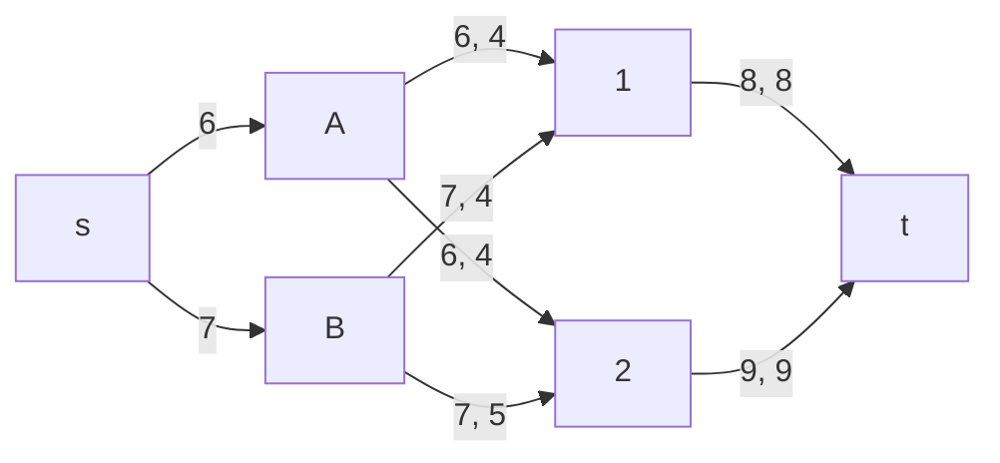
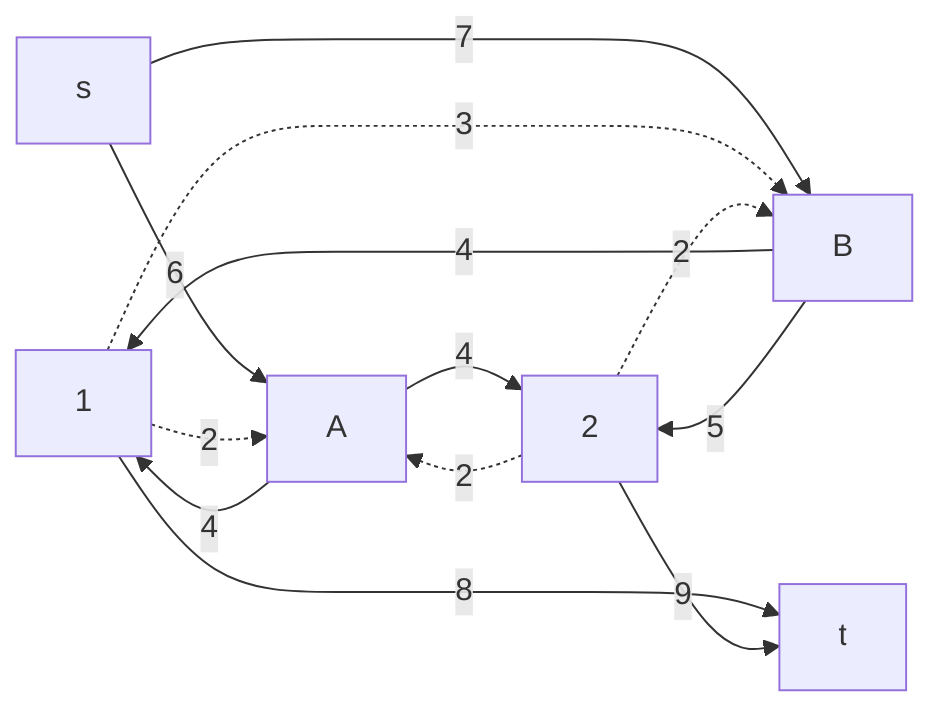
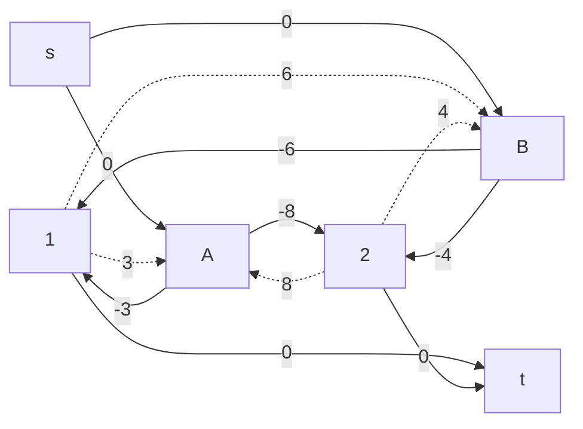
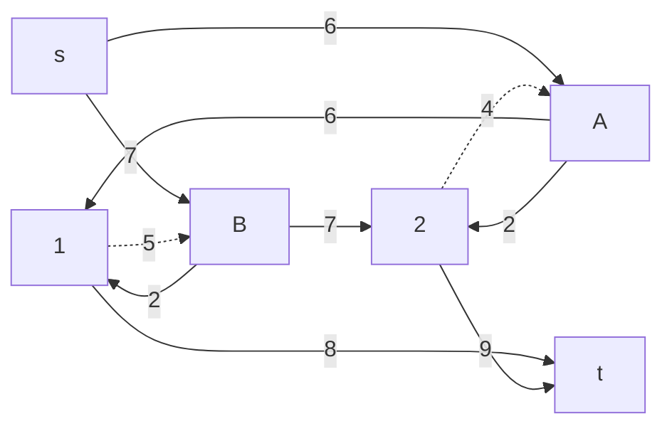
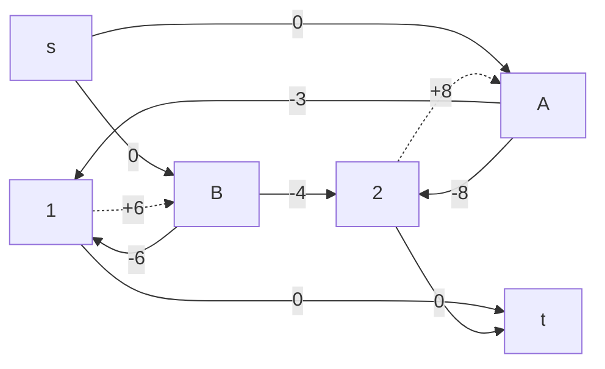

# Задание 14. Вариант 4
## Транспортная задача

Два завода имеют производительность 6 и 7, а два складских помещения имеют вместимость 8 и 9. Матрица затрат на перевозку одной единицы товара (строки – это заводы, столбцы – это склады) имеет вид:

$$
 \begin{pmatrix}    
  3 & 8 \\ 
  6 & 4 \\ 
 \end{pmatrix}    
$$

Требуется:
1. Найти стоимость перевозки с первого завода на второй склад 6 единиц товара, а со второго завода на первый склад 7 единиц товара;
2. Используя алгоритм поиска максимального потока минимальной стоимости, скорректировать указанный выше вариант перевозки товаров, так чтобы объём перевозимых товаров не изменился, а стоимость их перевозки стала минимальной.

Матрица затрат на перевозку
|     |**1**|**2**|
|:---:|:---:|:---:|
|**A**| 3  | 8  |
|**B**| 6  |  4  |

## Решение
### Задание 1
$$ A → 2 $$
$$ B → 1 $$ 

S = 8 * 6 + 6 * 7 = 90 (у.е.)

### Задание 2

На дугах указаны пары чисел, где первое число - локальный поток, а второе - пропускная способность. Локальные потоки выбраны из условия задания 1. Локальные потоки дуг, входящих и исходящих из вершин левой доли графа, являются производительностью заводов, а исходящих из вершин правой доли - вместимостью складов.

Остаточная сеть с абсолютными величинами стоимости.

В построенном графе присутствует цикл отрицательной стоимости
$$ 1 → A → 2 → B → 1 $$

Данный цикл указывает на возможность альтернативной менее затратной транспортировки. 
Сумма стоимостей равна 3 - 8 + 4 - 6 = -7 
Минимальный вес среди представленных дуг равен 2 
Таким образом, уничтожая отрицательный цикл, мы перенаправляем 2 единицы товара и экономим 7 единиц товара.

Остаточная сеть с абсолютными величинами стоимости.

Нет циклов отрицательной стоимости. Следовательно, мы уже имеем оптимальное решение для транспортировки товаров с минимальными затратами.
$$ A → 1 $$
$$ A → 2 $$
$$ B → 1 $$ 
$$ B → 2 $$ 

S = 3 * 6 + 8 * 2 + 6 * 2 + 4 * 7 = 74 (у.е.)
### Ответ ###
Минимальная стоимость: 74