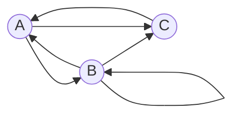

# Задача на взаимную рекурсию (маршруты в треугольнике)
# Вариант 4

В условиях задачи для каждого варианта указан граф с тремя вершинами. Для решения задачи требуется: 
1. Составить систему из 3 рекуррентных соотношений для предложенного графа.
2. Методом исключения свести систему к одному рекуррентному соотношению.
3. Составить и решить характеристическое уравнение.
4. Вывести формулу общего решения.

# Условие

Допустимые маршруты:
- A --> B
- B --> A
- B --> B
- B --> C
- C --> A
- A --> C

Найти формулу расчета количества маршрутов, начинающихся в вершине A и заканчивающихся в вершине B.

# Составим систему из 3 рекуррентных соотношений для предложенного графа

Составим табличку для расчёта маршрутов

| *n* | Маршруты                   | Количество |
|-----|----------------------------|------------|
| 1   | (A->B)                     | 1          |
| 2   | (A->B->B)                  | 1          |
| 3   | (A->C->A->B), (A->B->A->B) | 2          |
| 4   | (A->B->C->A->B)            | 1          |

Можно обозначить
* an - количество маршрутов длины *n* начинающихся и заканчивающихся 
в A,
* bn - количество маршрутов длины *n* начинающихся в A и 
заканчивающихся в B,
* cn - количество маршрутов длины *n* начинающихся в A и 
заканчивающихся в C.

Тогда справедливы равенства:

$$
\begin{cases}
a_n = b_{n-1} + c_{n-1}
\\
b_n = a_{n-1} + b_{n-1}
\\
c_n = a_{n-1} + b_{n-1}
\end{cases}
$$

# 2. Методом исключения сведём систему к одному рекуррентному соотношению

* Из третьего уравнения выведем cn и подставим в первое: 

$$
a_n = b_{n-1} + a_{n-2} + b_{n-2}
$$

* Также выведем an из первого и подставим во второе уравнение, ведь нам нужно найти те маршруты, которые начинаются в А и заканчиваются в B

$$
b_n = b_{n-2} + a_{n-3} + b_{n-3} + b_{n-1}
$$

Так как

$$
b_{n-2} = a_{n-3} + b_{n-3}
$$

Заменим и получим

$$
b_n = b_{n-2} + b_{n-2} + b_{n-1} = 2*b_{n-2} + b_{n-1}
$$

# 3. Составим и решим характеристическое уравнение

Рассмотрим уравнение:

$$
b_n = 2*b_{n-2} + b_{n-1}
$$

$$
b_n - b_{n-1} - 2*b_{n-2} = 0
$$

* Пусть $b_{n-1} = t$. Тогда $b_n = t^2$, а $b_{n-2} = 1$

$$
t^2 - t - 2 = 0
$$

По теореме Виета:

$$
t_1 = 2
t_2 = -1
$$

# 4. Выведем формулу общего решения

Общее решение:

$$
b_n = C_1*(t_1)^n + C_2*(t_2)^n
$$

$$
b_n = C_1 * 2^n + C_2 * (-1)^n
$$

При n = 1, b = 1
При n = 2, b = 1

Получаем следующую систему уравнений:

$$
1 = C_1 * 2^1 + C_2 * (-1)^1
$$

$$
1 = C_1 * 2^2 + C_2 * (-1)^2
$$

$$
1 = 2*C_1 - C_2
$$

$$
1 = 4*C_1 + C_2
$$

* Выразим $C_2$ из первого уравнения и подставим во второй, решим систему:

$$
C_2 = 2*C_1 - 1
$$

$$
1 = 4 * C_1 + 2 * C_1 - 1
$$

$$
2 = 6*C_1
$$

$$
C_1 = 1/3
$$

$$
C_2 = 2/3 - 1 = -1/3 
$$

Формула общего решения:

$$
b_n = 1/3 * 2^n - 1/3 * (-1)^n
$$
