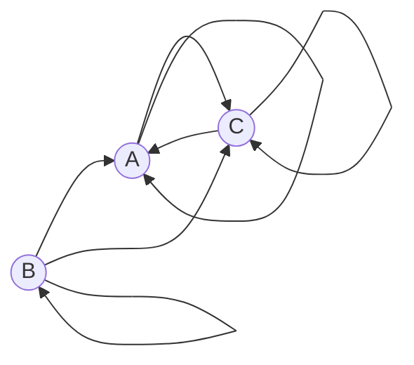

## Вариант 2:

**Допустимые маршруты:**
- A --> C
- A --> A
- B --> A
- B --> C
- B --> B
- C --> C
- C --> A

1. **Определение переменных:**

   Обозначим:
   - $a_n$ — количество маршрутов длины $n$, начинающихся в вершине A и заканчивающихся в вершине A.
   - $b_n$ — количество маршрутов длины $n$, начинающихся в вершине A и заканчивающихся в вершине B.
   - $c_n$ — количество маршрутов длины $n$, начинающихся в вершине A и заканчивающихся в вершине C.

2. **Составление системы рекуррентных соотношений:**

   Проанализируем возможные переходы из каждой вершины:

   - **Из вершины A:**
      - Можно перейти в A.
      - Можно перейти в C.

   - **Из вершины B:**
      - Можно перейти в A.
      - Можно перейти в B.
      - Можно перейти в C.

   - **Из вершины C:**
      - Можно перейти в A.
      - Можно перейти в C.

   Таким образом, получаем следующие рекуррентные соотношения:

$$
\begin{cases}
a_n = a_{n-1} + c_{n-1} \\
b_n = 0 \\
c_n = a_{n-1} + c_{n-1}
\end{cases}
$$
   

   **Пояснение:**

   - Для $a_n$: Чтобы маршрут длины $n$ начинался и заканчивался в A, последний переход должен быть либо из A в A, либо из C в A. Таким образом, $a_n = a_{n-1} + c_{n-1}$.

   - Для $b_n$: Из вершины A невозможно перейти напрямую в вершину B, и поскольку из других вершин маршруты начинаются только из A, то $b_n = 0$ для всех $n$.

   - Для $c_n$: Чтобы маршрут длины $ n $ начинался в A и заканчивался в C, последний переход должен быть либо из A в C, либо из C в C. Таким образом, $c_n = a_{n-1} + c_{n-1}$.

4. **Методом исключения сводим систему к одному рекуррентному соотношению:**

   Из системы уравнений видно, что:

$$
a_n = c_n
$$

   Подставляем $c_n = a_n$ во второе и третье уравнения:

$$
\begin{cases}
a_n = a_{n-1} + a_{n-1} \\
c_n = a_{n-1} + a_{n-1}
\end{cases}
$$

   Таким образом, получаем:

$$
a_n = 2a_{n-1}
$$

   Итак, сводим систему к одному рекуррентному соотношению:

$$
a_n = 2a_{n-1}
$$

5. **Составление и решение характеристического уравнения:**

   Рекуррентное соотношение имеет вид:

$$
a_n - 2a_{n-1} = 0
$$

   Характеристическое уравнение:

$$
t - 2 = 0
$$

   Корень уравнения:

$$
t = 2
$$

   Поскольку корень кратности 1, общее решение имеет вид:

$$
a_n = C \cdot 2^n
$$

6. **Нахождение константы $ C $ с помощью начальных условий:**

   Рассмотрим маршруты длины 1:

   - Из A в A: $A \rightarrow A$, количество маршрутов $a_1 = 1$.

   Подставляем в общее решение:

$$
a_1 = C \cdot 2^1 = 2C = 1 \Rightarrow C = \frac{1}{2}
$$

   Таким образом, формула общего решения:

$$
a_n = \frac{1}{2} \cdot 2^n = 2^{n-1}
$$

7. **Итоговая формула:**

   Для любого натурального числа $n$:

$$
a_n = 2^{n-1}
$$
