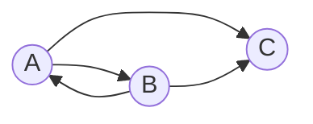

## Вариант 1:

Допустимые маршруты:
- A --> B
- A --> C
- B --> A
- B --> C

Найти формулу расчета количества маршрутов, начинающихся в вершине A и заканчивающихся в вершине C.

Пример расчета количества маршрутов длины n:

| *n* | Маршруты                   | Количество |
|-----|----------------------------|------------|
| 1   | (A->C)                     | 1          |
| 2   | (A->B->C)                  | 1          |
| 3   | (A->B->A->C)               | 1          |

Можно обозначить:
* cn - количество маршрутов длины *n* начинающихся в A и заканчивающихся в C.
* an - количество маршрутов длины *n* начинающихся в A и заканчивающихся в A
* bn - количество маршрутов длины *n* начинающихся в A и заканчивающихся в B,

Тогда справедливы равенства:

$$
\begin{cases}
c_n = a_{n-1} + b_{n-1}
\\
a_n = b_{n-1}
\\
b_n = a_{n-1}
\end{cases}
$$

Преобразуем:

$$
\begin{cases}
c_n = a_{n} + a_{n-1}
\\
a_n = a_{n-2}
\\
b_n = a_{n-1}
\end{cases}
$$

Привести данную систему уравнений к рекуррентному соотношению невозможно, максимум возможно избавиться от третьей переменной и получить систему выражений:

$$
\begin{cases}
c_n = a_{n} + a_{n-1}
\\
a_n = a_{n-2}
\end{cases}
$$

Из первого уравнения следует, что количество маршрутов длины n, начинающихся в вершине A и заканчивающихся в вершине C равно сумме маршрутов начинающихся в A и заканчивающихся в A длины n и длины n-1

Из второго уравнения следует, что если четность n совпадает, то количество маршрутов из A в A будет одинаковым. Пример:

$a_3 = a_{1}$

Расшифровка: количество маршрутов из A в A длины 3 РАВНО количеству маршрутов из А в А длины 1.

Покажем это наглядно в виде таблицы:
| *n* | Маршруты                   | Количество |
|-----|----------------------------|------------|
| 1   | нет                        | 0          |
| 2   | (A->B->A)                  | 1          |
| 3   | нет                        | 0          |
| 4   | (A->B->A->B->A)            | 1          |

Еще раз вставлю диаграмму, чтобы не листать вверх:

Как видно из графика и таблицы: 

$a_1 = a_3 = 0$

$a_2 = a_4 = 1$

Отсюда следует, что любое нечетное n можно "опустить" до n = 1, и любое четное n можно "опустить" до n = 2

Отсюда получаем

$c_n = a_{n} + a_{n-1}$

$c_n = a_2 + a_1$

$c_n = 1 + 0 = 1$

Итак, формула общего решения выглядит так:

$c_n = 1$