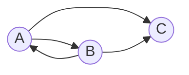

## Вариант 1:

Допустимые маршруты:
- A --> B
- A --> C
- B --> A
- B --> C

Найти формулу расчета количества маршрутов, начинающихся в вершине A и заканчивающихся в вершине C.

Пример расчета количества маршрутов длины n:

| *n* | Маршруты                   | Количество |
|-----|----------------------------|------------|
| 1   | (A->C)                     | 1          |
| 2   | (A->B->C)                  | 1          |
| 3   | (A->B->A->C)               | 1          |

Можно обозначить:
* cn - количество маршрутов длины *n* начинающихся в A и заканчивающихся в C.
* an - количество маршрутов длины *n* начинающихся в A и заканчивающихся в A
* bn - количество маршрутов длины *n* начинающихся в A и заканчивающихся в B,

Тогда справедливы равенства:

$$
\begin{cases}
c_n = a_{n-1} + b_{n-1}
\\
a_n = b_{n-1}
\\
b_n = a_{n-1}
\end{cases}
$$

Преобразуем:

$$
\begin{cases}
c_n = a_{n} + a_{n-1}
\\
a_n = a_{n-2}
\\
b_n = a_{n-1}
\end{cases}
$$

Данная система уравнений сводится к рекуррентному соотношению:

$a_n = a_{n-2}$

или

$a_n = 0*a_{n-1} + a_{n-2}$

Решаем характеристическое уравнение:

$t^2 - 1 = 0$

$t_{1} = 1  \ t_{2} = -1$

$t_{1} \neq t_{2} $

Выводим формулу общего решения:

$a_n = С_{1}t_{1}^n + С_{2}t_{2}^n$

$a_n = С_{1} * 1^n + С_{2} * (-1)^n$

$a_1 = 0$

$a_2 = 1$

$$\begin{cases}
0 = С_{1} - С_{2} \\ 
1 = С_{1} + С_{2} 
\end{cases} $$

$C_{1} = \frac{1}{2} $

$C_{2} = \frac{1}{2} $

$a_n = \frac{1}{2} * 1^{n} + \frac{1}{2} * (-1)^{n} $

$a_n = \frac{1}{2} * (1^{n} + (-1)^{n}) $

$c_n = a_{n} + a_{n-1}$

Итак, общая формула выглядит так:

$c_n = \frac{1}{2} * (1^{n} + (-1)^{n}) + \frac{1}{2} * (1^{n-1} + (-1)^{n-1}) $

Упростим выведенную формулу:

$1^{n}$ и $1^{n-1}$ при любом $n$ будут равны $1$

$c_n = \frac{1}{2} * (1 + (-1)^{n}) + \frac{1}{2} * (1 + (-1)^{n-1}) $

Рассмотрим 2 случая, когда n четное и когда n нечетное:

1 случай, n четное:

$c_n = \frac{1}{2} (1 + 1) + \frac{1}{2} (1 - 1)$

$c_n = \frac{1}{2} * 2 + \frac{1}{2} * 0$

$c_n = 1$

2 случай, n нечетное:

$c_n = \frac{1}{2} (1 - 1) + \frac{1}{2} (1 + 1)$

$c_n = \frac{1}{2} * 0 + \frac{1}{2} * 2$

$c_n = 1$

Следовательно, для любого n:

$c_n = 1$
