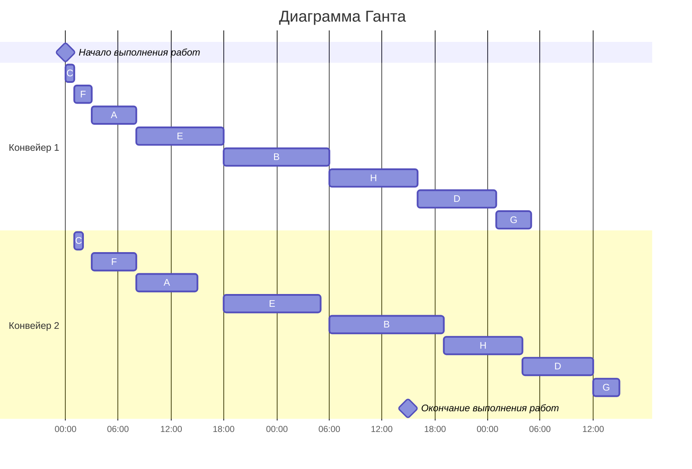

# Задание №5
## Конвейерная задача. Вариант 5
### Постановка конвейерной задачи:
1. Количество заданий произвольно;
2. Каждое задание состоит из двух последовательных этапов, длительность которых произвольна;
3. Задания независимы;
4. Запрещены прерывания при выполнении заданий;
5. Количество работников строго 2;
6. Первый работник выполняет только первый этап каждого задания, второй работник — только второй этап каждого задания;
7. Производительность работников, размеры оплаты из труда и т.д. не учитываются;
8. Требуется построить расписание выполнения всех заданий в кратчайшие сроки.

## Условие задачи
Имеется 8 независимых заданий, каждое из которых состоит из двух последовательных этапов, и 2 исполнителя, исполнитель 1 выполняет только первый этап задания, исполнитель 2 - только второй. 
Длительность заданий (по этапам): (5, 7), (12, 13), (1, 1), (9, 8), (10, 11), (2, 5), (4, 3), (10, 9)

Для удобства изображения, назовём каждое задание:
A (5, 7)
B (12, 13) 
C (1, 1) 
D (9, 8)
E (10, 11) 
F (2, 5) 
G (4, 3) 
H (10, 9)

Для решения задачи используем Алгоритм Джонсона

### Алгоритм Джонсона
Пусть аi и bi, — это длительности первого и второго 
этапов i-го задания. 

Для начала разобьём список всех заданий на две группы. 
В первую группу попадают задания, у которых аi <= bi:
A, B, C, E, F

Во вторую группу - все остальные задания:
D, G, H

Теперь задания из первой группы отсортируем в порядке возрастания величин аi. 
C, F, A, E, B

Задания из второй группы отсортируем в порядке убывания величин bi.
H, D, G

Построим диаграмму Ганта.
Согласно алгоритму Джонсона, расписание получается кратчайшим, если сначала выполнить все задания из первой группы в отсортированном порядке, а затем — все задания из второй группы также в отсортированном порядке.

