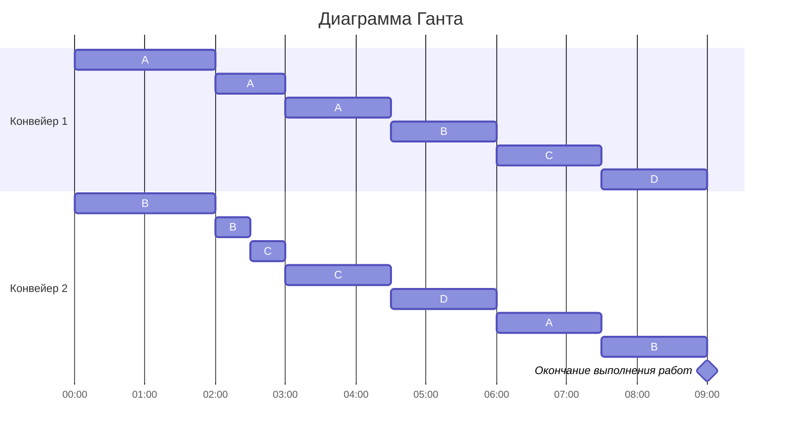

# Задача №5. Вариант 8 #

### Условие задачи ###
| A | B | C | D |
|:-:|:-:|:-:|:-:|
|21 |14 |10 | 9 |

p1 = 4, p2 = 2

### Решение ###

Найдём время выполнения всех задач при оптимальном расписании.

$$t_m = \frac{21 + 14 + 10 + 9}{4 + 2} = 9$$

Расставим приоритеты задач и назначим каждой из них исполнителя. **Самую приоритетную задачу выполняет самый производительный исполнитель.**

$$p_1 → A$$
$$p_2 → B$$ 

Рассчитаем время, когда A = B и B = C

$$A = B$$
$$21 - 4 * t_1 = 14 - 2 * t_1$$
$$2 * t_1 = 7$$
$$t_1 = 3,5$$

$$B = C$$
$$14 - 2 * t_2 = 10$$
$$2 * t_2 = 4$$
$$t_2 = 2$$

t1 > t2, следовательно смена исполнителей произойдёт из-за равенства задач B и C

t = 2

| A | B | C | D |
|:-:|:-:|:-:|:-:|
|13 |10 |10 | 9 |

Расставим приоритеты задач и назначим каждой из них исполнителя. **Самую приоритетную задачу выполняет самый производительный исполнитель.**

$$p_1 → A$$
$$p_2 → BC$$ 

Рассчитаем время, когда A = BC и BC = D

**$$A = BC$$**
$$13 - 4 * t_3 = 10 - \frac{2}{2} * t_3$$
$$3 * t_3 = 3$$
$$t_3 = 1$$

$$BC = D$$
$$10 - \frac{2}{2} * t_4 = 9$$
$$t_4 = 1$$

t3 = t4, следовательно смена исполнителей произойдёт из-за равенства всех задач в момент времени 3 ед.

| A | B | C | D |
|:-:|:-:|:-:|:-:|
| 9 | 9 | 9 | 9 |

Приоритеты задач сравнялись. Разделим оставшееся время равномерно между задачами.

$$\frac{t_m - (t_2 + t_3)}{4} = \frac{9 - (2 + 1)}{4} = 1,5$$

### Ответ ###

