## Вариант 6:  

Имеется 10 независимых заданий, каждое из которых состоит из двух последовательных этапов, и 2 исполнителя. Исполнитель 1 выполняет только первый этап задания, исполнитель 2 — только второй.  
Длительность заданий (по этапам):  
(14, 15), (1, 1), (10, 9), (15, 18), (1, 4), (1, 5), (4, 3), (10, 9), (10, 9), (8, 12).  

---

### Решение

Изначальная таблица заданий:  

| Задание | A  | B  | C  | D  | E  | F  | G  | H  | I  | J  |
|---------|----|----|----|----|----|----|----|----|----|----|
| Ⅰ       | 14 | 1  | 10 | 15 | 1  | 1  | 4  | 10 | 10 | 8  |
| ⅠⅠ      | 15 | 1  | 9  | 18 | 4  | 5  | 3  | 9  | 9  | 12 |

---
### Для выполнения данного задания мы воспользуемся алгоритмом Джонсона: 

**Этап №1:** Разбиваем задания на две группы:

- **Первая группа** — задания, в которых первый этап ≤ второго этапа.  
- **Вторая группа** — задания, в которых первый этап > второго этапа.  

Результат:

- **Первая группа:**  B, E, F, J, A, D.

- **Вторая группа:**  G, C, H, I.

---

**Этап №2:**  
Теперь отсортируем задания из первой группы по возрастанию времени выполнения.  

| Задание | Время 1 Этапа | Время 2 Этапа |
|---------|---------------|---------------|
| B       | 1             | 1             |
| E       | 1             | 4             |
| F       | 1             | 5             | 
| J       | 8             | 12            |
| A       | 14            | 15            |
| D       | 15            | 18            |

---

**Этап №3:**  
Задания из второй группы сортируем по убыванию времени выполнения.  

| Задание | Время 2 Этапа | Время 1 Этапа |
|---------|---------------|---------------|
| I       | 9             | 10            |
| H       | 9             | 10            |
| C       | 9             | 10            |
| G       | 3             | 4             |

---

**Этап №4:**  
Соединяем обе таблицы в таблицу последовательности выполнения:  

| **Этапы** | B   | E   | F    | J     | A     | D     | I     | H     | C     | G     |
|-----------|-----|-----|------|-------|-------|-------|-------|-------|-------|-------|
| **1**     | 0–1 | 1–2 | 2–3  | 3–11  | 11–25 | 25–40 | 40–50 | 50–60 | 60–70 | 70–74 |
| **2**     | 1–2 | 2–6 | 6–11 | 11–23 | 25–40 | 40–58 | 58–67 | 67–76 | 76–85 | 85–88 |

---
### Получившаяся диаграмма Ганта:

```mermaid
gantt
    title Диаграмма Ганта
    dateFormat  HH:mm
    axisFormat  %H:%M
    section Исполнитель I
    B : b1, 00:00, 1h
    E : e1, after b1, 1h
    F : f1, after e1, 1h
    J : j1, after f1, 8h
    A : a1, after j1, 14h
    D : d1, after a1, 15h
    I : i1, after d1, 10h
    H : h1, after i1, 10h
    C : c1, after h1, 10h
    G : g1, after c1, 4h
    section Исполнитель II
    B : b2, 01:00, 1h
    E : e2, after b2 e1, 4h
    F : f2, after e2, 5h
    J : j2, after f2 j1, 12h
    A : a2, after a1, 15h
    D : d2, after a2 , 18h
    I : i2, after d2, 9h
    H : h2, after i2, 9h
    C : c2, after h2, 9h
    G : g2, after c2, 3h
```

### Ответ:
Общее время выполнения всех заданий: **88 единиц времени**
