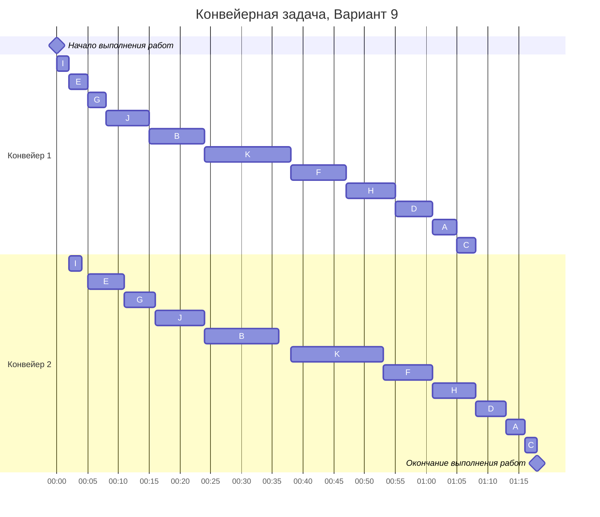

# Задача 5. Вариант 2
## Условие
Данный вариант задания представляет собой конвейерную задачу для 11 заданий и 2 исполнителей.
||A|B|C|D|E|F|G|H|I|J|K|
|-|-|-|-|-|-|-|-|-|-|-|-|
|Конвейер 1, $a_i$|4|9|3|6|3|9|3|8|2|7|14|
|Конвейер 2, $b_i$|3|12|2|5|6|8|5|7|2|8|15|

Условимся, что время дано в минутах.

## Решение задачи
Для решения задачи воспользуемся алгоритмом Джонсона.
1. Разбить работы на 2 группы:
    1. Длительность первого этапа не превосходит длительность второго, т.е. $a_i\leq b_i$
    2. Длительность первого этапа больше длительности второго, т.е. $a_i > b_i$
2. Отсортировать работы 1 группы по возрастанию $a_i$
3. Отсортировать работы 2 группы по убыванию $b_i$
4. Соединить в одну последовательность группа 1 + группа 2, отобразить на диаграмме Ганта
### Разбиение на группы
Поделим задания на группы согласно алгоритму:
|Группа I|Группа II|
|--------|---------|
|B (9; 12)|A (4; 3)|
|E (3; 6)| C (3; 2)|
|G (3; 5)|D (6; 5)|
|I (2; 2)|F (9; 8)|
|J (7; 8)|H (8; 7)|
|K (14; 15)|      |

### Сортировка работ
Произведем сортировку работ в таблице согласно шагам 2 и 3 алгоритма.
|Группа I|Группа II|
|--------|---------|
|I (2; 2)|F (9; 8) |
|E (3; 6)|H (8; 7) |
|G (3; 5)|D (6; 5) |
|J (7; 8)|A (4; 3) |
|B (9; 12)|C (3; 2)|
|K (14; 15)|       |

### Соединение работ, диаграмма Ганта
После объединения присоединения группы 2 к концу группы 1, получаем следующую последовательность выполнения работ на конвейере:
$$
I \to E \to G \to J \to B \to K \to F \to H \to D \to A \to C
$$
Теперь представим их на диаграмме Ганта:

## Ответ
Работа двух конвейеров с указанными заданиями займет 78 минут.