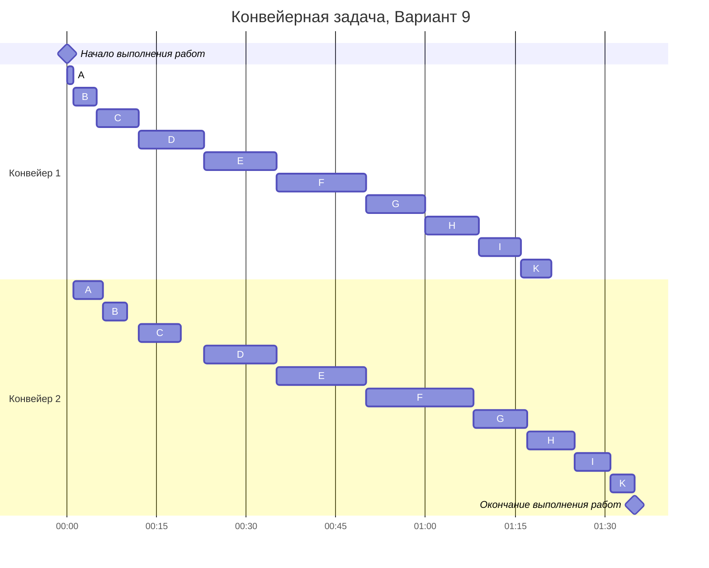

### Вариант 9:
Имеется 10 независимых заданий, каждое из которых состоит из двух последовательных этапов, и 2 исполнителя, исполнитель 1 выполняет только первый этап задания, исполнитель 2 - только второй. Длительность заданий (по этапам): (7, 6), (9, 8), (5, 4), (7, 8), (4, 4), (1, 5), (10, 9), (11, 12), (12, 15), (15, 18).

Решаем задачу с помощью алгоритма Джонсона.

1) Делим список всех заданий на две группы. В первую группу попадают задания, у которых аi <= bi. Во вторую группу - все остальные задания.

Первая группа: (7, 8), (4, 4), (1, 5), (11, 12), (12, 15), (15, 18).
Вторая группа: (7, 6), (9, 8), (5, 4), (10, 9).

2) Задания из первой группы отсортируем в порядке возрастания величин аi. Задания из второй группы отсортируем в порядке убывания величин bi.

Отсортированная первая группа: (1, 5), (4, 4), (7, 8), (11, 12), (12, 15), (15, 18).
Отсортированная вторая группа: (10, 9), (9, 8), (7, 6), (5, 4).

Также обозначим заглавными буквами латинского алфавита задания в уже отсортированном порядке.

| Обозначение | Задание |
| ----------- | ------- |
| A           |  (1, 5) |
| B           |  (4, 4) |
| C           |  (7, 8) |
| D           | (11, 12)|
| E           | (12, 15)|
| F           | (15, 18)|
| G           | (10, 9) |
| H           |  (9, 8) |
| I           |  (7, 6) |
| K           |  (5, 4) |

3) Выполняем задания по порядку сначала из первой группы, затем из второй. Время выполнения задачи будем исчислять в минутах.

Отметим несколько моментов:

Второй работник может начать выполнять задание N тогда и только тогда, когда он свободен и первый работник закончил выполнять задание N.

Первый работник ни от чего не зависит, соответственно простой на его конвейере может быть только в конце работы, когда второй работник доделывает свои последние задания.

Теперь начнем строить диаграмму Ганта:

Ответ: Длительность полученного испытания 95 минут.