# Вариант №3
Задание: Имеется 4 независимых задания и 2 исполнителя, исполнитель 1 с производительностью 10 и исполнитель 2 производительностью 6. Длительность заданий составляет 66, 40, 22, 16. Требуется построить расписание выполнения всех заданий в кратчайшие сроки.
# Решение
**Дано:** 

| Задания     | A  | B  | C  | D  |         
| ----------- | -- | -- | -- | -- |
| Длительность | 66 | 40 | 22 | 16 | 

| Испольнители     | 1  | 2  |
| ----------- | -- | -- |
| Производительность (p) | 10 | 6 |

Необходимо рассчитать оптимальное время выполнения всех задач: 

$$T = \frac{A}{V} = \frac{66  + 40 + 22 + 16}{10 + 6} = \frac{144}{16} = 9$$

Следовательно, выполнение всех задач при самом оптимальном расписании возможно за 9 единиц времени.

### **Момент времени t = 0**

**Шаги алгоритма:**

1. Так как время оптимального расписания рассчитано, необходимо определить над какой задачей и в какое время каждый работник будет работать.

 Для описания алгоритма построения оптимального расписания введем понятие приоритета задания в определенный момент времени - объем оставшейся части задания, которая в данный момент еще не выполнена. В начальный момент времени приоритет задания соответствует его объему. Следовательно самой приоритетной задачей является задача А. 

2. Самая приоритетная задача достается самому производительному исполнителю, тогда получаем: **p1 → A; p2 → B**. 
3. Работники выполняют задания до тех пор, пока не сравняются приоритеты у каких-то заданий. Этот момент станет моментом переключения.

Необходимо найти такое время. Сравняться в приоритах могут пары задач: A и B, B и C.

Рассмотрим момент времени t1, когда сравняется первая пара задач: 

$$A=B$$

$$ 66-10t_1 = 40-6t_1 $$

$$ 26 = 4t_1$$
$$ t_1 = 6,5$$

Расммотрим момент времени t2, когда сравняются задачи B и C: 

$$ B = C$$ 

$$ 40 - 6t_2 = 22$$

$$ t_2 = 3$$

Получаем: t1 > t2, следовательно момент переключения наступит спустя **3 единицы времени**.

### **Момент времени t = 3**

На момент времени t = 3 объем задач был следующим: **А = 36; B = 22; C = 22; D = 16.**

Оптимальное время выполнения всех задач: 

$$T = \frac{A}{V} = \frac{36  + 22 + 22 + 16}{10 + 6} = \frac{96}{16} = 6$$

Самой приоритетной задачей является попрежнему задача А. Следовательно исполнитель с большей производительностью будет работать над ней, то есть p1. 

Второй приоритет имеют сразу две задачи: B и C - следовательно производитель будет работать сразу с ними двумя, так как остался один производитель p2. 

Получаем: **p1 → A; p2 → BС**

Ищем момент переключения: сравняться в приоритетах могут пары задач: A и BC, BC и D. 

Рассмотрим момент t1, когда сравнялись A и BC: 

$$ A = BC$$

$$ 36 - 10t_1 = 22 - \frac{6}{2}t_1$$

$$ 36 - 10t_1 = 22 - 3t_1$$

$$ t_1 = 2$$

Рассмотрим момент t2, когда сравнялись BC и D: 

$$ BC = D $$

$$ 22 - \frac{6}{2}t_2 = 16 $$

$$ 22 - 3t_2 = 16$$

$$ t_2 = 2$$ 

Получаем: **t1 = t2** - из этого равенства следует, что спустя промежуток времени равный 2 единицам (момент переключения), **все задачи будут иметь одинаковый объем**. 

Итоговый момент времени: t = 3 + 2 = 5

### **Момент времени t = 5**

В момент времени t = 5 объем задач: **А = 16; B = 16; C = 16; D = 16.**

Оптимальное время выполнения всех задач: 

$$T = \frac{A}{V} = \frac{16  + 16 + 16 + 16}{10 + 6} = \frac{64}{16} = 4$$

Так как все задачи имеют одинаковый объем - они все имеют одинаковый приоритет - первый. Для распределения исполнителей между ними, необходимо разделить получившееся оптимальное время для данного объема работы разделить на количество промежутков, равное количеству работ. И каждому из производителей в эти промежутки выдать задачу для выполнения (таким образом, чтобы ни в один момент времени исполнители не работали над одной и той же задачей). 

Получим полное выполнение всех задач. Например, уравнение для задачи A:

$$ A = 16 - \frac{16}{4}t = 0 $$

# Ответ: Итоговая Диаграмма Ганта

```mermaid
gantt
    title Диаграмма Ганта
    dateFormat  HH:mm
    axisFormat  %H:%M
    section Исполнитель 1
    A :a, 01:00, 5h
    C :c, 06:00, 1h
    D :d, 07:00, 1h
    B :b, 08:00, 1h
    section Исполнитель 2
    B :b2, 01:00, 3h
    C :c2, 04:00, 2h
    B :b3, 06:00, 1h
    A :a2, 07:00, 1h
    D :d2, 08:00, 1h
    Конец работы : milestone, 09:00
```

