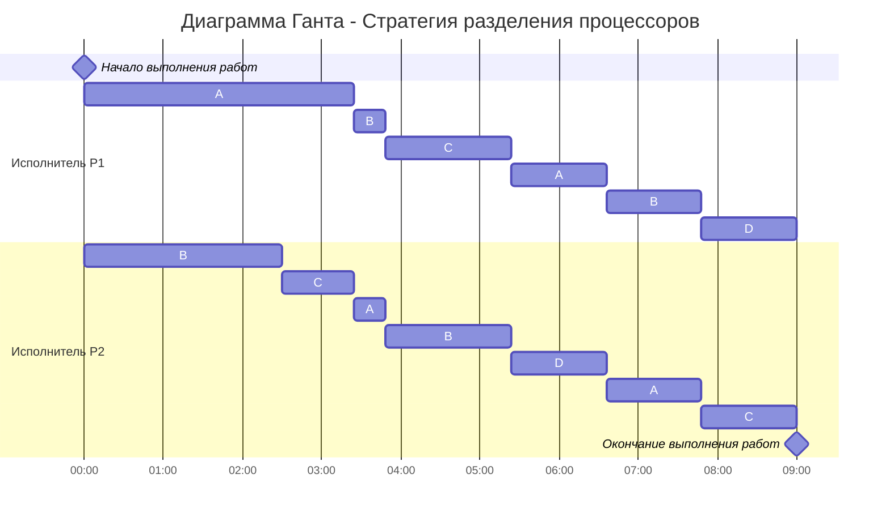

# Вариант 1:
Имеется 4 независимых задания и 2 исполнителя, исполнитель 1 с производительностью 6 и исполнитель 2 производительностью 4. Длительность заданий составляет 34, 26, 18, 12.  

### Постановка задачи:
1. Количество заданий произвольно;
2. Каждое задание имеет свою длительность;
3. Задания независимы и могут выполняться параллельно;
4. Разрешены прерывания при выполнении заданий;
5. Количество работников произвольно и не превышает количество заданий;
6. Работники универсальны в плане выполнения задач - каждый работник может выполнять любую из задач;
8. Производительность работников отличается;
9. Требуется построить расписание выполнения всех заданий в кратчайшие сроки.  

# Решение:
Для решения задачи был выбрана стратегия разделения исполнителя для построения оптимального расписания. В задаче требуется определить оптимальное расписание для нескольких независимых заданий, выполняемых 2 исполнителями, причем прерывания разрешены, поэтому для ее решения будем использовать стратегию разделения процессов.

__Введем обозначения:__

| Задания      |  A  |  B  |  C  |  D  |
|:------------:|:---:|:---:|:---:|:---:|
| Длительность | 34  |  26 |  18 |  12 |

| Исполнители        |  P1  |  P2  |
|:------------------:|:----:|:----:|
| Производительность |   6  |   4  |

Длительность оптимального расписания для $k$ исполнителей и $n$ заданий рассчитаем по формуле:

$$  
T_{min} = \frac {V_1 + V_2 + ... + V_n}{p_1 + p_2 + ... + p_k}  
$$  
где $V_i$ - объем i-го задания, а $p_j$ - производительность j-го исполнителя. Минимальное время расписания предполагает, что в течении всего времени $T_{min}$ все исполнители будут работать непрерывно (без простоев).

Для нашего случая (k = 2, n = 4) получим:
$$
    T_{min} = \frac{34+26+18+12}{6+4} = \frac{90}{10} = 9
$$

Так как время оптимального расписания рассчитано, необходимо определить над какой задачей и в какое время каждый работник будет работать.

Для описания алгоритма построения оптимального расписания введем понятие **приоритета задания** в определенный момент времени - объем оставшейся части задания, которая в данный момент еще не выполнена. В начальный момент времени приоритет задания соответствует его объему.

__Основная идея алгоритма__: задания с высоким приоритетом выполняет работник с высокой производительностью.

Шаги алгоритма:
1. Назначим на задание с самым высоким приоритетом более производительного работника, на следующее по приоритетности - менее производительного работника:

| Приоритеты     |  1  |  2  |  3  |  4  |
|:------------:|:---:|:---:|:---:|:---:|
| Задания      |  A  |  B  |  C  |  D  |
| Длительность | __34__  |  __26__ |  18 |  12 |
| Назначенный исполнитель | Р1  |  Р2 |     |     |

2. Работники выполняют задания до тех пор, пока не сравняются приоритеты у заданий (или пока какое-то из заданий не будет выполнено).

*Решим уравнения:*

    

        A = B  
        34 - 6t = 26 - 4t  
        2t = 8  
        t = 4
    

    

    

        B = C  
        26 - 4t = 18  
        4t = 8  
        <strong>t = 2</strong>
    

    

    

        A = C  
        34 - 6t = 18  
        6t = 16  
        t = 2,(6)
    

За 2 минуты сравняютса приоритеты заданий *B и C*. У задач изменятся приоритеты, поэтому необходимо провести перераспределение работников. Проделаем этапы заново:

| Приоритеты     |  1  |  2  |  2  |  3  |
|:------------:|:---:|:---:|:---:|:---:|
| Задания      |  A  |  B  |  C  |  D  |
| Длительность | __22__  |  __18__ |  __18__ |  12 |
| Назначенный исполнитель | Р1  |  Р2 |  P2   |     |

Так как задачи В и С имеют одинаковый приоритет, работник Р2 будет выполнять их поочередно (так как по условию задачи разрешены прерывания работ).

*Решим уравнения:*

<table>
  <tr>
    <td>
      A = BC  
      22 - 6t = 18 - 
      4t/2  
      4t = 4  
      <strong>t = 1</strong>
    </td>
    <td>
      BC = D  
      18 - 4t/2 = 12  
      2t = 6  
      t = 3
    </td>
  </tr>
</table>

За 1 минуту сравняются приоритеты заданий *А, B и C*. У задач изменятся приоритеты, поэтому необходимо провести перераспределение работников. Проделаем этапы заново:

| Приоритеты     |  1  |  1  |  1  |  2  |
|:------------:|:---:|:---:|:---:|:---:|
| Задания      |  A  |  B  |  C  |  D  |
| Длительность | __16__  |  __16__ |  __16__ |  12 |
| Назначенный исполнитель | Р1+P2  |  Р1+P2 |  P1+P2   |     |

Так как задачи А, В и С имеют одинаковый приоритет, назначим на из выполнение обоих исполнителей.

*Решим уравнение:*
<table>
  <tr>
    <td>
      AВС = D  
      16 - 10t/3 = 12  
      10t = 12  
      t = 1.2
    </td>
  </tr>
</table>

За 1,2 минуты сравняются приоритеты *всех заданий*:

| Приоритеты     |  1  |  1  |  1  |  1  |
|:------------:|:---:|:---:|:---:|:---:|
| Задания      |  A  |  B  |  C  |  D  |
| Длительность | __12__  |  __12__ |  __12__ |  __12__ |

Так как длительность всех задач сравнялась, будем поочередно назначать исполнителей на все задачи (подробнее решение отображено в диаграмме Ганта).

Таким образом работы будут выполнены за:
$$
    T_{min} = \frac{12+12+12+12}{6+4} = \frac{48}{10} = 4,8
$$

# Ответ

Оптимальная длительность расписания равна __9 минут__.

*Построим диаграмму Ганта:*

