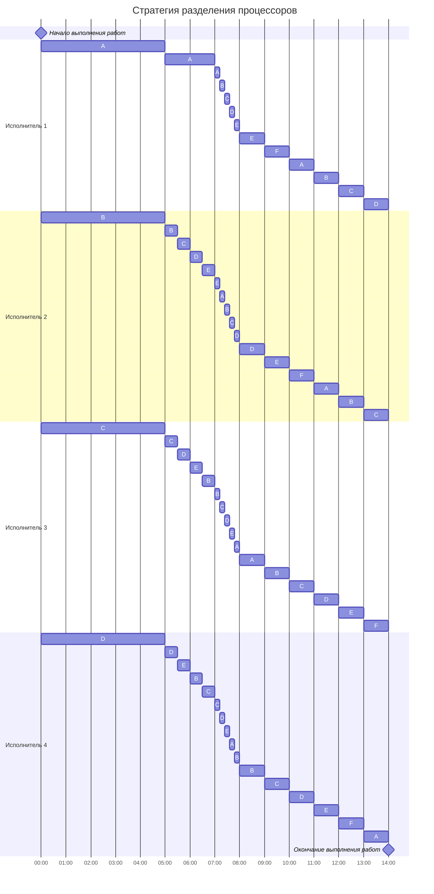

# Задание №6

## Оптимальное расписание. Стратегия разделения процессоров

Для выполнения задания необходимо: 
1. Придумать собственные условия задачи разделения процессоров, включающей не менее 5 заданий и не менее 3 исполнителей.
2. Решить задачу с придуманными условиями, в решении отобразить ход выполнения алгоритма с подробными комментариями.
3. В ответе указать длительность полученного расписания.
4. В ответе вывести полученное расписание **в виде диаграммы Ганта**.

Решение задачи нужно оформить в формате Markdown в отдельном файле с названием <название_команды>.md, который добавить в каталог task-6 данного репозитория.

### Постановка задачи:
1. Количество заданий произвольно;
2. Каждое задание имеет свою длительность;
3. Задания независимы и могут выполняться параллельно;
4. Разрешены прерывания при выполнении заданий;
5. Количество работников произвольно и не превышает количество заданий;
6. Работники универсальны в плане выполнения задач - каждый работник может выполнять любую из задач;
7. Производительность работников отличается;
8. Требуется построить расписание выполнения всех заданий в кратчайшие сроки.

### Стратегия разделения процессоров

Длительность оптимального расписания для $k$ исполнителей и $n$ заданий можно рассчитать по формуле:

$$  
T_{min} = \frac {V_1 + V_2 + ... + V_n}{p_1 + p_2 + ... + p_k}  
$$  

где $V_i$ - объем i-го задания, а $p_j$ - производительность j-го исполнителя. Минимальное время расписания предполагает, что в течении всего времени $T_{min}$ все исполнители будут работать непрерывно (без простоев).

Так как время оптимального расписания рассчитано, необходимо определить над какой задачей и в какое время каждый работник будет работать.

Для описания алгоритма построения оптимального расписания введем понятие **приоритета задания** в определенный момент времени - объем оставшейся части задания, которая в данный момент еще не выполнена. В начальный момент времени приоритет задания соответствует его объему. 

**Основная идея алгоритма**: задания с высоким приоритетом выполняет работник с высокой производительностью.

Шаги алгоритма:
1. Выбрать задания с самым высоким приоритетом (может быть одно задание или несколько заданий с одинаковым приоритетом), назначить на эти задания одного или несколько самых производительных работников. Если остались свободные работники назначить их на задания со следующим приоритетом.
2. Работники выполняют задания до тех пор, пока не наступит одно из событий:
- какое-либо задание будет завершено и освободится исполнитель,
- сравняются приоритеты у каких-то заданий, если до того эти приоритеты были разные, то есть с изменением приоритетов необходимо переназначить работников на задания согласно шагу 1.

## Выполнение задания
### Вариант 3

Для выполнения задание следует подобрать значения для 6ти заданий и 4х исполнителей
Такие, чтобы сумма заданий нацело делилось на исполнителей, дабы узнать минимальное значение, за которое можно выполнить все работы

Выбраны следующие условия:

| Задания      |  A  |  B  |  C  |  D  |  E  |  F  |
|:-------------|:---:|:---:|:---:|:---:|:---:|:---:|
| Длительность |  40 |  30 |  25 |  20 |  15 |  10 |

| Исполнители        |  1  |  2  |  3  |  4  |
|:-------------------|:---:|:---:|:---:|:---:|
| Производительность |  4  |  3  |  2  |  1  |

Рассчитаем, возможное минимальное время, за которой могут выполниться все задания и будем сверяться с ним при дальнейшем выполнении алгоритма:

$$
40 + 30 + 25 + 20 + 15 + 10 = 140
$$
$$
4 + 3 + 2 + 1 = 10
$$
$$
140 / 10 = 14
$$

За 14 минут у нас могут выполниться все задачи. Рассчитаем

Обозначим t за переменную времени. Рассмотрим ситуацию t = 0

В данной ситуации работа А является самой приоритетной, так как её значение больше всех остальных. Назначим на эту работу первого работника
Из-за того, что дальнейшие работы располагаются в порядке убывания, обозначим каждой из них приоритет в таком же убывающем порядке 
У нас свободно ещё три работника. Назначим их в порядке убывания на работы B, C, D

После начала работы не велик шанс, что какое-то задание будет выполнено целиком раньше, чем сравняются приоритеты работ
Поэтому рассчитаем минимальное время, за которое сравняются приоритеты

Рассчитаем уравнения, если приоритет работы A сравняется с B
$$
40 - 4*t = 30 - 3*t
$$
$$
t_a = 10
$$

Если B =? C
$$
30 - 3*t = 25 - 2*t
$$
$$
t_b = 5
$$

Если C =? D
$$
25 - 2*t = 20 - t
$$
$$
t_c = 5
$$

Если D =? E
$$
20 - t = 15
$$
$$
t_d = 5
$$

Так как на работы E и F не было исполнителей, они никак не уменьшаются в объёме, а значит ихи приоритет никак не меняется

Минимальное время до сравнения приоритетов 5. Рассмотрим ситуацию в периоде t = 5

| Задания      |  A  |  B  |  C  |  D  |  E  |  F  |
|:-------------|:---:|:---:|:---:|:---:|:---:|:---:|
| Длительность |  20 |  15 |  15 |  15 |  15 |  10 |

Проверим:
$$
(20 + 15*4 + 10) / 10 = 9
$$

В минимальное возможное время укладываемся

Первым приоритетом всё также остаётся работа A, остающаяся самой большой по объёму
В случае работ B, C, D и E, то их приоритет выравнивается. Работа F не сменяет приоритета.

Назначим на самую приоритетную работу самого продуктивного исполнителя, то есть первого
Исполнителей 2, 3 и 4 назначим на работы B, C, D, E, так как они уже исполнялись, а приоритет у F меньше остальных

Рассмотрим ситуацию, когда возможно сравнение приоритетов работ A, B, C, D, E, так как это произойдёт раньше

$$
20 - 4*t = 15 - (6*t) / 4
$$
$$
20 - 6*t = 15 - 1.5*t
$$
$$
t_a = 2
$$

Минимальное время до сравнения приоритетов 2. Рассмотрим ситуацию в периоде t = 7

| Задания      |  A  |  B  |  C  |  D  |  E  |  F  |
|:-------------|:---:|:---:|:---:|:---:|:---:|:---:|
| Длительность |  12 |  12 |  12 |  12 |  12 |  10 |

Проверим:
$$
(12*5 + 10) / 10 = 7
$$

В минимальное возможное время укладываемся

Теперь первым приоритетом являются работы A, B, C, D, E, так как имеют равное значение, большее среди всех представленных значений и уже выполнялись
Назначим на их выполнение всех исполнителей и рассмотрим возмоность сравнения их приоритетов и приеоритета F

Составим уравнение, если ABCDE =? F
$$
12 - ((4 + 3 + 2 + 1)*t) / 5 = 10
$$
$$
12 - 2*t = 10
$$
$$
t_f = 1
$$

Минимальное время до изменения приоритетов 1. Рассмотрим ситуацию в периоде t = 8

| Задания      |  A  |  B  |  C  |  D  |  E  |  F  |
|:-------------|:---:|:---:|:---:|:---:|:---:|:---:|
| Длительность |  10 |  10 |  10 |  10 |  10 |  10 |

Проверим:
$$
(10*6) / 10 = 6
$$

В минимальное возможное время укладываемся

Так как у нас одинаковый объём у всех оставшихся работ, их приоритет равный, и мы можем распределить всех исполнителей на всю группу работ, использовав возможное время
Проверим, будет ли в ответе ноль, если использовать всех исполнителей и значение t = 6

$$
10 - ((4+3+2+1)*6)/6 = 0
$$

Всё верно произошло, а значит все работы можно завершить за минимальное время, рассчитанное вначале: 14.

Построим диаграмму Ганта, чтобы наглядно показать оптимальное расписание

Оптимальное расписание:

