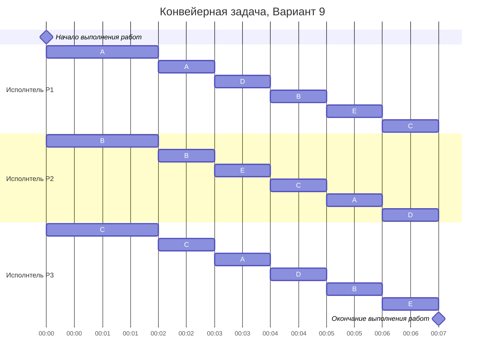

# Вариант задачи:
Есть 5 независимых заданий и 3 исполнителя с производительностями 6, 4 и 2. Длительность заданий составляет 24, 20, 16, 12, 12.

# Решение:
Длительность оптимального расписания для $k$ исполнителей и $n$ заданий можно рассчитать по формуле:

$$  
T_{min} = \frac {V_1 + V_2 + ... + V_n}{p_1 + p_2 + ... + p_k}  
$$  

где $V_i$ - объем i-го задания, а $p_j$ - производительность j-го исполнителя. Минимальное время расписания предполагает, что в течении всего времени $T_{min}$ все исполнители будут работать непрерывно (без простоев).

Для нашего случая ($k$ = 3, $n$ = 5) получим:

$$
    T_{min} = \frac{24+20+16+12+12}{2+4+6} = \frac{84}{12} = 7
$$

Так как время оптимального расписания рассчитано, необходимо определить над какой задачей и в какое время каждый работник будет работать.

Для описания алгоритма построения оптимального расписания введем понятие **приоритета задания** в определенный момент времени - объем оставшейся части задания, которая в данный момент еще не выполнена. В начальный момент времени приоритет задания соответствует его объему.

__Основная идея алгоритма__: задания с высоким приоритетом выполняет работник с высокой производительностью.

__Введем обозначения для простоты восприятия:__

| Задания      |  A  |  B  |  C  |  D  |  E  |  
|:------------:|:---:|:---:|:---:|:---:|:---:|
| Длительность | 24  | 20  |  16 |  12 |  12 |

| Исполнители        |  P1  |  P2  |  P3  |
|:------------------:|:----:|:----:|:----:|
| Производительность |   6  |   4  |   2  |

Шаги алгоритма:
1. Назначим на задание с самым высоким приоритетом наиболее производительного работника, на следующие по приоритетности - остальных работников в порядке убывания производительности.

| Приоритет     |  1  |  2  |  3  |  4  |  4  |
|:--------------:|:---:|:---:|:---:|:---:|:---:|
| Задания        |  A  |  B  |  C  |  D  |  E  |
| Длительность   |  24 |  20 |  16 |  12 |  12 |
| Исполнитель | Р1  |  Р2 |  P3 |

2. Работники выполняют задания до тех пор, пока не сравняются приоритеты у заданий (или пока какое-то из заданий не будет завершено).

Чтобы узнать, какие из заданий сравняются первые решим уравнения:

1. $A = B:$  
$24 - 6t = 20 - 4t$  
$t = 2$

2. $B = C:$  
$20 - 4t = 16 - 2t$  
$t = 2$

3. $C = D:$  
$16 - 2t = 12$  
$t = 2$

Отсюда делаем вывод, что через 2 минуты после начала выполнения заданий, все они сравняются и и их время выполнения будет равно 12 минутам.

Сделаем перераспределение работников:

| Приоритет     |  1  |  1  |  1  |  1  |  1  |
|:--------------:|:---:|:---:|:---:|:---:|:---:|
| Задания        |  A  |  B  |  C  |  D  |  E  |
| Длительность   |  12 |  12 |  12 |  12 |  12 |
| Исполнитель | Р1+P2+P3  |  Р1+P2+P3 |  Р1+P2+P3 | Р1+P2+P3 | Р1+P2+P3 |

будем поочередно назначать исполнителей на все задачи. В диаграмме Ганта отразим как именно.

# Ответ

Длительность полученного расписания равна __7 минут.__

